## <алгоритм>

**1. Анализ Текста:**
   - **Вход:** Текстовый документ, содержащий идеи контент-стратегий.
   - **Процесс:** Текст разбирается на разделы, такие как "Sustainable Living Tips" и "Remote Work Best Practices". Каждый раздел содержит подзаголовки, описывающие структуру контент-стратегии (введение, типы контента, календарь, темы, стратегии вовлечения, метрики и цели).
   - **Пример:**
     - Раздел "Sustainable Living Tips" содержит:
       - Введение о важности устойчивого образа жизни.
       - Описание типов контента (статьи, видео, посты в соцсетях).
       - План контент-календаря (еженедельные статьи, раз в две недели видео, ежедневные посты).
       - Примеры тем (сокращение отходов, экологичные продукты, устойчивый образ жизни).
       - Стратегии вовлечения (интерактивный контент, пользовательский контент, сотрудничество).
       - Метрики (трафик, вовлечение, рост аудитории) и цели (трафик +25%, рост +50%, лидерство).

**2. Выделение Ключевых Компонентов:**
   - **Процесс:** Из каждого раздела извлекаются ключевые элементы:
     - Название раздела (например, "Sustainable Living Tips").
     - Подзаголовки (например, "Introduction", "Content Types").
     - Типы контента (например, "Articles", "Videos").
     - Календарь контента (например, "Weekly Articles").
     - Примеры тем (например, "Reducing Waste").
     - Стратегии вовлечения (например, "Interactive Content").
     - Метрики и цели (например, "Website Traffic", "Increase website traffic by 25%").
   - **Пример:**
     - В разделе "Remote Work Best Practices":
       - Типы контента: "Blog Posts", "Webinars", "Infographics".
       - Календарь контента: "Weekly Blog Posts", "Monthly Webinars", "Bi-weekly Infographics".
       - Примеры тем: "Productivity Tips", "Work-life Balance", "Effective Communication".
       - Метрики: "Website Traffic", "Social Media Engagement", "Audience Growth".
       - Цели: "Increase website traffic by 30%", "Grow our social media following by 40%".

**3. Структурирование Данных:**
   - **Процесс:** Выделенные компоненты организуются в структуру для представления в формате markdown.
   - **Пример:**
     - Заголовки разделов форматируются как `##`.
     - Подзаголовки форматируются как `###`.
     - Списки форматируются как нумерованные или ненумерованные списки.
     - Примеры тем форматируются как подсписки.

**4. Форматирование в Markdown:**
   - **Процесс:** Все структурированные данные переводятся в формат markdown.
   - **Выход:** Markdown документ, представляющий контент-стратегии в структурированном и читаемом виде.
   - **Пример:**
     ```markdown
     ## 1. Sustainable Living Tips

     ### Introduction
     ...

     ### Content Types
     1. **Articles**: ...
     2. **Videos**: ...
     3. **Social Media Posts**: ...

     ### Content Calendar
     - **Weekly Articles**: ...
     - **Bi-weekly Videos**: ...
     - **Daily Social Media Posts**: ...

     ### Example Topics
     1. **Reducing Waste**:
        - How to reduce plastic waste in your daily life
        - ...
     ...
     ```

```mermaid
flowchart TD
    subgraph ContentStrategy ["Content Strategy Ideas"]
        direction TB

        subgraph SustainableLiving ["Sustainable Living Tips"]
          direction TB
          Intro1[Introduction]
          ContentTypes1[Content Types]
          Calendar1[Content Calendar]
          Topics1[Example Topics]
          Engagement1[Engagement Strategies]
          Metrics1[Metrics and Goals]

          Intro1 --> ContentTypes1
          ContentTypes1 --> Calendar1
          Calendar1 --> Topics1
          Topics1 --> Engagement1
          Engagement1 --> Metrics1
        end

        subgraph RemoteWork ["Remote Work Best Practices"]
          direction TB
          Intro2[Introduction]
          ContentTypes2[Content Types]
          Calendar2[Content Calendar]
          Topics2[Example Topics]
          Engagement2[Engagement Strategies]
          Metrics2[Metrics and Goals]
          
          Intro2 --> ContentTypes2
          ContentTypes2 --> Calendar2
          Calendar2 --> Topics2
          Topics2 --> Engagement2
          Engagement2 --> Metrics2
        end
    end
```

## <mermaid>


**Объяснение `mermaid` диаграммы:**

Диаграмма представляет собой блок-схему, отображающую структуру документа с контент-стратегиями. Она разделена на два основных подграфа: "Sustainable Living Tips" и "Remote Work Best Practices", каждый из которых представляет собой отдельную контент-стратегию.

-   **`ContentStrategy`**: Основной граф, представляющий весь документ с контент-стратегиями.
-   **`SustainableLiving`**: Подграф, представляющий стратегию "Sustainable Living Tips".
    -   **`Intro1`**: Узел, представляющий "Introduction" раздела "Sustainable Living Tips".
    -   **`ContentTypes1`**: Узел, представляющий "Content Types" раздела "Sustainable Living Tips".
    -   **`Calendar1`**: Узел, представляющий "Content Calendar" раздела "Sustainable Living Tips".
    -   **`Topics1`**: Узел, представляющий "Example Topics" раздела "Sustainable Living Tips".
    -   **`Engagement1`**: Узел, представляющий "Engagement Strategies" раздела "Sustainable Living Tips".
    -   **`Metrics1`**: Узел, представляющий "Metrics and Goals" раздела "Sustainable Living Tips".
    -   Стрелки `-->` показывают последовательность разделов внутри стратегии.
-   **`RemoteWork`**: Подграф, представляющий стратегию "Remote Work Best Practices".
    -   **`Intro2`**: Узел, представляющий "Introduction" раздела "Remote Work Best Practices".
    -   **`ContentTypes2`**: Узел, представляющий "Content Types" раздела "Remote Work Best Practices".
    -   **`Calendar2`**: Узел, представляющий "Content Calendar" раздела "Remote Work Best Practices".
    -   **`Topics2`**: Узел, представляющий "Example Topics" раздела "Remote Work Best Practices".
    -   **`Engagement2`**: Узел, представляющий "Engagement Strategies" раздела "Remote Work Best Practices".
    -   **`Metrics2`**: Узел, представляющий "Metrics and Goals" раздела "Remote Work Best Practices".
    -    Стрелки `-->` показывают последовательность разделов внутри стратегии.

**Импорты и зависимости:**

В данном случае, диаграмма не имеет импортов, поскольку она описывает структуру текста, а не программного кода. Диаграмма использует синтаксис `mermaid`, для визуализации структуры документа и его разделов.
## <объяснение>

**Общее описание:**

Этот документ представляет собой план контент-стратегии, включающий в себя идеи для двух основных тем: "Sustainable Living Tips" и "Remote Work Best Practices". Документ структурирован таким образом, чтобы предоставить подробное описание каждой стратегии, включая типы контента, расписание публикаций, примеры тем, стратегии вовлечения аудитории, метрики для измерения успеха и конкретные цели. Целью данных стратегий является не только предоставление ценной информации, но и укрепление позиций бренда как лидера мнений в соответствующих областях.

**Импорты:**
В данном случае нет импортов, поскольку данный код не является программным кодом, а представляет собой структурированный текстовый документ.

**Классы:**
В данном документе нет классов, поскольку это текстовый документ, а не программный код.

**Функции:**
В данном документе нет функций, поскольку это текстовый документ, а не программный код.

**Переменные:**
В контексте этого документа "переменными" можно считать различные элементы контент-стратегии, такие как:

-   **`Content Types`**: Определяют форматы контента (статьи, видео, блоги, инфографики).
-   **`Content Calendar`**: Задает расписание публикаций контента.
-   **`Example Topics`**: Примеры тем для контента.
-   **`Engagement Strategies`**: Способы взаимодействия с аудиторией (интерактивный контент, пользовательский контент, коллаборации).
-   **`Metrics and Goals`**: Метрики для измерения успеха и цели контент-стратегии.

**Подробное объяснение разделов:**

**1. Sustainable Living Tips:**
   - **Введение:** Подчеркивает важность устойчивого образа жизни и необходимость предоставлять пользователям ценные советы.
   - **Типы контента:** Определяет форматы, через которые будет доноситься информация: статьи, видео, посты в соцсетях.
   - **Контент-календарь:** Планирует еженедельные статьи, раз в две недели видео и ежедневные посты в соцсетях.
   - **Примеры тем:** Приводит конкретные темы для контента, связанные с уменьшением отходов, экологичными продуктами и устойчивым образом жизни.
   - **Стратегии вовлечения:** Описывает методы взаимодействия с аудиторией, включая интерактивные форматы, пользовательский контент и сотрудничество с инфлюенсерами.
   - **Метрики и цели:** Устанавливает метрики для оценки эффективности (трафик, вовлечение, рост аудитории) и конкретные цели (увеличение трафика на 25%, рост аудитории на 50%).

**2. Remote Work Best Practices:**
   - **Введение:** Подчеркивает растущую популярность удаленной работы и необходимость предоставления руководства в этой области.
   - **Типы контента:** Определяет форматы контента: блоги, вебинары и инфографики.
   - **Контент-календарь:** Планирует еженедельные посты в блоге, ежемесячные вебинары и инфографики раз в две недели.
   - **Примеры тем:** Предоставляет темы для контента, связанные с продуктивностью, балансом работы и личной жизни, а также эффективной коммуникацией.
   - **Стратегии вовлечения:** Описывает методы взаимодействия с аудиторией, включая опросы, сессии вопросов и ответов, пользовательский контент и сотрудничество с экспертами.
   - **Метрики и цели:** Устанавливает метрики для оценки эффективности (трафик, вовлечение, рост аудитории) и конкретные цели (увеличение трафика на 30%, рост аудитории на 40%).

**Потенциальные ошибки и области для улучшения:**

-   **Отсутствие детализации:** В некоторых областях, таких как конкретные темы, может потребоваться больше детализации.
-   **Нехватка конкретики:** Не хватает конкретных примеров того, как будут реализовываться стратегии вовлечения, а также не указаны конкретные платформы для распространения контента.
-   **Гибкость:** План должен быть гибким и адаптироваться к изменениям в интересах аудитории и трендах.
-   **Измерение эффективности:** Метрики должны быть конкретными и измеримыми, чтобы можно было отслеживать прогресс и вносить коррективы в стратегию.

**Цепочка взаимосвязей с другими частями проекта:**

Этот документ является частью более широкой контент-стратегии проекта, направленной на привлечение и удержание аудитории. Он может быть связан с:

-   **Маркетинговой стратегией**: Поддерживает общие маркетинговые цели проекта, направленные на увеличение узнаваемости бренда и привлечение потенциальных клиентов.
-   **Планом разработки контента**: Обеспечивает структуру для создания конкретного контента.
-   **Аналитикой и отчетностью**: Предоставляет данные для отслеживания эффективности контент-стратегии.
-   **SMM**: Определяет темы для публикаций в социальных сетях.

**Заключение:**

В целом, данный документ предоставляет хорошую основу для контент-стратегии по устойчивому образу жизни и лучшим практикам удаленной работы. Однако, требуется дополнительная детализация и гибкость для успешной реализации и достижения поставленных целей.