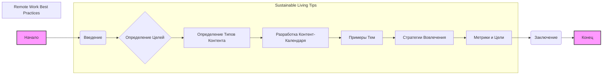

## Анализ кода "Content Strategy Ideas.None.md"

### 1. <алгоритм>

Данный код представляет собой документ, описывающий две стратегии контент-маркетинга:
1.  **Стратегия "Sustainable Living Tips" (Советы по устойчивому образу жизни)**
2.  **Стратегия "Remote Work Best Practices" (Лучшие практики удаленной работы)**

Обе стратегии имеют схожую структуру, которая может быть представлена в виде следующей блок-схемы:



**Примеры для каждого блока:**

*   **Введение:** Описание важности темы и целей контент-стратегии (например, "Введение: В современном мире устойчивость стала важным аспектом нашей повседневной жизни").
*   **Определение Целей**: "Цель: предоставить полезные советы и рекомендации для устойчивого образа жизни".
*   **Определение Типов Контента:** "Типы контента: Статьи, видео, посты в социальных сетях".
*   **Разработка Контент-Календаря:** "Контент-календарь: Публиковать одну статью в неделю, выпускать новое видео каждые две недели, делиться ежедневными советами в социальных сетях".
*   **Примеры Тем:** "Примеры тем: Как сократить отходы, обзор экологически чистых товаров, советы по созданию устойчивого дома".
*   **Стратегии Вовлечения:** "Стратегии вовлечения: Интерактивный контент, пользовательский контент, сотрудничество с влиятельными лицами".
*   **Метрики и Цели:** "Метрики: Трафик на сайте, вовлеченность в социальных сетях, рост аудитории. Цели: Увеличить трафик на сайте на 25% в течение первых шести месяцев".
*   **Заключение:** краткое суммирование стратегий и целей.

### 2. <mermaid>

```mermaid
graph LR
    subgraph Sustainable Living Tips Content Strategy
    A[Introduction: Sustainable Living] --> B(Content Types);
    B --> C(Content Calendar);
    C --> D(Example Topics);
    D --> E(Engagement Strategies);
    E --> F(Metrics and Goals);
    end

    subgraph Remote Work Best Practices Content Strategy
        G[Introduction: Remote Work] --> H(Content Types);
        H --> I(Content Calendar);
        I --> J(Example Topics);
        J --> K(Engagement Strategies);
        K --> L(Metrics and Goals);
    end
    
    
    style A fill:#f9f,stroke:#333,stroke-width:2px
    style G fill:#f9f,stroke:#333,stroke-width:2px

    
    linkStyle 0,1,2,3,4,5 stroke:#333,stroke-width:1px
    linkStyle 6,7,8,9,10 stroke:#333,stroke-width:1px
    
```

**Объяснение зависимостей:**

*   Диаграмма состоит из двух основных подграфов: "Sustainable Living Tips Content Strategy" и "Remote Work Best Practices Content Strategy".
*   Каждый подграф представляет собой последовательность действий контент-стратегии.
*   `Introduction` (Введение) является отправной точкой каждой стратегии.
*   `Content Types` (Типы контента) определяет форматы контента (статьи, видео, посты и т.д.).
*   `Content Calendar` (Контент-календарь) определяет график публикации контента.
*   `Example Topics` (Примеры тем) предлагает конкретные идеи для контента.
*   `Engagement Strategies` (Стратегии вовлечения) описывает методы взаимодействия с аудиторией.
*   `Metrics and Goals` (Метрики и цели) устанавливает критерии успеха и цели стратегии.
*   Связи между узлами (->) показывают последовательность этапов в каждой стратегии.

### 3. <объяснение>

**Общее объяснение:**

Этот файл представляет собой **план контент-стратегии** для двух различных направлений: устойчивого образа жизни и лучших практик удаленной работы. Структура каждой стратегии имеет четкую последовательность: введение, определение контента, календарь, примеры тем, стратегии вовлечения и метрики с целями.

**Детальное объяснение:**

**1. Импорты:**
   * Данный файл не содержит кода и импортов, так как это текстовый документ, а не программа. Следовательно, импорты не требуются.

**2. Классы:**
    * В данном файле нет классов, так как это не программный код, а текстовое описание стратегии.

**3. Функции:**
    * В данном файле нет функций, так как это не программный код, а текстовое описание стратегии.

**4. Переменные:**
    *  Файл оперирует текстовыми данными, а не переменными в программном смысле.
    * Например, "статьи", "видео", "еженедельно", "ежедневно", "трафик на сайт" являются текстовыми переменными, описывающими типы контента, частоту публикаций, метрики и т.д.

**Объяснения по разделам:**

*   **`Sustainable Living Tips`**:
    *   **Введение:** Обоснование важности устойчивого образа жизни и целей стратегии.
    *   **Типы контента:** Статьи, видео и посты в социальных сетях.
    *   **Контент-календарь:** Еженедельные статьи, би-недельные видео и ежедневные посты в соцсетях.
    *   **Примеры тем:** Сокращение отходов, экологичные продукты и устойчивый образ жизни.
    *   **Стратегии вовлечения:** Интерактивный контент, пользовательский контент и сотрудничество с инфлюенсерами.
    *   **Метрики и цели:** Трафик на сайт, вовлеченность в соцсетях, рост аудитории (цели - увеличение трафика на 25%, рост аудитории в соцсетях на 50%).

*   **`Remote Work Best Practices`**:
    *   **Введение:** Обоснование важности удаленной работы и целей стратегии.
    *   **Типы контента:** Блог-посты, вебинары и инфографика.
    *   **Контент-календарь:** Еженедельные блог-посты, ежемесячные вебинары и би-недельные инфографики.
    *   **Примеры тем:** Продуктивность, баланс работы и личной жизни, эффективная коммуникация.
    *   **Стратегии вовлечения:** Интерактивный контент, пользовательский контент и сотрудничество с инфлюенсерами.
    *   **Метрики и цели:** Трафик на сайт, вовлеченность в соцсетях, рост аудитории (цели - увеличение трафика на 30%, рост аудитории в соцсетях на 40%).

**Потенциальные ошибки и области для улучшения:**

1.  **Отсутствие конкретики в темах:** Необходимо более четко определить конкретные темы для контента, например, вместо "сокращение отходов" можно использовать "10 способов сократить использование пластика".
2.  **Недостаточно детализированный контент-календарь:** Стоит добавить конкретные даты публикаций, а не только периоды (еженедельно, ежемесячно).
3.  **Недостаточная проработка стратегий вовлечения:** Стоит более детально описать, как будет мотивироваться пользовательский контент и какого рода интерактив будет использоваться.
4.  **Метрики:** Стоит рассмотреть дополнительные метрики для отслеживания эффективности контента, например, количество конверсий или время просмотра видео.
5.  **Отсутствие персонализации:** Каждая стратегия должна быть адаптирована под конкретную аудиторию.

**Цепочка взаимосвязей с другими частями проекта:**

Этот документ является частью общей стратегии контент-маркетинга проекта. Он тесно связан с:

*   **Таргетингом аудитории**: Обе стратегии подразумевают понимание целевой аудитории (люди, заинтересованные в устойчивости и удаленной работе).
*   **Планированием контента:** Данный документ определяет структуру и темы контента, который будет создаваться.
*   **Маркетинговыми кампаниями:** Контент, созданный на основе этих стратегий, будет использоваться в маркетинговых кампаниях.
*   **Анализом результатов:** Метрики, определенные в документе, будут использоваться для оценки эффективности контента и корректировки стратегии.

В заключении, этот файл предоставляет подробный план контент-стратегий для двух разных тематик. Приведенные стратегии могут быть улучшены путем добавления большей детализации, конкретики и анализа целевой аудитории. Он выполняет функцию руководства для создания и распространения контента, а также оценки его эффективности.