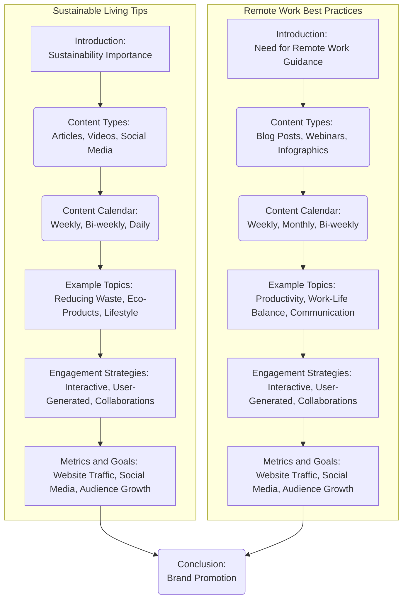

## АНАЛИЗ КОДА:

### <алгоритм>
1. **Начало**: Документ представляет собой план контент-стратегии, включающий идеи для двух основных тем: "Советы по устойчивому образу жизни" и "Лучшие практики удаленной работы".
2. **Раздел "Советы по устойчивому образу жизни"**:
    - **Введение**: Описание важности устойчивого образа жизни и целей контент-стратегии.
    - **Типы контента**: Определение форматов контента (статьи, видео, посты в соцсетях).
    - **Контент-календарь**: Планирование публикации контента (еженедельные статьи, двухнедельные видео, ежедневные посты).
    - **Примеры тем**: Список конкретных тем для контента (сокращение отходов, экологически чистые продукты, устойчивый образ жизни).
    - **Стратегии вовлечения**: Планы для увеличения взаимодействия (интерактивный контент, пользовательский контент, сотрудничество с инфлюенсерами).
    - **Метрики и цели**: Определение показателей успеха (трафик сайта, вовлеченность в соцсетях, рост аудитории) и целевых значений.
3. **Раздел "Лучшие практики удаленной работы"**:
    - **Введение**: Описание необходимости руководства по удаленной работе и целей контент-стратегии.
    - **Типы контента**: Определение форматов контента (блог-посты, вебинары, инфографика).
    - **Контент-календарь**: Планирование публикации контента (еженедельные посты, ежемесячные вебинары, двухнедельные инфографики).
    - **Примеры тем**: Список конкретных тем для контента (советы по продуктивности, баланс работы и личной жизни, эффективная коммуникация).
    - **Стратегии вовлечения**: Планы для увеличения взаимодействия (интерактивный контент, пользовательский контент, сотрудничество с инфлюенсерами).
    - **Метрики и цели**: Определение показателей успеха (трафик сайта, вовлеченность в соцсетях, рост аудитории) и целевых значений.
4. **Заключение**: Общее заключение о важности контент-стратегии для достижения целей бренда.
5. **Конец**: Конец документа.
Пример потока данных:
   - Идеи контента --> Планирование (контент календарь) -->  Производство контента (статьи, видео, инфографики) --> Публикация --> Вовлечение аудитории --> Измерение метрик --> Оценка эффективности

### <mermaid>

**Объяснение `mermaid` диаграммы:**
- Диаграмма разделена на две подгруппы, представляющие две основные темы контент-стратегии: "Sustainable Living Tips" (Советы по устойчивому образу жизни) и "Remote Work Best Practices" (Лучшие практики удаленной работы).
- Каждая подгруппа начинается с узла **Introduction**, который описывает контекст и цели раздела.
- За узлом **Introduction** следует узел **Content Types**, определяющий типы контента, которые будут использоваться (например, статьи, видео, блоги, вебинары и т.д.).
-  Узел **Content Calendar** описывает план публикаций по времени.
- Затем идет узел **Example Topics** который дает примеры тем для контента в рамках раздела.
- После **Example Topics** следует узел **Engagement Strategies**, описывающий стратегии вовлечения аудитории.
- **Metrics and Goals** определяет цели и метрики для измерения эффективности контент-стратегии.
- Оба раздела заканчиваются узлом **Conclusion**, связывающим оба раздела в общее заключение о стратегии.
- Стрелки показывают поток от ввода идеи к заключению.

### <объяснение>
**Общее описание**:
Этот документ представляет собой подробный план контент-стратегии, охватывающей две основные темы: "Советы по устойчивому образу жизни" и "Лучшие практики удаленной работы". Каждая тема тщательно продумана и включает разделы, описывающие цели, типы контента, график публикаций, примеры тем, стратегии вовлечения и метрики успеха.

**Раздел "Советы по устойчивому образу жизни"**:
- **Введение**: Подчеркивает важность устойчивого образа жизни и необходимость предоставления советов по экологически дружественному поведению.
- **Типы контента**: Сочетание статей (для глубокого погружения в тему), видео (для наглядных демонстраций) и постов в социальных сетях (для быстрого распространения и вовлечения).
- **Контент-календарь**: Обеспечивает последовательную публикацию контента, что является ключевым для поддержания интереса аудитории.
- **Примеры тем**: Охватывают ключевые аспекты устойчивого образа жизни, от сокращения отходов до экологически чистых продуктов и выбора образа жизни.
- **Стратегии вовлечения**: Направлены на повышение взаимодействия с аудиторией через интерактивный контент, пользовательский контент и сотрудничество с инфлюенсерами.
- **Метрики и цели**: Установка четких целей (рост трафика, вовлеченности в соцсетях, рост аудитории) и метрик для измерения успеха стратегии.

**Раздел "Лучшие практики удаленной работы"**:
- **Введение**: Подчеркивает актуальность удаленной работы и необходимость руководства по ее эффективной организации.
- **Типы контента**: Использование блог-постов (для детальных инструкций), вебинаров (для глубоких обсуждений с экспертами) и инфографики (для визуального представления информации).
- **Контент-календарь**: Гарантирует регулярный поток контента, что помогает поддерживать интерес аудитории.
- **Примеры тем**: Касаются важных аспектов удаленной работы, таких как продуктивность, баланс между работой и личной жизнью, а также эффективная коммуникация.
- **Стратегии вовлечения**: Аналогично предыдущему разделу, направлены на повышение взаимодействия через интерактив, пользовательский контент и коллаборации.
- **Метрики и цели**: Установка конкретных целей и метрик для измерения успеха, аналогичных целям в разделе "Советы по устойчивому образу жизни".

**Взаимосвязи с другими частями проекта**:
Этот документ выступает в качестве дорожной карты для создания контента. Он напрямую связан с отделами маркетинга и контент-производства.

**Потенциальные ошибки и области для улучшения**:
- **Недостаток конкретики**: В некоторых местах, например, в стратегиях вовлечения, можно добавить более конкретные примеры.
- **Отсутствие анализа конкурентов**: Стоит провести анализ конкурентов для определения уникальных возможностей и ниш.
- **Гибкость**: Необходима возможность адаптации контент-стратегии под изменяющиеся условия и новые тренды.

**Заключение**:
Документ представляет собой хорошо структурированную контент-стратегию, которая может быть использована для создания ценного контента, привлечения целевой аудитории и повышения узнаваемости бренда. Однако, он требует доработки в некоторых областях, чтобы стать еще более эффективным.