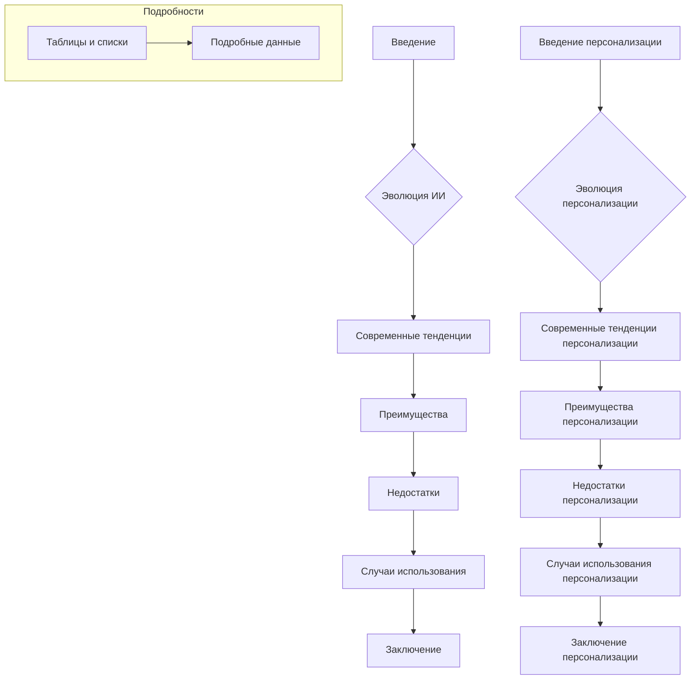

# Анализ кода: "Тенденции в цифровом маркетинге"

**1. <input code>**

```
# Impact of AI on Digital Marketing Strategies

## Introduction

# ... (Текст статьи)

# Importance of Personalized Content

## Introduction

# ... (Текст статьи)

## Tables and Lists

# ... (Таблицы и списки)
```

**2. <algorithm>**

Код представляет собой текстовый документ, а не программный код.  Алгоритм работы заключается в описании влияния ИИ на стратегии цифрового маркетинга и важности персонализированного контента.  Логика состоит в последовательном представлении информации:

* **Введение** -  описывает тему.
* **Эволюция ИИ в цифровом маркетинге** -  рассматривает историю применения ИИ.
* **Современные тенденции** - выявляет текущие способы применения ИИ.
* **Преимущества** -  перечисляет выгоды от использования ИИ.
* **Недостатки** -  обсуждает проблемы, связанные с внедрением ИИ.
* **Случаи использования** -  приводит примеры успешного применения ИИ и персонализированного контента.
* **Заключение** -  подводит итоги и делает выводы.

В каждом разделе есть подзаголовки, структурирующие текст и облегчающие восприятие.  Данные не перемещаются между функциями или методами, так как это не программный код.  Информационный поток — это последовательное изложение идей.


**3. <mermaid>**



Диаграмма отображает последовательное изложение идей, структуру статьи.  Зависимостей между функциями или методами нет.  Все элементы являются частями текста, описывающего тему. Подключаемые зависимости - это структура текста.

**4. <explanation>**

* **Импорты:**  Нет импортов, так как это текстовый документ.  
* **Классы:** Нет классов.  Это текстовый документ, а не программный код.
* **Функции:** Нет функций.
* **Переменные:** Нет переменных.
* **Возможные ошибки/улучшения:**  Статья представляет собой хорошо структурированный обзор, но для большей академической строгости можно было бы добавить больше ссылок на исследования, конкретные примеры успешного использования ИИ в маркетинге, а также более глубокий анализ конкретных алгоритмов и технологий.  Не хватает технических деталей о том, как ИИ используется в маркетинге.


**Цепочка взаимосвязей с другими частями проекта:**

Нет видимых связей с другими частями проекта, так как документ — это автономная статья о цифровом маркетинге.  Он скорее описывает общую тенденцию, нежели реализует её на конкретном примере.