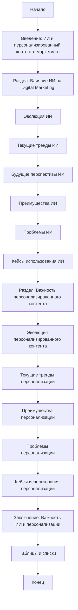

## Анализ кода

### <алгоритм>
1. **Начало:** Текст начинается с вводного абзаца, определяющего контекст о влиянии искусственного интеллекта (ИИ) на стратегии цифрового маркетинга и важности персонализированного контента.
   * **Пример:** "Artificial Intelligence (AI) is revolutionizing the digital marketing landscape." и "In today's digital age, personalized content is key to engaging audiences."
2. **Раздел "Влияние ИИ на стратегии цифрового маркетинга":**
   * **Эволюция ИИ в цифровом маркетинге:** Рассматривается развитие ИИ в маркетинге от раннего использования простых алгоритмов до современных сложных решений.
     * **Пример:** "The early adoption of AI... was marked by the use of basic algorithms" и "Today, AI is being used in a multitude of ways..."
   * **Текущие тренды:** Описываются основные тенденции использования ИИ в маркетинге, такие как чат-боты, предиктивная аналитика и создание контента.
     * **Пример:** "Chatbots and Virtual Assistants", "Predictive Analytics", "Content Creation".
   * **Будущие перспективы:** Обсуждается дальнейшее развитие ИИ и его влияние на маркетинг.
     * **Пример:** "The future of AI in digital marketing looks promising."
   * **Преимущества ИИ в цифровом маркетинге:** Подробно рассматриваются преимущества использования ИИ, такие как повышение эффективности, улучшенная персонализация, аналитика и экономия средств.
      * **Пример:** "Enhanced Efficiency", "Improved Personalization", "Better Insights", "Cost Savings".
   * **Проблемы ИИ в цифровом маркетинге:** Обсуждаются проблемы и трудности внедрения ИИ, включая конфиденциальность данных, высокие затраты и недостаток понимания.
     * **Пример:** "Data Privacy Concerns", "High Costs", "Lack of Understanding".
   * **Кейсы:** Приводятся примеры успешного использования ИИ в маркетинге на практике.
      * **Пример:** "Chatbots in Customer Service", "Predictive Analytics in Ad Targeting", "AI in Content Creation".
3. **Раздел "Важность персонализированного контента":**
   * **Эволюция персонализированного контента:** Рассматривается эволюция персонализации от базовой сегментации до современных технологий.
     * **Пример:** "In the early days of digital marketing, personalization was limited to basic segmentation." и "With advancements in technology, marketers are now able to deliver a higher level of personalization."
   * **Текущие тренды:** Описываются текущие тренды в персонализации контента, такие как динамический контент, персонализированные электронные письма и реклама.
       * **Пример:** "Dynamic Content", "Personalized Emails", "Personalized Ads".
   * **Преимущества персонализированного контента:** Обсуждаются преимущества персонализации, включая удовлетворенность клиентов, увеличение конверсии, лояльность и ROI.
       * **Пример:** "Improved Customer Satisfaction", "Increased Conversion Rates", "Enhanced Customer Loyalty", "Better ROI".
   * **Проблемы персонализированного контента:** Обсуждаются проблемы, связанные с персонализацией, такие как конфиденциальность данных, высокие затраты и недостаток понимания.
      * **Пример:** "Data Privacy Concerns", "High Costs", "Lack of Understanding".
   * **Кейсы:** Приводятся примеры успешного использования персонализированного контента.
      * **Пример:** "Personalized Emails", "Dynamic Content", "Personalized Ads".
4. **Заключение:** Завершающие абзацы, подчеркивающие важность ИИ и персонализированного контента в современном маркетинге.
   * **Пример:** "AI is revolutionizing the digital marketing landscape." и "In today's digital age, personalized content is key to engaging audiences."
5. **Таблицы и списки:** Приведены таблицы с преимуществами и проблемами ИИ, а также списки текущих трендов.
   * **Пример:** "Table 1: Benefits of AI in Digital Marketing", "List 1: Current Trends in AI in Digital Marketing".
   
### <mermaid>

**Объяснение:**
- `flowchart TD`: Определяет тип диаграммы как блок-схему, отображающую поток данных сверху вниз.
- `Start`, `End`: Начало и конец блок-схемы.
- `Intro`, `AI_Section`, `Personalized_Content_Section`, `Conclusion`: Основные разделы документа, представляющие собой блоки верхнего уровня.
- `AI_Evolution`, `AI_Trends`, `AI_Future`, `AI_Benefits`, `AI_Challenges`, `AI_Cases`, `PC_Evolution`, `PC_Trends`, `PC_Benefits`, `PC_Challenges`, `PC_Cases`, `Tables_Lists`: Подразделы и дополнительные элементы внутри основных разделов.
- `-->`: Стрелки, показывающие последовательность потока данных от одного блока к другому.

### <объяснение>
**Общее:**
   - **Тип кода:** Документ в формате Markdown, описывающий влияние ИИ и важность персонализированного контента в цифровом маркетинге. Это не исполняемый код, а текстовое описание концепций и примеров.
   - **Назначение:** Документ предназначен для ознакомления с текущими трендами и вызовами в использовании ИИ и персонализированного контента в маркетинге.

**Импорты:**
    - В данном коде нет явных импортов, так как это текст, а не исполняемый код.

**Классы:**
    - В данном коде нет классов, поскольку это Markdown-документ.

**Функции:**
    - В данном коде нет функций, поскольку это Markdown-документ.

**Переменные:**
    - В данном коде нет переменных в классическом понимании программирования. Однако, используются заголовки разделов и подразделов, а также текстовые описания.

**Детали:**

-   **Структура документа:** Документ четко структурирован на разделы и подразделы, что облегчает понимание темы. Используются заголовки разных уровней для логической организации текста.
-   **Использование примеров:** Приводятся конкретные примеры использования ИИ и персонализированного контента, что делает документ более наглядным.
-   **Анализ преимуществ и недостатков:** Документ объективно рассматривает как преимущества, так и недостатки внедрения ИИ и персонализированного контента в маркетинге, что дает сбалансированное представление о теме.
-   **Кейсы:** Приводятся реальные кейсы, демонстрирующие практическое применение рассматриваемых технологий.
-   **Таблицы и списки:** Используются для структурирования информации и облегчения восприятия.

**Потенциальные ошибки или области для улучшения:**
-   **Отсутствие графических представлений:** Документ был бы более наглядным, если бы содержал графики или диаграммы для иллюстрации ключевых моментов.
-   **Детализация кейсов:** Некоторые кейсы можно было бы рассмотреть более подробно, с указанием конкретных метрик и результатов.
-  **Сложность для новичков:** Некоторые термины могут быть сложными для людей, не знакомых с маркетингом или ИИ. Возможно, стоило бы добавить пояснения для таких терминов.

**Взаимосвязь с другими частями проекта:**
    - Поскольку этот документ является частью примера, его взаимосвязь с другими частями проекта заключается в предоставлении контекста и объяснения использования инструментов ИИ и персонализации в маркетинге. Документ служит теоретической базой для других примеров и реализаций, которые могут быть разработаны в рамках проекта.

**Заключение:**
Документ представляет собой детальный обзор влияния ИИ и персонализированного контента на цифровой маркетинг, с четкой структурой, использованием примеров и анализом как преимуществ, так и проблем.