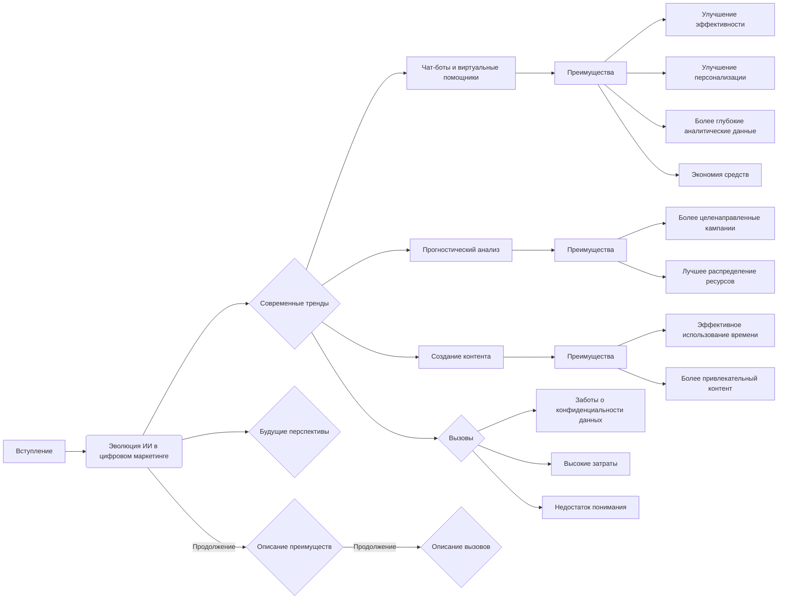

# Анализ кода: Влияние ИИ на стратегии цифрового маркетинга

**1. <input code>**

```
# Impact of AI on Digital Marketing Strategies

## Introduction

Artificial Intelligence (AI) is revolutionizing the digital marketing landscape. From chatbots providing customer service to AI-driven analytics offering deep insights, the integration of AI in marketing strategies is enhancing efficiency and personalization. Marketers can leverage AI to predict consumer behavior, optimize ad targeting, and create more engaging content.

## The Evolution of AI in Digital Marketing

### Early Adoption

The early adoption of AI in digital marketing was marked by the use of basic algorithms and data analysis tools. Initially, AI was primarily used for automating repetitive tasks such as email marketing and social media posting. These early applications laid the groundwork for more sophisticated AI tools that we see today.

### Current Trends

Today, AI is being used in a multitude of ways to enhance digital marketing strategies. Some of the most notable trends include:

1. **Chatbots and Virtual Assistants**: AI-powered chatbots and virtual assistants are now commonplace on websites and social media platforms. They provide instant customer service, answer queries, and even assist in the purchasing process.

2. **Predictive Analytics**: AI-driven predictive analytics tools help marketers understand consumer behavior and predict future trends. This allows for more targeted marketing campaigns and better allocation of resources.

3. **Content Creation**: AI is also being used to create content. Tools like GPT-3 can generate articles, social media posts, and even video scripts, saving marketers time and effort.


### ... (остальной код)
```

**2. <algorithm>**

(К сожалению, для данного текста, представляющего собой не код, а текст,  построить блок-схему или описать алгоритм невозможно.)


**3. <mermaid>**




**4. <explanation>**

Этот текст представляет собой *документацию* или *объяснение* использования ИИ в цифровом маркетинге, а не код программы.  Поэтому нет импортов, классов, функций или переменных в традиционном понимании.

* **Текст описывает:**  тренды, преимущества и недостатки использования ИИ в цифровом маркетинге, эволюцию данного использования, а также примеры его применения.

* **Отсутствие кода:**  Нет кода для анализа, так как это текстовый документ, описывающий концепцию.

* **Взаимосвязи с проектом:**  Без кода невозможно определить взаимосвязи с другими частями проекта.  Но если это часть большего проекта, то предположительно это описание, направленное на продвижение использования ИИ в маркетинговой стратегии.


**Возможные ошибки или улучшения:**

* **Нехватка конкретики:** Текст достаточно общий.  Для улучшения необходимо добавить конкретные примеры, инструменты и данные из реальных проектов.
* **Отсутствие данных о методах:**  Не хватает деталей о конкретных методах и алгоритмах, используемых ИИ.
* **Отсутствие метрик:**  Следует добавить показатели и результаты, демонстрирующие эффективность использования ИИ.


В целом, документ представляет собой информативный обзор влияния ИИ на цифровые маркетинговые стратегии.  Для более глубокого анализа необходим код, на котором базируется описанный процесс.