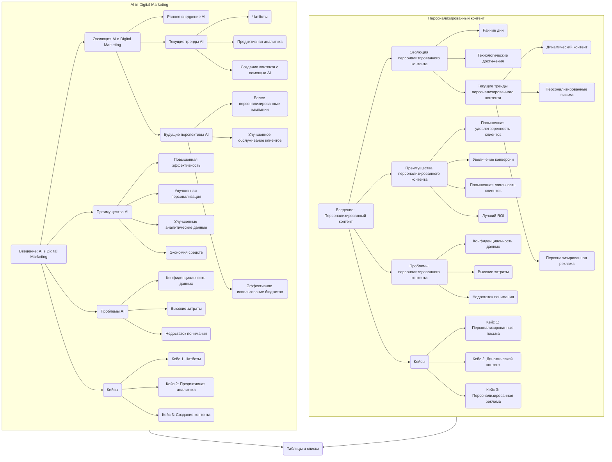

# Анализ документа "Current Trends in Digital Marketing"

## 1. <алгоритм>

Этот документ представляет собой статью, описывающую текущие тенденции в цифровом маркетинге, связанные с применением искусственного интеллекта (AI) и персонализированного контента. Алгоритмически документ можно представить как последовательность разделов, каждый из которых посвящен определенной теме:

1.  **Введение:**
    *   Представление темы: Введение в использование AI и важность персонализированного контента.
    *   Пример: AI улучшает эффективность и персонализацию маркетинга.
2.  **Эволюция AI в Digital Marketing:**
    *   **Раннее принятие:** Описание начального использования AI для автоматизации задач.
        *   Пример: Автоматизация email-маркетинга и публикации в соцсетях.
    *   **Текущие тренды:** Описание текущих тенденций использования AI.
        *   Пример: Использование чат-ботов, предиктивной аналитики и AI для создания контента.
    *   **Перспективы:** Описание будущего AI в digital marketing.
        *   Пример: Дальнейшее развитие машинного обучения и обработки естественного языка.
3.  **Преимущества AI в Digital Marketing:**
    *   **Повышенная эффективность:** Описание, как AI автоматизирует задачи и повышает эффективность.
        *   Пример: AI автоматизирует email-маркетинг.
    *   **Улучшенная персонализация:** Описание, как AI позволяет персонализировать контент.
        *   Пример: Анализ потребительских данных для создания персонализированного контента.
    *   **Улучшенные аналитические данные:** Описание, как AI предоставляет более глубокое понимание данных.
        *   Пример: Анализ взаимодействий в соцсетях.
    *   **Экономия средств:** Описание, как AI помогает экономить средства за счет автоматизации и оптимизации.
        *   Пример: Оптимизация таргетинга рекламы.
4.  **Проблемы AI в Digital Marketing:**
    *   **Конфиденциальность данных:** Описание проблем, связанных с конфиденциальностью данных.
        *   Пример: Соблюдение норм конфиденциальности.
    *   **Высокие затраты:** Описание высоких затрат на внедрение AI.
        *   Пример: Первоначальные инвестиции в AI.
    *   **Недостаток понимания:** Описание проблемы недостаточного понимания AI маркетологами.
        *   Пример: Отсутствие понимания, как эффективно применять AI.
5.  **Кейсы:**
    *   **Кейс 1:** Использование чат-ботов для обслуживания клиентов.
        *   Пример: Внедрение чат-ботов на сайте для обработки запросов.
    *   **Кейс 2:** Применение предиктивной аналитики в таргетинге рекламы.
        *   Пример: Оптимизация размещения рекламы на основе анализа данных.
    *   **Кейс 3:** Использование AI для создания контента.
        *   Пример: Генерация статей и постов в соцсетях с помощью AI.
6.  **Заключение:**
    *   Итог: Заключение о важности AI в digital marketing.
    *   Пример: AI повышает эффективность и персонализацию, но требует решения ряда проблем.
7.  **Важность персонализированного контента:**
    *   **Введение:** Введение в тему персонализированного контента.
        *   Пример: Важность персонализированного контента для привлечения аудитории.
    *   **Эволюция персонализированного контента:**
        *   **Ранние дни:** Описание начальной сегментации аудитории.
            *   Пример: Сегментация по демографии.
        *   **Технологические достижения:** Описание развития технологий персонализации.
            *   Пример: Использование инструментов анализа данных.
        *   **Текущие тренды:** Описание текущих трендов персонализированного контента.
            *   Пример: Динамический контент, персонализированные письма и реклама.
    *   **Преимущества персонализированного контента:**
        *   **Повышенная удовлетворенность клиентов:** Описание, как персонализация улучшает удовлетворенность клиентов.
            *   Пример: Понимание потребностей и предпочтений клиентов.
        *   **Увеличение конверсии:** Описание, как персонализация увеличивает конверсию.
            *   Пример: Персонализированные рекомендации продуктов.
        *   **Повышение лояльности:** Описание, как персонализация способствует лояльности.
            *   Пример: Создание связи между брендом и потребителем.
        *   **Лучший ROI:** Описание, как персонализация улучшает ROI.
            *   Пример: Более эффективное использование ресурсов.
    *   **Проблемы персонализированного контента:**
        *   **Конфиденциальность данных:** Описание проблем, связанных с конфиденциальностью данных.
            *   Пример: Соблюдение норм конфиденциальности.
        *   **Высокие затраты:** Описание высоких затрат на создание персонализированного контента.
            *   Пример: Инвестиции в инструменты анализа и AI.
        *   **Недостаток понимания:** Описание проблемы недостаточного понимания персонализации маркетологами.
            *   Пример: Отсутствие понимания, как использовать данные для персонализации.
    *   **Кейсы:**
        *   **Кейс 1:** Персонализированные письма.
            *   Пример: Персонализированные рассылки с рекомендациями продуктов.
        *   **Кейс 2:** Динамический контент.
            *   Пример: Разное отображение контента на сайте в зависимости от поведения пользователя.
        *   **Кейс 3:** Персонализированная реклама.
            *   Пример: Таргетирование рекламы в соцсетях на основе интересов пользователей.
    *   **Заключение:**
        *   Итог: Заключение о важности персонализированного контента.
        *   Пример: Персонализированный контент повышает удовлетворенность клиентов и конверсию, но требует решения ряда проблем.
8.  **Таблицы и списки:**
    *   **Таблица 1:** Преимущества AI в Digital Marketing.
    *   **Таблица 2:** Проблемы AI в Digital Marketing.
    *   **Список 1:** Текущие тренды AI в Digital Marketing.
    *   **Список 2:** Текущие тренды в персонализированном контенте.

## 2. <mermaid>

**Анализ зависимостей:**

Диаграмма состоит из двух основных подграфов: "AI in Digital Marketing" и "Personalized Content". Каждый из этих подграфов содержит разделы, представляющие собой логические части анализа.

*   **AI in Digital Marketing:**
    *   `Introduction_AI`: Введение в использование AI в цифровом маркетинге.
    *   `Evolution_AI`: Эволюция AI в цифровом маркетинге, которая включает раннее внедрение (`Early_Adoption`), текущие тренды (`Current_Trends_AI`) и будущие перспективы (`Future_Prospects`). Текущие тренды детализируются с помощью `Chatbots`, `Predictive_Analytics` и `Content_Creation_AI`. Будущие перспективы детализируются как `More_Personalized`, `Improved_Customer_Service` и `Efficient_Budgets`.
    *   `Benefits_AI`: Преимущества AI, включая `Enhanced_Efficiency`, `Improved_Personalization`, `Better_Insights` и `Cost_Savings`.
    *   `Challenges_AI`: Проблемы использования AI, включая `Data_Privacy`, `High_Costs` и `Lack_of_Understanding`.
    *   `Case_Studies_AI`: Кейсы использования AI, включая `Case1_Chatbots`, `Case2_Predictive` и `Case3_Content`.
*   **Personalized Content:**
    *   `Introduction_PC`: Введение в важность персонализированного контента.
    *   `Evolution_PC`: Эволюция персонализированного контента, которая включает ранние дни (`Early_Days_PC`), технологические достижения (`Technological_Advancements`) и текущие тренды (`Current_Trends_PC`). Текущие тренды детализируются с помощью `Dynamic_Content`, `Personalized_Emails` и `Personalized_Ads`.
    *   `Benefits_PC`: Преимущества персонализированного контента, включая `Improved_Customer_Satisfaction`, `Increased_Conversion_Rates`, `Enhanced_Customer_Loyalty` и `Better_ROI`.
    *   `Challenges_PC`: Проблемы персонализированного контента, включая `Data_Privacy_PC`, `High_Costs_PC` и `Lack_of_Understanding_PC`.
    *   `Case_Studies_PC`: Кейсы использования персонализированного контента, включая `Case1_Emails`, `Case2_Dynamic` и `Case3_Ads`.

Оба подграфа связаны с блоком `Tables_Lists`, в котором находятся таблицы и списки из документа.

**Осмысленность переменных:**

Все имена переменных выбраны осмысленно и описательно, чтобы отражать содержание и роль каждого блока в документе. Это позволяет легко понять структуру документа и взаимосвязи между различными разделами.

## 3. <объяснение>

**Обзор:**

Представленный документ является аналитической статьей, рассматривающей влияние искусственного интеллекта (AI) и персонализированного контента на стратегии цифрового маркетинга. Он разделен на несколько логических частей, каждая из которых детально рассматривает определенный аспект. Статья начинается с введения в AI и персонализацию контента, затем углубляется в эволюцию, преимущества, проблемы, кейсы и заканчивается заключением. Также рассмотрены проблемы связанные с конфиденциальностью данных, высокими затратами и недостаточным пониманием технологий. В конце документа представлены таблицы и списки, суммирующие основные моменты.

**Структура:**

Документ структурирован таким образом, чтобы читатель мог последовательно ознакомиться с концепциями и их влиянием на цифровой маркетинг. Он содержит следующие разделы:

1.  **Введение:**
    *   Краткое представление темы: AI и персонализация контента являются ключевыми факторами в современном цифровом маркетинге.
    *   Утверждение: Использование AI и персонализированного контента повышает эффективность и персонализацию маркетинга.

2.  **Эволюция AI в Digital Marketing:**
    *   **Раннее принятие:**
        *   Объяснение: В начале AI использовался для автоматизации рутинных задач, таких как email-маркетинг и публикация в соцсетях.
    *   **Текущие тренды:**
        *   Объяснение: AI используется для чат-ботов, предиктивной аналитики и создания контента.
        *   Примеры: Чат-боты для поддержки клиентов, AI для прогнозирования поведения потребителей, AI для генерации контента.
    *   **Перспективы:**
        *   Объяснение: AI будет развиваться в направлении большей персонализации, улучшения обслуживания клиентов и более эффективного управления бюджетами.

3.  **Преимущества AI в Digital Marketing:**
    *   **Повышенная эффективность:**
        *   Объяснение: Автоматизация задач позволяет маркетологам сосредоточиться на стратегических задачах.
        *   Пример: Автоматизация email-рассылок и таргетирования рекламы.
    *   **Улучшенная персонализация:**
        *   Объяснение: AI позволяет анализировать потребительские данные и создавать персонализированный контент.
    *   **Улучшенные аналитические данные:**
        *   Объяснение: AI предоставляет глубокое понимание поведения потребителей.
        *   Пример: Анализ взаимодействий в соцсетях.
    *   **Экономия средств:**
        *   Объяснение: AI позволяет оптимизировать затраты за счет автоматизации и улучшения таргетинга.
        *   Пример: Оптимизация расходов на рекламу.

4.  **Проблемы AI в Digital Marketing:**
    *   **Конфиденциальность данных:**
        *   Объяснение: Проблемы конфиденциальности данных пользователей при использовании AI.
    *   **Высокие затраты:**
        *   Объяснение: Высокие начальные затраты на внедрение AI-инструментов.
    *   **Недостаток понимания:**
        *   Объяснение: Маркетологи не всегда понимают принципы работы AI и не знают, как его эффективно использовать.

5.  **Кейсы:**
    *   **Кейс 1: Чатботы в Customer Service:**
        *   Описание: Успешное внедрение чат-ботов для обслуживания клиентов.
    *   **Кейс 2: Предиктивная аналитика в Ad Targeting:**
        *   Описание: Успешное использование AI для оптимизации таргетинга рекламы.
    *   **Кейс 3: AI в Content Creation:**
        *   Описание: Использование AI для создания контента, такого как статьи и посты.

6.  **Заключение (AI в Digital Marketing):**
    *   Итог: AI является мощным инструментом для повышения эффективности и персонализации, несмотря на проблемы.

7.  **Важность персонализированного контента:**
    *   **Введение:**
        *   Объяснение: Персонализированный контент является ключом к вовлечению аудитории.
    *   **Эволюция персонализированного контента:**
        *   **Ранние дни:**
            *   Объяснение: Персонализация начиналась с простой сегментации аудитории по демографическим признакам.
        *   **Технологические достижения:**
            *   Объяснение: Современные технологии позволяют создавать более персонализированный контент, используя данные и AI.
        *   **Текущие тренды:**
            *   Объяснение: Использование динамического контента, персонализированных писем и рекламы.
    *   **Преимущества персонализированного контента:**
        *   **Повышенная удовлетворенность клиентов:**
            *   Объяснение: Клиенты более удовлетворены, когда получают контент, соответствующий их предпочтениям.
        *   **Увеличение конверсии:**
            *   Объяснение: Персонализированный контент повышает конверсию.
        *   **Повышение лояльности:**
            *   Объяснение: Персонализация способствует лояльности клиентов.
        *   **Лучший ROI:**
            *   Объяснение: Персонализация приводит к более эффективному использованию ресурсов.
    *   **Проблемы персонализированного контента:**
        *   **Конфиденциальность данных:**
            *   Объяснение: Те же проблемы конфиденциальности, что и при использовании AI.
        *   **Высокие затраты:**
            *   Объяснение: Создание персонализированного контента требует инвестиций.
        *   **Недостаток понимания:**
            *   Объяснение: Маркетологи не всегда понимают, как правильно использовать инструменты персонализации.
    *   **Кейсы:**
        *   **Кейс 1: Персонализированные письма:**
            *   Описание: Успешное использование персонализированных email-рассылок.
        *   **Кейс 2: Динамический контент:**
            *   Описание: Успешное использование динамического контента на веб-сайтах.
        *   **Кейс 3: Персонализированная реклама:**
            *   Описание: Успешное использование персонализированной рекламы в соцсетях.

8. **Заключение (Персонализированный контент):**
     *   Итог: Персонализация важна, но требует решения ряда проблем.

9.  **Таблицы и списки:**
    *   **Таблица 1:** Преимущества AI в Digital Marketing
    *   **Таблица 2:** Проблемы AI в Digital Marketing
    *   **Список 1:** Текущие тренды в AI
    *   **Список 2:** Текущие тренды в персонализированном контенте

**Потенциальные ошибки и области для улучшения:**

*   **Недостаточная детализация:** Некоторые кейсы могут быть более детализированы, включая конкретные результаты и ROI.
*   **Общие проблемы:** В разделе проблем можно было бы добавить больше практических рекомендаций по их решению.
*   **Отсутствие глубокого анализа:** Некоторые утверждения могли бы быть подкреплены более глубокими исследованиями и статистикой.
*   **Общая структура:** Можно было бы более четко разделить блоки по тематикам, добавив больше подзаголовков.

**Взаимосвязи с другими частями проекта:**

Этот документ является аналитическим обзором и не имеет прямых связей с конкретными кодовыми компонентами. Он может быть использован в качестве теоретического обоснования для разработки маркетинговых стратегий или AI-инструментов.

**Заключение:**

Документ представляет собой хороший обзор текущих трендов в цифровом маркетинге, связанных с применением AI и персонализированного контента. Он охватывает основные концепции, преимущества и проблемы, но может быть улучшен за счет большей детализации и анализа.