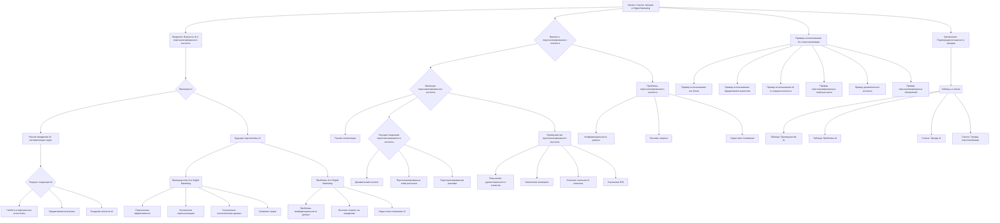

## Анализ кода

### <алгоритм>
1. **Введение**:
   - Представлен текст о влиянии искусственного интеллекта (ИИ) и персонализированного контента на цифровой маркетинг.
   - Описываются общие тенденции и важность этих технологий.

2. **Эволюция ИИ в цифровом маркетинге**:
   - **Раннее внедрение**: ИИ использовался для автоматизации простых задач, таких как email-рассылки и посты в социальных сетях.
   - **Текущие тенденции**:
     - **Чат-боты и виртуальные ассистенты**: Используются для мгновенной поддержки клиентов.
     - **Предиктивная аналитика**: Помогает прогнозировать поведение потребителей и оптимизировать маркетинговые кампании.
     - **Создание контента**: ИИ используется для генерации статей, постов в социальных сетях и видеосценариев.
   - **Будущие перспективы**: Ожидается повышение уровня персонализации и эффективности маркетинговых кампаний благодаря развитию машинного обучения.

3. **Преимущества ИИ в цифровом маркетинге**:
   - **Повышенная эффективность**: Автоматизация рутинных задач, позволяющая маркетологам сосредоточиться на стратегиях.
     - *Пример*: Автоматизация рассылки электронных писем и публикации в соцсетях.
   - **Улучшенная персонализация**: Анализ данных о потребителях для создания персонализированного контента.
     - *Пример*: Создание персональных рекламных объявлений, учитывающих интересы пользователей.
   - **Улучшенные аналитические данные**: Глубокий анализ потребительского поведения для оптимизации стратегий.
     - *Пример*: Анализ взаимодействий в социальных сетях для понимания предпочтений аудитории.
   - **Снижение затрат**: Оптимизация нацеливания рекламы и повышение эффективности, приводящие к снижению затрат.
      - *Пример*: Улучшенное таргетирование рекламы позволяет снизить стоимость привлечения новых клиентов.

4. **Проблемы ИИ в цифровом маркетинге**:
   - **Проблемы конфиденциальности данных**: Опасения по поводу использования и защиты данных потребителей.
   - **Высокие затраты**: Внедрение ИИ может потребовать значительных начальных инвестиций.
   - **Недостаточное понимание**: Отсутствие знаний об ИИ среди маркетологов.

5. **Примеры использования**:
   - **Чат-боты в обслуживании клиентов**: Электронная торговая компания внедрила чат-ботов для обслуживания клиентов, что привело к увеличению удовлетворенности клиентов и снижению затрат на поддержку.
   - **Предиктивная аналитика в таргетинге рекламы**: Глобальный бренд моды использовал аналитику для оптимизации таргетинга, что повысило конверсию и снизило расходы на рекламу.
   - **ИИ в создании контента**: Агентство использовало ИИ для создания контента для клиентов, что сэкономило время и повысило вовлеченность.

6. **Важность персонализированного контента**:
    - **Введение**: Подчеркивается важность персонализированного контента для вовлечения аудитории.
    - **Эволюция**: Рассматривается от простой сегментации до современных технологий.
    - **Текущие тенденции**:
        - **Динамический контент**: Содержание, меняющееся в зависимости от поведения пользователя.
        - **Персонализированные электронные письма**: Адаптация контента к предпочтениям получателя.
        - **Персонализированные объявления**: Таргетирование рекламы на основе интересов пользователя.
    - **Преимущества**:
        - **Повышение удовлетворенности клиентов**: Учет предпочтений повышает удовлетворенность.
        - **Увеличение конверсии**: Персонализированный контент повышает продажи.
        - **Усиление лояльности клиентов**: Персональный подход укрепляет связь с брендом.
        - **Улучшение ROI**: Более эффективное использование ресурсов приводит к лучшему возврату инвестиций.
    - **Проблемы**:
       - **Конфиденциальность данных**: Аналогичные проблемы, как и с ИИ.
       - **Высокие затраты**: Требуются инвестиции в технологии и время на создание персонализированного контента.
       - **Недостаток понимания**: Не все маркетологи знают, как правильно использовать персонализированный контент.
    - **Примеры**:
       - **Персонализированные электронные письма**: Электронная торговая компания использовала персонализированные рассылки, что привело к увеличению открываемости и конверсии.
       - **Динамический контент**: Туристическая компания использовала динамический контент для отображения персонализированной информации на сайте, что привело к увеличению бронирований.
       - **Персонализированные объявления**: Социальная платформа использовала персонализированную рекламу, что увеличило кликабельность и конверсии.

7. **Таблицы и Списки**:
   - **Таблица 1**: Преимущества ИИ в цифровом маркетинге.
   - **Таблица 2**: Проблемы ИИ в цифровом маркетинге.
   - **Список 1**: Текущие тенденции в ИИ в цифровом маркетинге.
   - **Список 2**: Текущие тенденции в персонализированном контенте.

### <mermaid>

### <объяснение>

**Импорты:**

В предоставленном коде отсутствуют импорты, так как это текстовый документ, описывающий концепции и тенденции в цифровом маркетинге. Он не содержит исполняемого кода.

**Классы:**

В данном коде нет классов, так как это текст, а не программа.

**Функции:**
В данном документе нет функций, поскольку это не код, а текст.

**Переменные:**
В данном документе нет переменных, поскольку это не код, а текст.

**Объяснение:**

- **Общее содержание**: Документ представляет собой подробный обзор текущих тенденций в цифровом маркетинге, включая влияние искусственного интеллекта (ИИ) и персонализированного контента.
- **Структура документа**: Документ разделен на несколько разделов, каждый из которых рассматривает различные аспекты ИИ и персонализации:
   - **Введение**: Определяет тему и ее важность.
   - **Эволюция ИИ и персонализированного контента**: Описывает, как эти технологии развивались со временем.
   - **Текущие тенденции**: Перечисляет современные подходы к ИИ и персонализации.
   - **Преимущества**: Описывает выгоды использования этих технологий.
   - **Проблемы**: Рассматривает трудности, связанные с их внедрением.
   - **Примеры**: Представляет практические кейсы использования.
   - **Заключение**: Подводит итоги и подчеркивает важность рассмотренных трендов.
   - **Таблицы и списки**: Приводит структурированную информацию для облегчения восприятия.
- **Искусственный интеллект (ИИ)**: Рассматривается как ключевой фактор в оптимизации маркетинговых стратегий. Отмечается его роль в автоматизации, аналитике и создании контента.
- **Персонализированный контент**: Выделен как неотъемлемая часть современной маркетинговой практики, способствующая улучшению взаимодействия с потребителями.
- **Акцент на данных**: Подчеркивается необходимость использования данных для понимания потребительских предпочтений и оптимизации маркетинговых кампаний.
- **Проблемы конфиденциальности**: Признаются проблемы конфиденциальности данных как существенное препятствие для внедрения технологий ИИ и персонализации.
- **Рекомендации**: В заключении говорится, что маркетологи, которые примут эти технологии, будут лучше подготовлены к успеху в цифровой среде.
- **Формат представления**: Использование таблиц и списков помогает структурировать информацию и облегчает ее восприятие.

**Потенциальные ошибки или области для улучшения:**

1. **Ограниченность практических примеров**: Хотя приведены примеры использования, они могли бы быть более подробными и включать конкретные метрики и результаты.
2. **Отсутствие углубленного анализа**: Документ представляет собой обзор, но не включает глубокий анализ конкретных алгоритмов или технологий.
3. **Общие рекомендации**: Заключение могло бы предложить более конкретные шаги для маркетологов, желающих внедрить эти технологии.
4. **Возможные упущения**: Документ не рассматривает некоторые этические аспекты использования ИИ и персонализированного контента.

**Цепочка взаимосвязей с другими частями проекта:**
- **Взаимосвязь с другими документами**:
   - Этот документ можно использовать как справочный материал для обучения или планирования маркетинговых стратегий в других частях проекта.
   -  Может использоваться для обоснования использования тех или иных ИИ или персонализированных инструментов.
- **Взаимодействие с другими модулями**:
  - Информация из документа может быть использована для разработки или улучшения инструментов аналитики и автоматизации в других частях проекта.
  - Результаты исследований из документа могут быть учтены при разработке пользовательских интерфейсов и контента.

Этот анализ обеспечивает всестороннее понимание структуры и содержания предоставленного текста, а также его места в более широком контексте проекта.