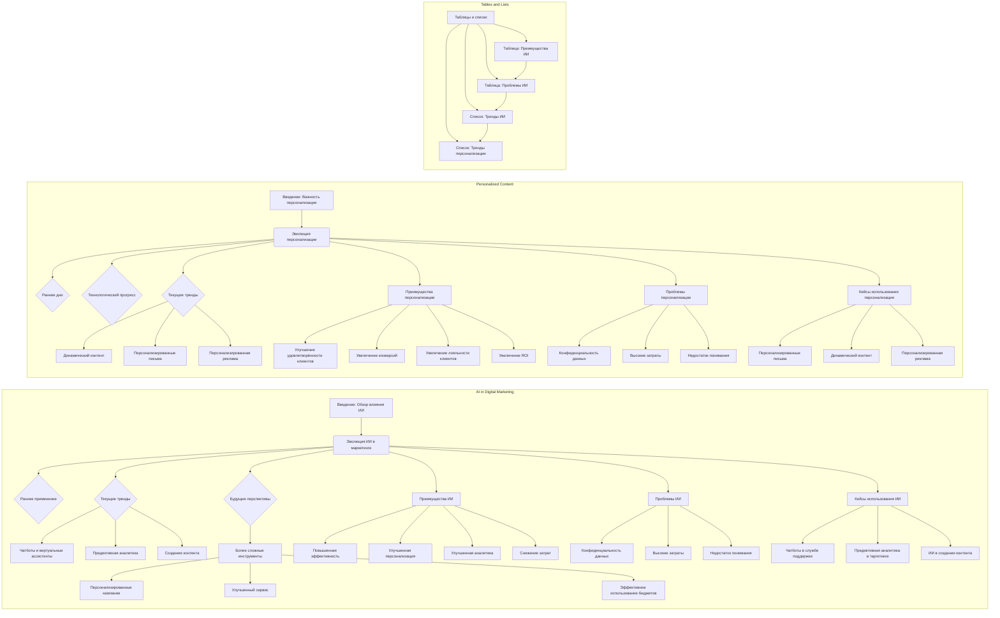

## Анализ кода

### 1. **<алгоритм>**

Данный код представляет собой структурированный текст, описывающий текущие тенденции в цифровом маркетинге, связанные с искусственным интеллектом (ИИ) и персонализированным контентом. Этот текст не является исполняемым кодом, но его можно рассматривать как алгоритм, определяющий структуру и содержание документа.

**Блок-схема:**

1.  **Введение:**
    *   Описывает общий контекст: влияние ИИ на цифровой маркетинг.
    *   Затрагивает общие вопросы по персонализации контента.
    *   *Пример*: "Искусственный интеллект (ИИ) революционизирует ландшафт цифрового маркетинга."
2.  **Развитие ИИ в цифровом маркетинге:**
    *   Описывает раннее применение ИИ (автоматизация задач).
    *   Описывает текущие тренды (чат-боты, аналитика, создание контента).
    *   Описывает будущие перспективы (более продвинутые инструменты).
    *   *Пример*: "Раннее использование ИИ в цифровом маркетинге было отмечено использованием базовых алгоритмов и инструментов анализа данных."
3.  **Преимущества ИИ в цифровом маркетинге:**
    *   Объясняет повышение эффективности за счёт автоматизации задач.
    *   Объясняет улучшенную персонализацию на основе анализа данных.
    *   Объясняет улучшенные инсайты (аналитика).
    *   Объясняет снижение затрат (оптимизация рекламы).
    *   *Пример*: "Инструменты ИИ могут автоматизировать повторяющиеся задачи, позволяя маркетологам сосредоточиться на более стратегических мероприятиях."
4.  **Проблемы ИИ в цифровом маркетинге:**
    *   Описывает проблемы конфиденциальности данных.
    *   Описывает высокие затраты внедрения ИИ.
    *   Описывает недостаток понимания ИИ среди маркетологов.
    *   *Пример*: "Одна из основных проблем использования ИИ в цифровом маркетинге — это конфиденциальность данных."
5.  **Примеры использования ИИ:**
    *   Представлены конкретные кейсы:
        *   Чат-боты в службе поддержки.
        *   Предиктивная аналитика для таргетинга рекламы.
        *   ИИ в создании контента.
    *   *Пример*: "Ведущая компания электронной коммерции внедрила чат-боты на базе ИИ на своем веб-сайте для оказания немедленной поддержки клиентов."
6.  **Важность персонализированного контента:**
    *   Описание перехода от базовой сегментации к персонализации.
    *   Описывает текущие тренды (динамический контент, персональные письма, персональные объявления).
    *   *Пример*: "В первые дни цифрового маркетинга персонализация ограничивалась базовой сегментацией."
7.  **Преимущества персонализированного контента:**
    *   Описывает улучшенную удовлетворенность клиентов.
    *   Описывает повышенные показатели конверсии.
    *   Описывает повышенную лояльность клиентов.
    *   Описывает увеличение рентабельности инвестиций (ROI).
    *   *Пример*: "Персонализированный контент повышает удовлетворенность клиентов, обеспечивая индивидуальный подход."
8.  **Проблемы персонализированного контента:**
    *   Описывает проблемы конфиденциальности данных.
    *   Описывает высокие затраты создания персонализированного контента.
    *   Описывает недостаток понимания.
    *   *Пример*: "Одна из основных проблем создания персонализированного контента — это конфиденциальность данных."
9.  **Примеры использования персонализированного контента:**
    *   Представлены конкретные кейсы:
        *   Персонализированные рассылки.
        *   Динамический контент на веб-сайте.
        *   Персонализированная реклама.
    *   *Пример*: "Ведущая компания электронной коммерции внедрила кампании персонализированных писем для повышения вовлеченности и конверсии."
10. **Заключение:**
    *   Повторение основных тезисов о важности ИИ и персонализированного контента в цифровом маркетинге.
    *   *Пример*: "ИИ революционизирует ландшафт цифрового маркетинга."
11. **Таблицы и списки:**
    *   Сводные таблицы: преимущества и проблемы ИИ в маркетинге.
    *   Сводные списки: текущие тренды ИИ и персонализированного контента.
    *   *Пример*: "Таблица 1: Преимущества ИИ в цифровом маркетинге"

### 2. **<mermaid>**

**Анализ зависимостей:**

- Диаграмма показывает разделение логических блоков статьи, охватывающей ИИ в маркетинге, персонализацию контента, таблицы и списки.
- Каждый блок разбит на подразделы (например, эволюция, преимущества, проблемы, кейсы).
- Связи между блоками показывают последовательность изложения материала.
- Имена переменных являются описательными, например, `Раннее применение`, `Улучшение удовлетворённости клиентов` и так далее.

### 3. **<объяснение>**

**Импорты:**

- В данном тексте не используются импорты, так как это не исполняемый код на Python или другом языке программирования. Это структурированный текст в формате Markdown.

**Классы:**

- В предоставленном тексте нет определения классов.

**Функции:**

- В предоставленном тексте нет определения функций.

**Переменные:**

- В тексте используются переменные в виде заголовков, разделов, таблиц, списков и описаний. Это текстовые данные, а не переменные в понимании программирования.

**Объяснения:**

- **Разделы:** Текст структурирован с использованием заголовков (`#`, `##`, `###`), что обеспечивает логичное разделение на вводную часть, описание развития ИИ, описание персонализации, преимущества, проблемы, кейсы и заключение.
- **Таблицы:** Используются таблицы для наглядного представления информации, например, преимуществ и проблем использования ИИ, что помогает читателю быстро воспринять информацию.
- **Списки:** Используются для перечисления трендов, что улучшает восприятие информации.

**Потенциальные ошибки или области для улучшения:**

- **Отсутствие кода:** Так как это текст, здесь нет синтаксических или логических ошибок.
- **Анализ текста:** Можно улучшить, добавив более подробный анализ текста, например, с помощью инструментов обработки естественного языка (NLP).
- **Связь с другими частями проекта:** Так как это автономный текст, связи с другими частями проекта нет, но если бы это был фрагмент более крупной системы, то можно было бы добавить информацию о том, как это документ используется в общем процессе.

**Цепочка взаимосвязей с другими частями проекта:**

- Так как это автономный текстовый файл, цепочка взаимосвязей не применяется в контексте этого файла. Если бы это была часть большого проекта, то этот файл можно было бы использовать для обучения модели, либо как часть системы, которая предоставляет информацию по трендам в маркетинге.

**Заключение**

Предоставленный текст представляет собой подробное описание текущих тенденций в цифровом маркетинге, включая использование ИИ и персонализированного контента. Он хорошо структурирован, содержит конкретные примеры и кейсы, а также выделяет как преимущества, так и проблемы, связанные с этими технологиями.