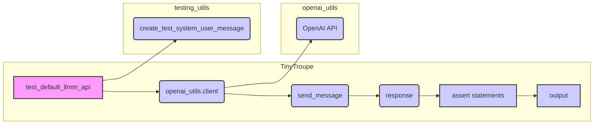

# <input code>

```python
"""
General security tests for the TinyTroupe library.
"""

import pytest
import textwrap

import logging
logger = logging.getLogger("tinytroupe")

import sys
sys.path.append('../../tinytroupe/')
sys.path.append('../../')
sys.path.append('..')

from tinytroupe import openai_utils

from testing_utils import *

def test_default_llmm_api():
    """
    Tests some desireable properties of the default LLM API configured for TinyTroupe.
    """

    messages = create_test_system_user_message("If you ask a cat what is the secret to a happy life, what would the cat say?")

    next_message = openai_utils.client().send_message(messages)

    print(f"Next message as dict: {next_message}")

    # checks that the response meets minimum requirements
    assert next_message is not None, "The response from the LLM API should not be None."
    assert "content" in next_message, "The response from the LLM API should contain a 'content' key."
    assert len(next_message["content"]) >= 1, "The response from the LLM API should contain a non-empty 'content' key."
    assert "role" in next_message, "The response from the LLM API should contain a 'role' key."
    assert len(next_message["role"]) >= 1, "The response from the LLM API should contain a non-empty 'role' key."

    # convert to the dict to string
    next_message_str = str(next_message)
    print(f"Next message as string: {next_message_str}")

    # checks max and min characters
    assert len(next_message_str) >= 1, "The response from the LLM API should contain at least one character."
    assert len(next_message_str) <= 2000000, "The response from the LLM API should contain at most 2000000 characters."

    # checks encoding is UTF-8
    assert next_message_str.encode('utf-8'), "The response from the LLM API should be encodable in UTF-8 without exceptions."
```

# <algorithm>

```mermaid
graph TD
    A[test_default_llmm_api] --> B{create_test_system_user_message};
    B --> C[messages];
    C --> D[openai_utils.client().send_message];
    D --> E[next_message];
    E --> F[assert next_message is not None];
    E --> G[assert "content" in next_message];
    E --> H[assert len(next_message["content"]) >= 1];
    E --> I[assert "role" in next_message];
    E --> J[assert len(next_message["role"]) >= 1];
    E --> K[next_message_str = str(next_message)];
    K --> L[assert len(next_message_str) >= 1];
    K --> M[assert len(next_message_str) <= 2000000];
    K --> N[next_message_str.encode('utf-8')];
    
    subgraph "Dependencies"
        B --> O[create_test_system_user_message(from testing_utils)];
        O --> C;
        D --> P[openai_utils client()];
        P --> Q[send_message(from openai_utils)];
        Q --> E;
    end
```

Example: If `create_test_system_user_message` returns `[{'role': 'system', 'content': 'Hello'}]`, then `messages` will contain this data.  `openai_utils.client().send_message` sends this data to an OpenAI API endpoint.


# <mermaid>



# <explanation>

* **Импорты:**
    * `pytest`: Библиотека для написания юнит-тестов.
    * `textwrap`: Для форматирования текста (не используется в данном случае).
    * `logging`: Для ведения журналов, используется для логирования, но в данном случае не используется.
    * `sys`: Для изменения пути поиска модулей.  `sys.path.append` позволяет найти модули `tinytroupe` и `testing_utils`, которые находятся в иерархии каталогов выше текущего файла.
    * `openai_utils`:  Модуль, вероятно, из `tinytroupe`, предоставляющий функции для взаимодействия с API OpenAI.
    * `testing_utils`: Модуль, содержащий вспомогательные функции для тестов, в данном случае, `create_test_system_user_message` для создания тестовых сообщений.

* **Классы:**  В данном коде нет определенных классов. Все операции происходят в рамках функций.

* **Функции:**
    * `test_default_llmm_api`:  Функция тестирования, проверяющая корректность работы API OpenAI, используемого в библиотеке TinyTroupe.
        * Принимает на вход `messages`, в которых находятся сообщения.
        * Вызывает `openai_utils.client().send_message` для получения ответа от API.
        * Проверяет, что ответ не `None`, что в ответе присутствует ключ `content` и ключ `role`, а также что длина значения ключа `content` больше 0 и длина значения ключа `role` больше 0.
        * Проверяет, что длина строки ответа не превышает 2000000 и что длина строки ответа не меньше 1.
        * Проверяет, что ответ можно закодировать в UTF-8.


* **Переменные:**
    * `messages`: Список сообщений, которые передаются в API.
    * `next_message`:  Ответ API OpenAI в формате словаря.
    * `next_message_str`: Строковое представление `next_message`.

* **Возможные ошибки/улучшения:**
    * Отсутствует обработка возможных исключений, которые могут возникнуть при взаимодействии с OpenAI API (например, сетевые ошибки, ошибки авторизации).  Добавление try...except блоков для таких случаев сильно улучшит надежность кода.
    * Отсутствие явного указания на ожидаемое поведение в случае ошибки (например, возврат специального значения или исключение).
    * Нет указания ожидаемого формата ответа от API.
    * Вместо `print` можно использовать `logger.info` для вывода информации в логи.

**Взаимосвязь с другими частями проекта:**

Функция `test_default_llmm_api` зависит от `openai_utils`, который, вероятно, предоставляет интерфейс для взаимодействия с OpenAI API.  `testing_utils` обеспечивает вспомогательные функции для создания тестовых данных.  Все эти модули, скорее всего, находятся в проекте TinyTroupe.