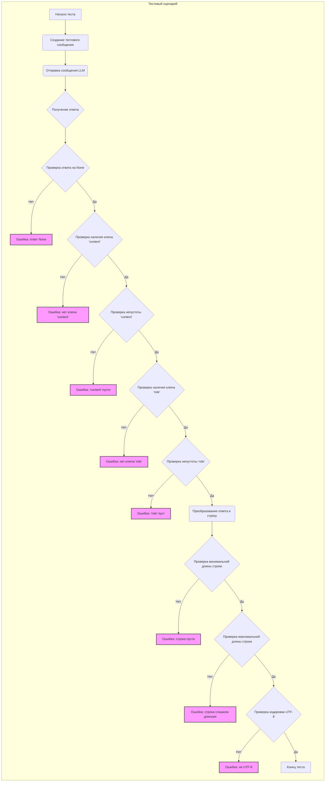

## Анализ кода `test_security.py`

### 1. <алгоритм>

**Блок-схема:**

```mermaid
graph TD
    A[Начало теста: test_default_llmm_api()] --> B{Создание тестового сообщения};
    B --> C[Отправка сообщения в LLM API];
    C --> D{Получение ответа};
    D --> E{Проверка ответа на None};
    E -- Нет --> F[Ошибка: ответ None];
    E -- Да --> G{Проверка наличия ключа 'content'};
    G -- Нет --> H[Ошибка: нет ключа 'content'];
    G -- Да --> I{Проверка непустоты 'content'};
    I -- Нет --> J[Ошибка: 'content' пусто];
    I -- Да --> K{Проверка наличия ключа 'role'};
    K -- Нет --> L[Ошибка: нет ключа 'role'];
    K -- Да --> M{Проверка непустоты 'role'};
    M -- Нет --> N[Ошибка: 'role' пуст];
    M -- Да --> O[Преобразование ответа в строку];
    O --> P{Проверка минимальной длины строки};
    P -- Нет --> Q[Ошибка: строка пуста];
    P -- Да --> R{Проверка максимальной длины строки};
    R -- Нет --> S[Ошибка: строка слишком длинная];
    R -- Да --> T{Проверка кодировки UTF-8};
    T -- Нет --> U[Ошибка: не UTF-8];
    T -- Да --> V[Конец теста];
    
    style F fill:#f9f,stroke:#333,stroke-width:2px
    style H fill:#f9f,stroke:#333,stroke-width:2px
    style J fill:#f9f,stroke:#333,stroke-width:2px
    style L fill:#f9f,stroke:#333,stroke-width:2px
    style N fill:#f9f,stroke:#333,stroke-width:2px
    style Q fill:#f9f,stroke:#333,stroke-width:2px
    style S fill:#f9f,stroke:#333,stroke-width:2px
    style U fill:#f9f,stroke:#333,stroke-width:2px
```
**Примеры:**

1.  **Создание тестового сообщения (B):**
    *   Функция `create_test_system_user_message` создает список сообщений, содержащий системное и пользовательское сообщение.
        *   `messages = [{"role": "system", "content": "You are a helpful assistant."}, {"role": "user", "content": "If you ask a cat what is the secret to a happy life, what would the cat say?"}]`
2.  **Отправка сообщения в LLM API (C):**
    *   Метод `send_message` класса `openai_utils.client()` отправляет запрос в OpenAI API.
        *   Предположим, что `next_message` будет равен: `{'role': 'assistant', 'content': 'Meow, purr, and nap a lot!'}`.
3. **Проверка ответа на None (E):**
    *   Проверка, что `next_message` не является `None`. В примере `next_message` не `None`.
4. **Проверка наличия ключа 'content' (G):**
    *   Проверка, что в `next_message` есть ключ `content`. В примере такой ключ есть.
5. **Проверка непустоты 'content' (I):**
    *   Проверка, что значение ключа `content` не является пустой строкой. В примере `next_message['content']` это `'Meow, purr, and nap a lot!'`.
6. **Проверка наличия ключа 'role' (K):**
    *   Проверка, что в `next_message` есть ключ `role`. В примере такой ключ есть.
7. **Проверка непустоты 'role' (M):**
    *   Проверка, что значение ключа `role` не является пустой строкой. В примере `next_message['role']` это `assistant`.
8.  **Преобразование ответа в строку (O):**
    *   Ответ `next_message` преобразуется в строку `next_message_str = "{'role': 'assistant', 'content': 'Meow, purr, and nap a lot!'}"`.
9.  **Проверка минимальной длины строки (P):**
    *   Проверяется, что длина `next_message_str` больше или равна 1. В примере это так, длина равна 50.
10. **Проверка максимальной длины строки (R):**
     *   Проверяется, что длина `next_message_str` меньше или равна 2000000. В примере это так, длина равна 50.
11. **Проверка кодировки UTF-8 (T):**
    *   Проверяется, что строка `next_message_str` может быть закодирована в UTF-8. В примере это верно.

### 2. <mermaid>



**Зависимости и их объяснение:**

1.  **`test_default_llmm_api` (A):** Начальная точка теста, функция которая запускает сценарий тестирования.
2.  **`Создание тестового сообщения` (B):** Создает тестовые сообщения, используя `create_test_system_user_message` из `testing_utils`.
3.  **`Отправка сообщения LLM` (C):** Вызывает функцию `send_message` из `openai_utils` для отправки сообщения в LLM API.
4.  **`Получение ответа` (D):** Получает ответ от LLM API.
5.  **`Проверка ответа на None` (E):** Проверка, что ответ от LLM API не равен `None`.
6.  **`Ошибка: ответ None` (F):** Выводит ошибку если ответ равен `None`.
7. **`Проверка наличия ключа 'content'` (G):** Проверяет наличие ключа `content` в полученном ответе.
8. **`Ошибка: нет ключа 'content'` (H):** Выводит ошибку если нет ключа `content`.
9. **`Проверка непустоты 'content'` (I):** Проверяет, что значение ключа `content` не является пустой строкой.
10. **`Ошибка: 'content' пусто` (J):** Выводит ошибку если `content` является пустой строкой.
11. **`Проверка наличия ключа 'role'` (K):** Проверяет наличие ключа `role` в полученном ответе.
12. **`Ошибка: нет ключа 'role'` (L):** Выводит ошибку если нет ключа `role`.
13. **`Проверка непустоты 'role'` (M):** Проверяет, что значение ключа `role` не является пустой строкой.
14. **`Ошибка: 'role' пуст` (N):** Выводит ошибку если `role` является пустой строкой.
15. **`Преобразование ответа в строку` (O):** Преобразует ответ в строку.
16. **`Проверка минимальной длины строки` (P):** Проверяет минимальную длину строки.
17. **`Ошибка: строка пуста` (Q):** Выводит ошибку если строка пуста.
18. **`Проверка максимальной длины строки` (R):** Проверяет максимальную длину строки.
19. **`Ошибка: строка слишком длинная` (S):** Выводит ошибку если строка слишком длинная.
20. **`Проверка кодировки UTF-8` (T):** Проверяет кодировку UTF-8.
21. **`Ошибка: не UTF-8` (U):** Выводит ошибку если не UTF-8.
22. **`Конец теста` (V):** Завершение теста.

### 3. <объяснение>

**Импорты:**

*   **`pytest`**: Используется для создания и запуска тестов. Это фреймворк для тестирования.
*   **`textwrap`**: Используется для форматирования текста, хотя в данном коде он не используется.
*   **`logging`**: Используется для логирования, в данном случае создается логгер с именем "tinytroupe".
    *   Взаимосвязь: Используется для отладки и мониторинга работы кода, но не влияет на функциональность теста.
*   **`sys`**: Используется для модификации пути поиска модулей Python.
    *   Взаимосвязь: Позволяет импортировать модули из директорий `../../tinytroupe/`, `../../` и `../`, что позволяет  использовать код из других частей проекта.
*   **`tinytroupe.openai_utils`**: Содержит утилиты для работы с OpenAI API.
    *   Взаимосвязь: Используется для отправки сообщений в LLM API.
*   **`testing_utils`**:  Содержит вспомогательные функции для тестирования, такие как `create_test_system_user_message`.
    *   Взаимосвязь: Используется для создания тестового сообщения, чтобы можно было протестировать LLM API.

**Функции:**

*   **`test_default_llmm_api()`**:
    *   **Аргументы**: Нет.
    *   **Возвращаемое значение**: Нет.
    *   **Назначение**: Проверяет основные свойства ответа, полученного от LLM API.
    *   **Пример**:
        1.  Создается тестовое сообщение с помощью `create_test_system_user_message` с вопросом, что сказал бы кот.
        2.  Отправляет сообщение в LLM API, используя `openai_utils.client().send_message(messages)`.
        3.  Проверяет, что ответ не `None`, содержит ключи `content` и `role`, не пустые.
        4.  Преобразует ответ в строку.
        5.  Проверяет минимальную и максимальную длину строки.
        6.  Проверяет кодировку UTF-8.

**Переменные:**

*   **`logger`**: Объект логгера, настроенный для логирования сообщений с именем "tinytroupe".
*   **`messages`**: Список сообщений, которые будут отправлены в LLM API, созданный функцией `create_test_system_user_message`.
*   **`next_message`**: Ответ от LLM API, полученный в виде словаря.
*   **`next_message_str`**: Ответ от LLM API, преобразованный в строку.

**Потенциальные ошибки или области для улучшения:**

*   **Жестко заданные проверки**: Проверки, такие как максимальная длина строки, являются жестко заданными и могут не подходить для всех моделей LLM.
*   **Отсутствие тестирования крайних случаев**: Тест не проверяет крайние случаи или обработку ошибок LLM API.
*   **Отсутствие мок-тестирования**: Тест напрямую обращается к LLM API, что делает его зависимым от внешнего сервиса и не может быть выполнен в автономном режиме. Следует использовать мок-объекты для `openai_utils.client()`, чтобы сделать тест более надежным и быстрым.
*   **Зависимость от API ключа**: Тест не управляет API ключом для OpenAI, он должен быть настроен отдельно.

**Цепочка взаимосвязей:**

1.  `test_security.py` использует `testing_utils.create_test_system_user_message` для создания тестовых сообщений.
2.  `test_security.py` использует `openai_utils.client().send_message()` для отправки сообщений в OpenAI API.
3.  `test_security.py` использует `pytest` для запуска тестов и проверок.
4.  `test_security.py` использует `logging` для логирования.
5.  `test_security.py` использует `sys.path.append` для корректного импорта модулей `tinytroupe`.

**Дополнительные замечания:**

*   Код демонстрирует базовое тестирование LLM API, фокусируясь на валидации структуры ответа и базовой безопасности.
*   Тест не включает сложные тесты безопасности, такие как SQL-инъекции или другие векторы атак, которые могут быть актуальны при использовании LLM для генерации контента, который может влиять на безопасность приложения.