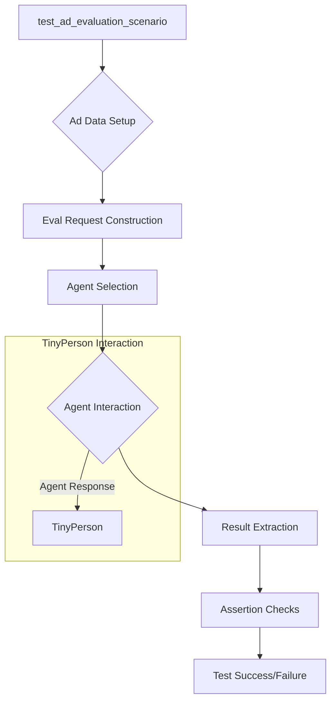

# <input code>

```python
import pytest
import logging
logger = logging.getLogger("tinytroupe")

import sys
sys.path.append('../../tinytroupe/')
sys.path.append('../../')
sys.path.append('..')


import tinytroupe
from tinytroupe.agent import TinyPerson
from tinytroupe.environment import TinyWorld, TinySocialNetwork
from tinytroupe.factory import TinyPersonFactory
from tinytroupe.extraction import ResultsExtractor
from tinytroupe.examples import create_lisa_the_data_scientist, create_oscar_the_architect, create_marcos_the_physician
from tinytroupe.extraction import default_extractor as extractor
import tinytroupe.control as control
from tinytroupe.control import Simulation

from testing_utils import *

# ... (rest of the code)
```

# <algorithm>

Unfortunately, creating a detailed flowchart for the entire code is impractical due to its size and complexity.  However, I can outline the key steps and data flows for the `test_ad_evaluation_scenario` function as an example:

1. **Ad Data Setup:**  Defines several strings `travel_ad_1`, `travel_ad_2`, etc., containing advertisement text. This data is directly used in constructing the evaluation request.

2. **Evaluation Request Construction:** Creates a formatted string `eval_request_msg` combining the advertisement data to present to the agent.

3. **Contextualization:** Sets the situation for the agents (e.g., planning a European vacation).

4. **Agent Selection and Interaction:** Creates agents using `create_lisa_the_data_scientist`, `create_oscar_the_architect`.  These agents are provided the situation and the request, and they respond with their evaluations (the data flow here is within the `TinyPerson` class and its methods).

5. **Result Extraction:** `ResultsExtractor` gathers the results from each agent's response regarding which ad they prefer and why.  Crucially, the `extract_results_from_agent` method receives the results from the `TinyPerson` instance (and likely accesses its internal state).

6. **Assertion Checks:**  Verifies that the results are not empty, contain the necessary fields (ad id, title, justification), and are valid.

This process repeats for the `test_ad_creation_scenario` with a different task and dataset, and similar logic but different data is used.  In `test_consumer_profiling_scenario`, the process iterates to collect responses from a large number of consumer personas.

# <mermaid>



# <explanation>

* **Imports:**
    * `pytest`: Used for testing.
    * `logging`: For logging information. The `logger = logging.getLogger("tinytroupe")` statement configures logging to a specific logger named "tinytroupe" for the package `tinytroupe` (this is useful for grouping log entries).
    * `sys`: Used for appending paths to the Python module search path.  This is often used when the code resides in a project structure different from the module locations.
    * `tinytroupe`, `tinytroupe.agent`, `tinytroupe.environment`, `tinytroupe.factory`, `tinytroupe.extraction`, `tinytroupe.examples`, `tinytroupe.control`, `testing_utils`: These import various modules/components from the `tinytroupe` project. This suggests a modular design for the `tinytroupe` project with related functionality organized into individual packages.
    * `default_extractor`: Likely a utility function for extracting results from agent responses.


* **Classes:**
    * `TinyPerson`: Represents an agent;  methods like `change_context` and `listen_and_act` define how an agent interacts with the environment and processes information;
    * `TinyWorld`, `TinySocialNetwork`: These classes represent the environment where agents interact. These are likely internal to the `tinytroupe` package and handle the simulated interactions between agents and the context.
    * `ResultsExtractor`: Responsible for retrieving and structuring information from the `TinyPerson` responses.


* **Functions:**
    * `test_ad_evaluation_scenario`, `test_ad_creation_scenario`, `test_consumer_profiling_scenario`: These are test functions; they define scenarios to evaluate the agent's behavior, generate examples for different contexts, and measure the success of the agent.

* **Variables:**
    * `travel_ad_1`, `travel_ad_2`, etc.: Strings containing advertisement text.
    * `eval_request_msg`: String that holds the request to the agent (using the ad text), prompting for ad evaluation.
    * `people`: List of `TinyPerson` instances created for the evaluation.
    * `situation`: Sets the context for the agents.
    * `extraction_objective`: Tells the extractor how to analyze the responses.


* **Possible Errors/Improvements:**

    * **Test Data:** The advertisement data (`travel_ad_1`, etc.) is hardcoded.  Consider loading this data from a file for more flexibility and maintainability.
    * **Error Handling:** The code could benefit from more robust error handling to catch issues with agent responses or result extraction.
    * **Testing:** The assertions are fairly basic and can be expanded to check for more specific conditions or expected behaviors.  A thorough test suite is critical.


**Relationships with other parts of the project:**

The code heavily relies on the `tinytroupe` package.  The interaction functions like `listen_and_act` rely on internal components of `tinytroupe`'s agent and environment handling to simulate how agents interact and interpret responses.  The `testing_utils` module likely contains helper functions for test setup and assertion procedures.  All these elements are part of the wider system of the `tinytroupe` project.