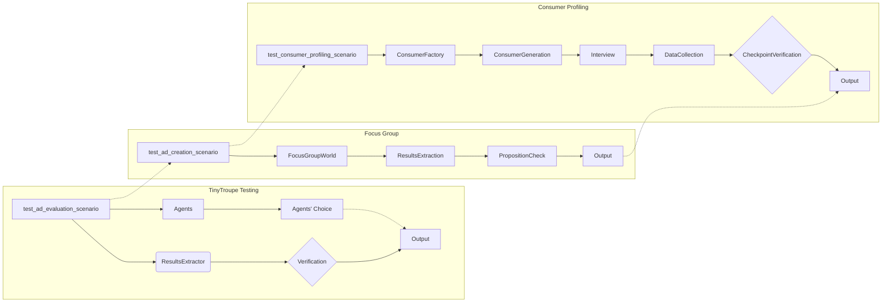

# <input code>

```python
import pytest
import logging
logger = logging.getLogger("tinytroupe")

import sys
sys.path.append('../../tinytroupe/')
sys.path.append('../../')
sys.path.append('..')


import tinytroupe
from tinytroupe.agent import TinyPerson
from tinytroupe.environment import TinyWorld, TinySocialNetwork
from tinytroupe.factory import TinyPersonFactory
from tinytroupe.extraction import ResultsExtractor
from tinytroupe.examples import create_lisa_the_data_scientist, create_oscar_the_architect, create_marcos_the_physician
from tinytroupe.extraction import default_extractor as extractor
import tinytroupe.control as control
from tinytroupe.control import Simulation

from testing_utils import *

# ... (rest of the code)
```

# <algorithm>

**test_ad_evaluation_scenario:**

1. **Initialization:** Defines advertisement texts (travel_ad_1, travel_ad_2, etc.).
2. **Evaluation Request:** Creates a formatted message (eval_request_msg) containing the advertisements for evaluation by the agents.
3. **Situation Setting:** Sets the situation context for agents.
4. **Agent Creation and Context Setting:** Creates two agents (Oscar the Architect and Lisa the Data Scientist) and sets the situation context for each agent.
5. **Evaluation and Action:**  Each agent listens to and acts upon the evaluation request message, generating evaluation results.
6. **Result Extraction:** Extracts evaluation results from each agent using the ResultsExtractor.
7. **Result Verification:** Validates the extracted results (ad_id, ad_title, justification) for each agent.
8. **Confirmation and Output:** Checks if the number of choices aligns with expectations and prints the agent choices.

**test_ad_creation_scenario:**

1. **Initialization:** Defines a situation and task related to apartment advertisement.
2. **Apartment Description:** Provides a detailed description of the apartment.
3. **Broadcast:** Broadcasts the situation, description, and task to the focus group world.
4. **Focus Group Run:** Runs the focus group for a specified duration (2 in this case).
5. **Result Extraction:** Extracts the results from the focus group world.
6. **Result Validation:** Validates the extracted results using a proposition checker.

**test_consumer_profiling_scenario:**

1. **Initialization:** Sets up a context for consumer profiling.
2. **Consumer Factory Creation:** Creates a factory for generating consumers.
3. **Consumer Generation:** Iteratively generates a number of consumers (15 in this example).
4. **Consumer Interview:** Presents a set of questions to each consumer to understand their opinions on a bottled gazpacho product.
5. **Consumer Data Collection:** Collects the consumer responses.
6. **Checkpoint and Result Verification:** Checks if the expected checkpoint file was created.


# <mermaid>



# <explanation>

**Imports:**

- `pytest`: Used for writing and running unit tests.
- `logging`: Enables logging messages for debugging.
- `sys`: Provides access to system-specific parameters and functions, including modifying the path to import modules. Used to add custom paths to import packages from the local project.
- `tinytroupe`, `tinytroupe.agent`, `tinytroupe.environment`, `tinytroupe.factory`, `tinytroupe.extraction`, `tinytroupe.examples`, `tinytroupe.control`: These imports reference modules within the `tinytroupe` project. They likely contain the core functionalities for agent interaction, world simulation, data extraction, example agents, and control logic. `testing_utils` is a custom testing module (likely contains helper functions/classes for testing).
- `default_extractor`: An extractor used for extracting the results from agents, possibly the default extractor used by the framework.  This demonstrates how tests interact with the actual software components.

**Classes:**

- `TinyPerson`: Represents an agent in the TinyTroupe framework.  Has methods like `change_context` and `listen_and_act` used for interactions within the environment. Likely an abstract or base class for defining the agent interface.
- `TinyWorld`, `TinySocialNetwork`: Part of the simulation environment. Define the world agents operate in and potentially social network interactions.
- `TinyPersonFactory`: Creates `TinyPerson` instances. Crucial for dynamically populating the testing environment.
- `ResultsExtractor`: Extracts information from agents. This class is crucial for the test functions to access the results of the simulated interactions.
- The use of separate test functions implies a structured testing approach focusing on specific scenarios.


**Functions:**

- `test_ad_evaluation_scenario`, `test_ad_creation_scenario`, `test_consumer_profiling_scenario`: These are test functions that handle different scenarios related to the functionality of the TinyTroupe framework.
- `create_lisa_the_data_scientist`, `create_oscar_the_architect`, `create_marcos_the_physician`: Create instances of specific agents with pre-defined characteristics. 
- `interview_consumer_batch`: A helper function used to conduct a large-scale interview process.
- `setup`, `focus_group_world`:  These are likely fixtures or setup functions provided by the testing framework (like pytest) that set up the necessary environments and contexts for the tests.


**Variables:**

- The various `travel_ad_*` variables contain the ad texts.
- `eval_request_msg`: Contains the evaluation request to the agents.
- `situation`, `extraction_objective`: Defines the scenario and desired output format for the tests.
- `people`: List of agents to be used in the test.
- `choices`: List to store the agents' results.
- `apartment_description`, `task`: Variables describing the scenario for the focus group.


**Possible Errors/Improvements:**

- **Hardcoded advertisement texts:** The advertisement texts are hardcoded. This could be improved by loading them from a dedicated data source (e.g., CSV, JSON).
- **Limited Agent Interaction:** The agents' interactions are straightforward, potentially lacking in depth. Enhancing the agents' listening and action strategies could lead to more nuanced results.
- **Generalizability:** The testing might become more generalizable if data was loaded from a file.
- **Robustness:**  Error handling in case of missing fields in extracted results, or unexpected agent responses should be added.
- **Clearer Structure:** The code could be structured for better readability, especially by creating a consistent naming convention.

**Inter-project dependencies:**

The code relies heavily on the `tinytroupe` package, demonstrating a clear modular design. This suggests a larger project where `tinytroupe` is a core component. The `testing_utils` module suggests a testing-specific section of the project separate from `tinytroupe`. `control` implies a framework for controlling the simulation environment.  The structure is testable in a modular fashion, allowing for isolation of individual components.

**Overall:**

The code is well-structured for testing different scenarios within the TinyTroupe project. It focuses on testing specific agent behavior and interactions, demonstrating a test-driven development approach, and leverages a clear framework for managing the tests.