## <алгоритм>

1. **`test_ad_evaluation_scenario(setup)`**:
   - **Начало**: Функция `test_ad_evaluation_scenario` вызывается для тестирования оценки рекламных объявлений.
   - **Определение рекламных объявлений**: Определяются четыре текстовых рекламных объявления (`travel_ad_1`, `travel_ad_2`, `travel_ad_3`, `travel_ad_4`) о туристических пакетах.
   - **Формирование запроса на оценку**: Создается строка `eval_request_msg`, которая содержит запрос на оценку объявлений, требующий от агента выбрать одно объявление и объяснить свой выбор.
   - **Определение контекста**: Создается строка `situation`, описывающая контекст ситуации, в которой агент должен оценить рекламные объявления.
   - **Определение цели извлечения**: Создается строка `extraction_objective`, описывающая, какую информацию необходимо извлечь из ответа агента.
   - **Создание агентов**: Создаются два агента: Оскар-архитектор и Лиза-аналитик данных.
   - **Цикл по агентам**:
     - Изменение контекста каждого агента.
     - Запуск агента для ответа на запрос оценки объявлений.
   - **Извлечение результатов**:
     - Создается объект `ResultsExtractor`.
     - В цикле по агентам извлекаются результаты ответов (выбранное объявление, его заголовок и обоснование выбора) с помощью `extractor.extract_results_from_agent`.
     - Проверка корректности результатов (наличие полей, соответствие идентификатора объявления допустимым значениям).
     - Добавление результатов в список `choices`.
   - **Проверка количества выборов**: Проверяется, что было сделано два выбора.
   - **Вывод результатов**: Выводятся результаты выбора агентов.
   - **Конец**: Завершение функции.

2. **`test_ad_creation_scenario(setup, focus_group_world)`**:
   - **Начало**: Функция `test_ad_creation_scenario` вызывается для тестирования сценария создания рекламного объявления.
   - **Определение ситуации**: Создается строка `situation`, описывающая контекст фокус-группы, которая должна разработать рекламу квартиры.
   - **Определение описания квартиры**: Создается строка `apartment_description`, детально описывающая характеристики квартиры.
   - **Определение задачи**: Создается строка `task`, описывающая задачу фокус-группы — обсудить, как лучше рекламировать квартиру.
   - **Запуск симуляции**:
     - Фокус-группе передаются описание ситуации, описание квартиры и задача.
     - Запускается симуляция на два шага.
   - **Извлечение результатов**:
     - Извлекаются результаты обсуждения фокус-группы с помощью `extractor.extract_results_from_world`.
     - Проверка наличия идей для рекламы квартиры.
   - **Конец**: Завершение функции.

3. **`test_consumer_profiling_scenario(setup)`**:
    - **Начало**: Функция `test_consumer_profiling_scenario` вызывается для тестирования сценария профилирования потребителей.
    - **Настройка кэша**:
        - Удаление файла кэша, если он существует.
        - Начало контроля с указанием файла кэша.
    - **Определение контекста**: Создается строка `general_context`, описывающая контекст маркетингового исследования.
    - **Создание фабрики потребителей**: Создается `TinyPersonFactory`, которая может создавать персон с различными характеристиками.
    - **Опрос потребителей**:
        - Цикл, который опрашивает 15 потребителей.
        - Задержка перед опросом каждого потребителя.
        - Создание потребителя с помощью `consumer_factory.generate_person`.
        - Вывод краткой биографии потребителя.
        - Запуск агента для представления, описания интересов, и высказывания мнения о покупке гаспачо.
        - Добавление потребителя в список `consumers`.
        - Сохранение состояния (`checkpoint`) для последующего возобновления.
    - **Проверка кэша**: Проверка, что файл кэша был создан.
    - **Завершение контроля**: Завершение контроля.
    - **Конец**: Завершение функции.

## <mermaid>

```mermaid
flowchart TD
    subgraph test_ad_evaluation_scenario
        A[Start: test_ad_evaluation_scenario] --> B{Define Ads: travel_ad_1, travel_ad_2, travel_ad_3, travel_ad_4};
        B --> C[Create evaluation request message: eval_request_msg];
        C --> D[Define context: situation];
        D --> E[Define extraction objective: extraction_objective];
        E --> F[Create agents: oscar_the_architect, lisa_the_data_scientist];
        F --> G{For each agent};
        G --> H[Change agent context];
        H --> I[Agent listen and act: eval_request_msg];
        I --> G;
        G --> J{ResultsExtractor};
        J --> K{For each agent};
        K --> L[Extract results from agent];
        L --> M[Check result fields];
        M --> N[Append results to choices];
        N --> K;
        K --> O[Check if two choices were made];
        O --> P[Print Agent Choices];
        P --> Q[End: test_ad_evaluation_scenario];
    end
    
    subgraph test_ad_creation_scenario
        R[Start: test_ad_creation_scenario] --> S[Define situation: focus_group context];
        S --> T[Define apartment description: apartment_description];
        T --> U[Define task: focus_group task];
        U --> V[Broadcast situation, description, task to focus_group_world];
        V --> W[Run focus_group_world simulation];
        W --> X[Extract results from focus_group_world];
        X --> Y[Check proposition of extracted results];
        Y --> Z[End: test_ad_creation_scenario];
    end

    subgraph test_consumer_profiling_scenario
        AA[Start: test_consumer_profiling_scenario] --> AB[Remove cache file if exists];
        AB --> AC[Begin control with cache file];
        AC --> AD[Define general context];
        AD --> AE[Create TinyPersonFactory: consumer_factory];
        AE --> AF{Interview Consumer Batch: 15 consumers};
        AF --> AG{For each consumer};
        AG --> AH[Create a person using consumer_factory];
         AH --> AI[Agent listen and act: present and list interests]
        AI --> AJ[Agent listen and act: consider buying bottled gazpacho];
        AJ --> AK[Append to consumers list];
        AK --> AL[Control checkpoint];
         AL --> AG
        AG --> AM[Check that checkpoint file exists];
        AM --> AN[Control end];
        AN --> AO[End: test_consumer_profiling_scenario];
    end
```

### Объяснение `mermaid` диаграммы

1.  **`flowchart TD`**: Определяет тип диаграммы как блок-схему (flowchart) с направлением слева направо (TD).
2.  **Подграфы (subgraph)**: Каждый тест представлен в своем подграфе, что улучшает читаемость и организацию.
    *   `test_ad_evaluation_scenario`: Описывает логику теста оценки рекламных объявлений.
    *   `test_ad_creation_scenario`: Описывает логику теста создания рекламного объявления фокус-группой.
    *   `test_consumer_profiling_scenario`: Описывает логику теста профилирования потребителей.
3.  **Узлы (ноды)**:
    *   Каждый узел в диаграмме представляет собой шаг или действие в коде.
    *   Круглые скобки `()` обозначают начало и конец функций.
    *   Прямоугольники `[]` обозначают действия.
    *   Ромбы `{}` обозначают циклы или условные проверки.
4.  **Стрелки**: Стрелки `-->` показывают поток выполнения кода от одного шага к другому.
5.  **Имена переменных**: Все переменные и функции в диаграмме используют имена, соответствующие именам в коде, что делает диаграмму более понятной и легко соотносимой с кодом.

## <объяснение>

### Импорты

*   `pytest`: Фреймворк для написания и запуска тестов. Используется для организации тестовых функций и проверок.
*   `logging`: Модуль для ведения логов, который позволяет записывать информацию о ходе выполнения программы и ошибках.
*   `sys`: Модуль, предоставляющий доступ к некоторым переменным и функциям, которые взаимодействуют с интерпретатором Python. В данном случае используется для добавления путей к директориям в `sys.path`, чтобы импортировать модули из других папок.
*   `tinytroupe`:  Основной пакет проекта, содержащий классы и функции для моделирования агентов и окружения.
*   `tinytroupe.agent.TinyPerson`: Класс, представляющий агента (виртуального человека).
*   `tinytroupe.environment.TinyWorld`: Класс, представляющий виртуальное окружение, где агенты взаимодействуют.
*   `tinytroupe.environment.TinySocialNetwork`: Класс для моделирования социальных сетей.
*   `tinytroupe.factory.TinyPersonFactory`: Класс для создания агентов.
*   `tinytroupe.extraction.ResultsExtractor`: Класс для извлечения результатов из взаимодействий агентов.
*   `tinytroupe.examples`: Модуль, содержащий функции для создания готовых персонажей (например, `create_lisa_the_data_scientist`).
*   `tinytroupe.extraction.default_extractor`: Переменная, которая ссылается на объект-экстрактор по умолчанию.
*  `tinytroupe.control` и `tinytroupe.control.Simulation`: Пакет и класс, управляющие ходом симуляций, включая сохранение и восстановление состояний.
*   `testing_utils`: Модуль, содержащий вспомогательные функции для тестов (`remove_file_if_exists`).
*  `os`: Модуль для взаимодействия с операционной системой, в частности для проверки существования файла.

### Классы

*   `TinyPerson`: Агент, способный взаимодействовать с окружением. Имеет методы для изменения контекста, прослушивания и действий.
*   `TinyWorld` и `TinySocialNetwork`: Окружение, где действуют агенты. `TinyWorld` может быть использован для фокус групп, тогда как `TinySocialNetwork` для более сложных взаимодействий.
*   `TinyPersonFactory`: Фабрика для создания объектов `TinyPerson` на основе заданных параметров.
*   `ResultsExtractor`: Извлекает структурированные данные из взаимодействий агентов.

### Функции

*   `test_ad_evaluation_scenario(setup)`:
    *   **Аргументы**: `setup` (аргумент fixture, предоставляемый `pytest`).
    *   **Назначение**: Тестирует сценарий, в котором агенты оценивают рекламные объявления.
    *   **Рабочий процесс**:
        1.  Определяет четыре текстовых рекламных объявления.
        2.  Формирует запрос на оценку объявлений.
        3.  Создает двух агентов.
        4.  Заставляет каждого агента ответить на запрос, выбирая лучшее объявление.
        5.  Извлекает результаты (выбранное объявление, заголовок и обоснование выбора).
        6.  Проверяет правильность результатов.

*   `test_ad_creation_scenario(setup, focus_group_world)`:
    *   **Аргументы**: `setup` и `focus_group_world` (аргументы fixture, предоставляемые `pytest`).
    *   **Назначение**: Тестирует сценарий, в котором фокус-группа генерирует идеи для рекламы квартиры.
    *   **Рабочий процесс**:
        1.  Определяет контекст фокус-группы, описание квартиры и задачу.
        2.  Передает эти данные в виртуальный мир фокус-группы.
        3.  Запускает симуляцию на несколько шагов.
        4.  Извлекает результаты обсуждения.
        5.  Проверяет наличие идей для рекламы квартиры.

*   `test_consumer_profiling_scenario(setup)`:
    *   **Аргументы**: `setup` (аргумент fixture, предоставляемый `pytest`).
    *   **Назначение**: Тестирует сценарий профилирования потребителей через создание и опрос большого количества агентов.
    *   **Рабочий процесс**:
        1.  Удаляет файл кэша, если он существует.
        2.  Инициализирует контроль для сохранения и восстановления состояний.
        3.  Определяет контекст рыночного исследования.
        4.  Создает фабрику потребителей.
        5.  Создает и опрашивает 15 потребителей (каждый потребитель является новым агентом).
        6.  Сохраняет состояния агентов после каждого опроса.
        7.  Проверяет создание файла кэша.
        8.  Завершает контроль.
*   `remove_file_if_exists`: Вспомогательная функция для удаления файла, если он существует.
*   `proposition_holds`: Вспомогательная функция для проверки наличия определенной фразы в ответе от агента.

### Переменные

*   Рекламные объявления (`travel_ad_1`, `travel_ad_2`, `travel_ad_3`, `travel_ad_4`): Многострочные строки, содержащие текст рекламных объявлений.
*   `eval_request_msg`: Многострочная строка, содержащая запрос на оценку объявлений.
*   `situation`, `apartment_description`, `task`, `general_context`: Многострочные строки, задающие контекст и инструкции для агентов.
*   `extraction_objective`: Строка, описывающая цель извлечения информации из ответа агента.
*   `people`: Список созданных агентов.
*   `extractor`: Объект класса `ResultsExtractor`, используемый для извлечения результатов.
*   `choices`: Список, содержащий результаты выбора рекламных объявлений агентами.
*   `focus_group`: Виртуальный мир для фокус группы.
*   `consumers`: Список, содержащий созданных агентов-потребителей.

### Потенциальные ошибки и области для улучшения

*   **Зависимость от текстовых объявлений**: Тест `test_ad_evaluation_scenario` сильно зависит от текстового формата рекламных объявлений. Любые изменения в формате могут привести к поломке теста. Можно рассмотреть использование более гибкого формата (например, JSON).
*   **Отсутствие сложных проверок в `test_ad_creation_scenario`**: Проверка результатов теста `test_ad_creation_scenario` (`assert proposition_holds(...)`) является достаточно общей. Можно улучшить, добавив более детальные проверки, например, на наличие конкретных ключевых слов в предложениях по рекламе.
*   **Неоптимальное использование `sleep`**: Использование `sleep(2)` в `test_consumer_profiling_scenario` замедляет выполнение теста. Можно использовать более продвинутые методы для ожидания завершения процессов, например, асинхронное программирование.
*  **Сложность отслеживания результатов**: При большом количестве агентов в `test_consumer_profiling_scenario`, отслеживание результатов становится сложным. Необходимо добавить логирование или другие методы визуализации результатов.

### Взаимосвязи с другими частями проекта

*   **`tinytroupe.agent`**: Тесты используют класс `TinyPerson` для создания агентов, которые взаимодействуют в заданном контексте.
*   **`tinytroupe.environment`**: Тесты используют классы `TinyWorld` и `TinySocialNetwork` для создания виртуального окружения, где действуют агенты.
*   **`tinytroupe.factory`**: Класс `TinyPersonFactory` используется для создания агентов, основываясь на заданном контексте и параметрах.
*   **`tinytroupe.extraction`**: Класс `ResultsExtractor` используется для извлечения и структурирования результатов из взаимодействий агентов.
*   **`tinytroupe.control`**: Класс `Simulation` управляет ходом симуляций и предоставляет функциональность для сохранения и восстановления состояний.

Эти тесты проверяют взаимодействие различных компонентов проекта, моделируя сценарии, где агенты принимают решения, создают идеи и высказывают свое мнение в разных контекстах. Тесты демонстрируют, как можно использовать `tinytroupe` для создания симуляций и тестирования различных гипотез.