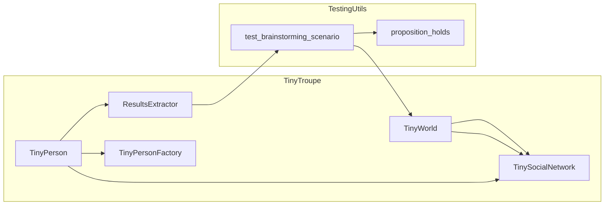

# <input code>

```python
import pytest
import logging
logger = logging.getLogger("tinytroupe")

import sys
sys.path.append('../../tinytroupe/')
sys.path.append('../../')
sys.path.append('..')


import tinytroupe
from tinytroupe.agent import TinyPerson
from tinytroupe.environment import TinyWorld, TinySocialNetwork
from tinytroupe.factory import TinyPersonFactory
from tinytroupe.extraction import ResultsExtractor
from tinytroupe.examples import create_lisa_the_data_scientist, create_oscar_the_architect, create_marcos_the_physician
from tinytroupe.extraction import default_extractor as extractor
import tinytroupe.control as control
from tinytroupe.control import Simulation

from testing_utils import *

def test_brainstorming_scenario(setup, focus_group_world):
    world = focus_group_world

    world.broadcast("""
             Folks, we need to brainstorm ideas for a new product. Your mission is to discuss potential AI feature ideas
             to add to Microsoft Word. In general, we want features that make you or your industry more productive,
             taking advantage of all the latest AI technologies.

             Please start the discussion now.
             """)
    
    world.run(1)

    agent = TinyPerson.get_agent_by_name("Lisa")

    agent.listen_and_act("Can you please summarize the ideas that the group came up with?")

    from tinytroupe.extraction import ResultsExtractor

    extractor = ResultsExtractor()

    results = extractor.extract_results_from_agent(agent, 
                            extraction_objective="Summarize the the ideas that the group came up with, explaining each idea as an item of a list. Describe in details the benefits and drawbacks of each.", 
                            situation="A focus group to brainstorm ideas for a new product.")

    print("Brainstorm Results: ", results)

    assert proposition_holds(f"The following contains some ideas for new product features or entirely new products: \'{results}\'"), f"Proposition is false according to the LLM."
```

# <algorithm>

**Блок-схема:**

```mermaid
graph TD
    A[Инициализация];
    B{Получить мир (focus_group_world)};
    C[Трансляция сообщения в мир];
    D[Запуск мира (world.run(1))];
    E[Получить агента Лизу];
    F[Запрос на обобщение идей];
    G[Экстракция результатов];
    H[Проверка утверждения];
    I[Вывод результатов];
    J[Завершение теста];
    
    A --> B;
    B --> C;
    C --> D;
    D --> E;
    E --> F;
    F --> G;
    G --> H;
    H -- Истина --> I;
    H -- Ложь --> J;
    I --> J;
```

**Пример:**

1. `A`: Функция `test_brainstorming_scenario` инициализирует необходимые переменные.
2. `B`: Из внешнего контекста (`setup`) получен `focus_group_world`.
3. `C`: В мир `focus_group_world` передаётся сообщение о необходимости мозгового штурма.
4. `D`: Мировой `focus_group_world` запускается в течение 1 временного шага.
5. `E`: Получается агент `Lisa` по имени.
6. `F`: Отправляется запрос агенту `Lisa` для обобщения идей.
7. `G`: Используется `ResultsExtractor` для извлечения результатов от `Lisa`.
8. `H`: Проверяется утверждение о содержании результатов.
9. `I`: Выводятся полученные результаты.
10. `J`: Завершение теста.

Данные перемещаются между функциями и объектами в виде аргументов, возвращаемых значений, и через состояния объектов (например, `world` хранит сообщения и результаты).


# <mermaid>



**Объяснение диаграммы:**

* `TinyTroupe`: Модуль, содержащий классы `TinyPerson`, `TinyWorld`, `TinySocialNetwork`, `ResultsExtractor`, `TinyPersonFactory`, отвечающие за моделирование агентов, среды и взаимодействия. Они взаимосвязаны для работы агентов в среде.
* `TestingUtils`: Модуль, содержащий функцию `proposition_holds`, которая используется для проверки утверждения.
* `test_brainstorming_scenario`: Функция, выполняющая тест. Она использует классы из `TinyTroupe` для моделирования мозгового штурма.
* `TinyWorld`: Центральный объект, управляющий взаимодействием агентов.
* `TinySocialNetwork`: Управляет коммуникацией между агентами.
* `ResultsExtractor`: Извлекает и обрабатывает результаты работы агентов.
* `proposition_holds`: Функция, используемая для проверки результатов, возвращает булево значение.


# <explanation>

**Импорты:**

* `pytest`, `logging`: Стандартные библиотеки Python для тестирования и логирования.
* `sys`: Для динамической модификации пути поиска модулей.
* `tinytroupe`: Основной модуль проекта.
* `tinytroupe.agent`, `tinytroupe.environment`, `tinytroupe.factory`, `tinytroupe.extraction`, `tinytroupe.examples`, `tinytroupe.control`: Подмодули `tinytroupe`, содержащие классы и функции для моделирования агентов, среды, создания агентов, извлечения результатов и управления симуляцией.
* `testing_utils`: Модуль, содержащий вспомогательные функции, например `proposition_holds`.


**Классы:**

* `TinyPerson`: Представляет агента в системе.
* `TinyWorld`: Представляет среду, в которой происходят взаимодействия агентов.
* `TinySocialNetwork`: Управляет взаимодействием агентов.
* `ResultsExtractor`: Извлекает и обрабатывает результаты от агента.

**Функции:**

* `test_brainstorming_scenario`: Тестовая функция, симулирующая процесс мозгового штурма.
    * `setup`: Неясно по предоставленному коду, скорее всего функция, инициализирующая мир и агентов.
    * `focus_group_world`: Вероятно, аргумент, представляющий инициализированный мир.
    * `world.broadcast`: Отправляет сообщение во всемирную сеть.
    * `world.run(1)`: Запускает симуляцию на один шаг.
    * `TinyPerson.get_agent_by_name()`: Ищет агента по имени.
    * `agent.listen_and_act()`: Принимает входящие сообщения и генерирует ответ.
    * `extractor.extract_results_from_agent()`: Извлекает результаты от агента.
    * `proposition_holds()`: Проверяет утверждение.


**Переменные:**

* `world`: Объект `TinyWorld`, представляющий фокус-группу.
* `agent`: Объект `TinyPerson`, представляющий агента Лизу.
* `results`: Результаты, извлеченные из агента.


**Возможные ошибки и улучшения:**

* Неясно, как реализована `proposition_holds()`. Требуется дополнительная информация для проверки правильности работы утверждения.
* Отсутствует детальный механизм работы `world.run(1)`.
* Не определен формат сообщений и обработки сообщений в `TinySocialNetwork`, следовательно, нет гарантии, что `agent` получит все необходимые данные.
* Тест не проверяет корректность обработки исключительных ситуаций, например, если нет агента с нужным именем.
* Дополнительные пояснения к `setup` и `focus_group_world` улучшат понимание.
* Сложно оценить сложность `extractor`, без детализации метода `extract_results_from_agent`.

**Цепочка взаимосвязей:**

Код тесно связан с классами и функциями из `tinytroupe`.  Тест `test_brainstorming_scenario` использует `TinyWorld` и `TinySocialNetwork` для моделирования взаимодействия агентов, а `ResultsExtractor` извлекает результаты взаимодействия.  Функция `proposition_holds` используется для проверки утверждения об этих результатах.