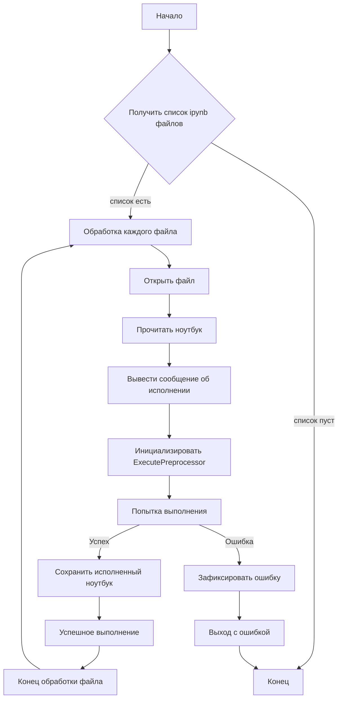

# <input code>

```python
import os
import nbformat
from nbconvert.preprocessors import ExecutePreprocessor
import pytest

import sys
sys.path.insert(0, '../../tinytroupe/') # ensures that the package is imported from the parent directory, not the Python installation
sys.path.insert(0, '../../') # ensures that the package is imported from the parent directory, not the Python installation
sys.path.insert(0, '..') # ensures that the package is imported from the parent directory, not the Python installation

# Set the folder containing the notebooks
NOTEBOOK_FOLDER = "../examples/"  # Update this path

# Set a timeout for long-running notebooks
TIMEOUT = 600

KERNEL_NAME = "python3" #"py310"


def get_notebooks(folder):
    """Retrieve all Jupyter notebook files from the specified folder."""
    return [
        os.path.join(folder, f)
        for f in os.listdir(folder)
        if f.endswith(".ipynb") and not ".executed." in f and not ".local." in f
    ]


@pytest.mark.parametrize("notebook_path", get_notebooks(NOTEBOOK_FOLDER))
def test_notebook_execution(notebook_path):
    """Execute a Jupyter notebook and assert that no exceptions occur."""
    with open(notebook_path, "r", encoding="utf-8") as nb_file:
        notebook = nbformat.read(nb_file, as_version=4)
        print(f"Executing notebook: {notebook_path} with kernel: {KERNEL_NAME}")
        ep = ExecutePreprocessor(timeout=TIMEOUT, kernel_name=KERNEL_NAME)

        try:
            ep.preprocess(notebook, {'metadata': {'path': NOTEBOOK_FOLDER}})
            print(f"Notebook {notebook_path} executed successfully.")

        except Exception as e:
            pytest.fail(f"Notebook {notebook_path} raised an exception: {e}")
        
        finally:
            # save a copy of the executed notebook
            output_path = notebook_path.replace(".ipynb", ".executed.local.ipynb")
            with open(output_path, "w", encoding="utf-8") as out_file:
                nbformat.write(notebook, out_file)
            
            print(f"Executed notebook saved as: {output_path}")
```

# <algorithm>

**Блок-схема:**



**Описание:**

1. **Получение списка ipynb файлов:** Функция `get_notebooks` ищет все `.ipynb` файлы в заданной папке `NOTEBOOK_FOLDER`.  Пример: `get_notebooks("../examples/")` вернет список путей к `.ipynb` файлам в папке `../examples/`.

2. **Обработка каждого файла:** Цикл `@pytest.mark.parametrize` выполняет функцию `test_notebook_execution` для каждого найденного файла.

3. **Открытие и чтение файла:**  Файл открывается для чтения и читается в объект `notebook` с помощью `nbformat.read()`. Пример: `notebook = nbformat.read(nb_file, as_version=4)`.

4. **Выполнение ноутбука:** Используется `ExecutePreprocessor` для выполнения ячеек ноутбука. Пример: `ep.preprocess(notebook, {'metadata': {'path': NOTEBOOK_FOLDER}})`.

5. **Обработка ошибок:** Блок `try...except` ловит исключения при выполнении ноутбука и сообщает о них.

6. **Сохранение исполненного ноутбука:**  Ноутбук сохраняется в новом файле с добавлением префикса `.executed.local.` Пример: `.ipynb` -> `.executed.local.ipynb`

# <mermaid>

```mermaid
graph LR
    subgraph "Модуль тестирования"
        A[test_notebook_execution] --> B(get_notebooks);
        B --> C{notebook_path};
        C --> D[Открыть файл];
        D --> E[nbformat.read];
        E --> F[ExecutePreprocessor];
        F --> G(preprocess);
        G --> H{Успешно?};
        H -- Да --> I[Сохранить исполненный ноутбук];
        H -- Нет --> J[Зафиксировать ошибку];
        I --> K[Выход];
        J --> K;
    end
    subgraph "Вспомогательные модули"
        B -- sys.path -- Sys.Path;
        B -- os -- OS;
        B -- nbformat -- NBFormat;
        B -- nbconvert -- NBConvert;
        B -- pytest -- Pytest;
    end
```

# <explanation>

**Импорты:**

* `os`:  Для работы с файловой системой (например, получение списка файлов).
* `nbformat`: Для работы с Jupyter Notebook файлами.
* `nbconvert.preprocessors.ExecutePreprocessor`: Для запуска ячеек Jupyter Notebook.
* `pytest`: Для фреймворка тестирования.
* `sys`: Для изменения пути поиска модулей.

**Классы:**

*  Нет явных пользовательских классов в данном примере.  Используется предопределенный класс `ExecutePreprocessor` из библиотеки `nbconvert`.

**Функции:**

* `get_notebooks(folder)`:  Возвращает список путей к `.ipynb` файлам в заданной папке.  Аргумент `folder` - строка с путем к папке.  Возвращает список строк с путями.

* `test_notebook_execution(notebook_path)`:  Функция тестирования, которая открывает, выполняет и сохраняет `.ipynb` файл.  Аргумент `notebook_path` - путь к `.ipynb` файлу.  Не возвращает значений, но фиксирует успех/ошибки.

**Переменные:**

* `NOTEBOOK_FOLDER`: Путь к папке с `.ipynb` файлами.
* `TIMEOUT`:  Таймаут для выполнения ноутбука в секундах.
* `KERNEL_NAME`: Имя ядра, используемого для выполнения ноутбука.

**Возможные ошибки и улучшения:**

* **Управление исключениями:**  Блок `try...except` важен для обработки ошибок при выполнении ноутбука.  Можно добавить более конкретные типы исключений, чтобы получить более точную информацию об ошибке.
* **Логирование:**  Добавление логирования может помочь отследить выполнение и предоставить более подробную информацию о происходящих событиях.
* **Документация:** Добавление подробной документации к функции `test_notebook_execution` улучшит понимание ее работы.

**Взаимосвязь с другими частями проекта:**

Функция `test_notebook_execution`  используется для тестирования ноутбуков в проекте `tinytroupe`, вероятно, содержащем какие-то вычисляемые модели или операции, которые проверяются с помощью этих ноутбуков.  `../../tinytroupe/` указывает на структуру проекта.