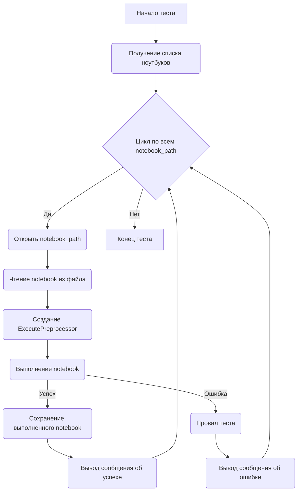

# Анализ кода `test_jupyter_examples.py`

## <алгоритм>

1.  **Импорт библиотек:**
    *   Импортируются необходимые библиотеки: `os`, `nbformat`, `ExecutePreprocessor` из `nbconvert`, `pytest`, `sys`.

2.  **Настройка путей:**
    *   Добавляются пути к каталогам проекта для правильного импорта пакетов.

3.  **Определение констант:**
    *   `NOTEBOOK_FOLDER`: Путь к папке с ноутбуками.
    *   `TIMEOUT`: Максимальное время выполнения ноутбука.
    *   `KERNEL_NAME`: Имя ядра Python для выполнения ноутбуков.

4.  **`get_notebooks(folder)`:**
    *   Функция принимает путь к папке с ноутбуками `folder`.
    *   Находит все файлы с расширением `.ipynb`, которые не содержат `.executed.` или `.local.` в имени файла.
    *   Возвращает список полных путей к файлам ноутбуков.
    *   Пример: `get_notebooks("../examples/")` может вернуть `["../examples/example1.ipynb", "../examples/example2.ipynb"]`.

5.  **`test_notebook_execution(notebook_path)`:**
    *   Функция параметризована с помощью `pytest.mark.parametrize`, принимая на вход путь к ноутбуку `notebook_path`.
    *   Открывает указанный файл ноутбука на чтение.
    *   Использует `nbformat.read` для преобразования содержимого файла в объект `notebook`.
    *   Создает экземпляр `ExecutePreprocessor` с заданными `timeout` и `kernel_name`.
    *   Выводит в консоль сообщение о начале выполнения ноутбука.
    *   Использует `try-except` блок для отлова исключений.
        *   Внутри блока `try` выполняется `ep.preprocess(notebook, {'metadata': {'path': NOTEBOOK_FOLDER}})`, что запускает выполнение ячеек кода в ноутбуке.
        *   Если выполнение завершается успешно, выводится соответствующее сообщение.
        *   Если возникает исключение, тест проваливается с сообщением об ошибке.
    *   В блоке `finally`:
        *   Сохраняет выполненный ноутбук в файл с добавлением `.executed.local.` в имя.
        *   Выводит сообщение о сохранении выполненного ноутбука.
    *   Пример вызова: `test_notebook_execution("../examples/example1.ipynb")`

## <mermaid>

**Описание зависимостей:**

*   `A`: Начало тестового процесса.
*   `B`: Вызов `get_notebooks()` для получения списка всех подходящих файлов ноутбуков.
*   `C`: Цикл `pytest.mark.parametrize`, который перебирает каждый полученный путь к ноутбуку.
*   `D`: Открытие файла ноутбука с помощью `open()`.
*   `E`: Чтение содержимого файла с помощью `nbformat.read()`.
*   `F`: Создание объекта `ExecutePreprocessor` с параметрами `timeout` и `kernel_name`.
*   `G`: Выполнение кода в ноутбуке с помощью `ep.preprocess()`.
*   `H`: Сохранение выполненного ноутбука в новый файл с добавлением `.executed.local.` в имя файла.
*   `I`: Вывод сообщения об ошибке, если при выполнении возникло исключение.
*   `J`: Вывод сообщения об успешном выполнении ноутбука.
*   `K`: Вывод сообщения об ошибке, если возникло исключение.
*  `L`: Конец тестового процесса.

## <объяснение>

### Импорты

*   **`os`**: Предоставляет функции для работы с операционной системой, такие как манипуляции с путями файлов и каталогами. В данном коде используется для составления полных путей к файлам ноутбуков.
*   **`nbformat`**: Библиотека для работы с форматом файлов Jupyter Notebook. Используется для чтения и записи файлов ноутбуков (`.ipynb`).
*   **`ExecutePreprocessor`** из **`nbconvert.preprocessors`**:  Класс, предназначенный для выполнения кода в ячейках Jupyter Notebook. Используется для автоматического запуска и тестирования ноутбуков.
*   **`pytest`**: Фреймворк для тестирования. Используется для создания параметризованных тестов и для обработки результатов выполнения тестов.
*   **`sys`**: Предоставляет доступ к некоторым переменным и функциям, взаимодействующим с интерпретатором Python. Здесь используется для изменения пути поиска модулей, чтобы обеспечить правильный импорт пакета `tinytroupe`.

### Переменные

*   **`NOTEBOOK_FOLDER`**: Строка, содержащая путь к папке, в которой лежат ноутбуки для тестирования.
*   **`TIMEOUT`**: Целое число, определяющее максимальное время в секундах для выполнения одного ноутбука.
*   **`KERNEL_NAME`**: Строка, определяющая имя ядра Jupyter, которое будет использоваться для выполнения ноутбуков.
*   **`notebook_path`**: Строка, содержащая путь к конкретному файлу ноутбука, который в данный момент обрабатывается в цикле.
*   **`notebook`**: Объект `nbformat.NotebookNode`, представляющий собой содержимое Jupyter Notebook.
*   **`ep`**: Экземпляр класса `ExecutePreprocessor`, используемый для выполнения кода в ноутбуке.
*   **`output_path`**: Строка, содержащая путь к файлу, в который будет сохранен выполненный ноутбук.
*   **`e`**: Объект исключения, перехваченного в блоке `try-except`.
*   **`nb_file`**: файловый объект, открытый для чтения ноутбука.
*   **`out_file`**: файловый объект, открытый для записи выполненного ноутбука.

### Функции

*   **`get_notebooks(folder)`**:
    *   **Аргумент:** `folder` - строка, представляющая путь к папке с ноутбуками.
    *   **Возвращаемое значение:** Список строк, представляющих полные пути к файлам ноутбуков, найденным в указанной папке.
    *   **Назначение:** Функция находит все файлы Jupyter Notebook в указанной папке, исключая файлы, которые уже были выполнены (`.executed.`) или являются локальными файлами (`.local.`).
    *   **Пример:** `get_notebooks("../examples/")` может вернуть `["../examples/example1.ipynb", "../examples/example2.ipynb"]`.

*   **`test_notebook_execution(notebook_path)`**:
    *   **Аргумент:** `notebook_path` - строка, представляющая путь к конкретному файлу ноутбука для выполнения.
    *   **Возвращаемое значение:** Отсутствует (функция изменяет состояние тестов `pytest`).
    *   **Назначение:** Функция выполняет Jupyter Notebook, переданный в качестве аргумента. Она открывает файл, читает его содержимое, выполняет код в ячейках, обрабатывает возможные исключения и сохраняет выполненный ноутбук.
    *   **Пример:** `test_notebook_execution("../examples/example1.ipynb")` выполнит ноутбук `example1.ipynb` и при успешном выполнении сохранит его как `example1.executed.local.ipynb`.

### Потенциальные ошибки и области для улучшения

1.  **Обработка ошибок:** Текущая обработка ошибок заключается в простом выводе сообщения об ошибке и провале теста. В будующем можно добавить более детальное логирование или создание отдельных артефактов для анализа проблем, таких как стектрейс.
2.  **Улучшение именования:**  Имена некоторых переменных можно улучшить для большей ясности.
3.  **Расширение функциональности:**  Можно добавить дополнительные проверки на наличие необходимых библиотек или окружения перед запуском теста.
4.  **Параметризация:** Параметры вроде `NOTEBOOK_FOLDER` и `TIMEOUT` можно вынести в конфигурационный файл или передавать как аргументы командной строки для большей гибкости.
5.  **Не хватает `assert`:**  После выполнения, тесты ничего не утверждают, если не было ошибок. Можно добавить проверки, например, на ожидаемый вывод в определенных ячейках.

### Цепочка взаимосвязей

1.  **Зависимость от `nbformat`**: Для чтения и записи файлов Jupyter Notebook.
2.  **Зависимость от `nbconvert`**: Для выполнения кода в ячейках ноутбука.
3.  **Зависимость от `pytest`**: Для организации и запуска тестов.
4.  **Зависимость от `sys`**: Для настройки импорта пакетов.
5.  **Использование файлов .ipynb**: Тесты зависят от наличия файлов Jupyter Notebook в папке, указанной в `NOTEBOOK_FOLDER`.
6.  **Зависимость от установленного ядра**: Тесты зависят от наличия ядра, указанного в `KERNEL_NAME`.
7. **Цепочка внутри проекта**: Данный файл используется в качестве тестового модуля для проверки примеров, находящихся в папке `examples` и использует `tinytroupe` для выполнения конкретных задач.

Этот анализ обеспечивает полное понимание функциональности кода, его зависимостей и потенциальных улучшений.