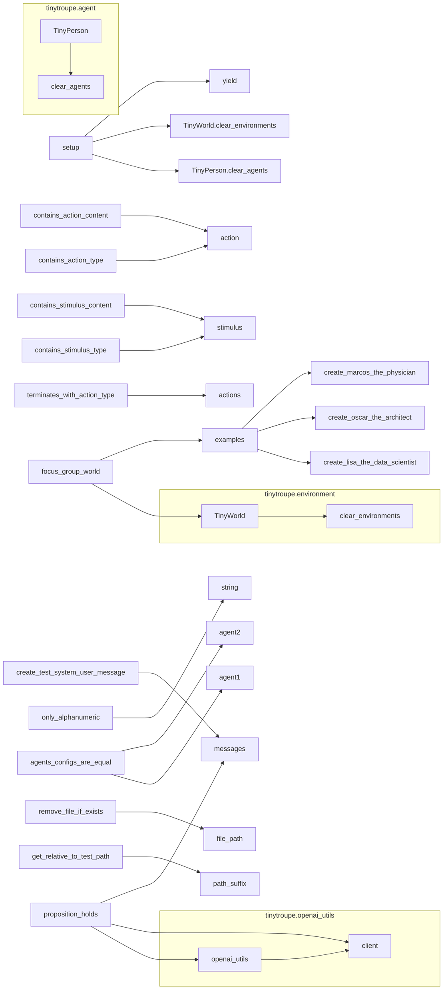

```MD
# <input code>

```python
"""
Testing utilities.
"""
import os
import sys
from time import sleep
sys.path.append('../../tinytroupe/')
sys.path.append('../../')
sys.path.append('..')

import tinytroupe.openai_utils as openai_utils
from tinytroupe.agent import TinyPerson
from tinytroupe.environment import TinyWorld, TinySocialNetwork
import pytest
import importlib

# force caching, in order to save on API usage
openai_utils.force_api_cache(True, "tests_cache.pickle")

def contains_action_type(actions, action_type):
    """
    Checks if the given list of actions contains an action of the given type.
    """

    for action in actions:
        if action["action"]["type"] == action_type:
            return True
    
    return False

def contains_action_content(actions:list, action_content: str):
    """
    Checks if the given list of actions contains an action with the given content.
    """

    for action in actions:
        # checks whether the desired content is contained in the action content
        if action_content.lower() in action["action"]["content"].lower():
            return True
    
    return False

def contains_stimulus_type(stimuli, stimulus_type):
    """
    Checks if the given list of stimuli contains a stimulus of the given type.
    """

    for stimulus in stimuli:
        if stimulus["type"] == stimulus_type:
            return True
    
    return False

def contains_stimulus_content(stimuli, stimulus_content):
    """
    Checks if the given list of stimuli contains a stimulus with the given content.
    """

    for stimulus in stimuli:
        # checks whether the desired content is contained in the stimulus content
        if stimulus_content.lower() in stimulus["content"].lower():
            return True
    
    return False

def terminates_with_action_type(actions, action_type):
    """
    Checks if the given list of actions terminates with an action of the given type.
    """

    if len(actions) == 0:
        return False
    
    return actions[-1]["action"]["type"] == action_type

def proposition_holds(proposition: str) -> bool:
    """
    Checks if the given proposition is true according to an LLM call.
    This can be used to check for text properties that are hard to
    verify mechanically, such as "the text contains some ideas for a product".
    """

    system_prompt = f"""
    Check whether the following proposition is true or false. If it is
    true, write "true", otherwise write "false". Don't write anything else!
    """

    user_prompt = f"""
    Proposition: {proposition}
    """

    messages = [{"role": "system", "content": system_prompt},
                {"role": "user", "content": user_prompt}]

    # call the LLM
    next_message = openai_utils.client().send_message(messages)

    # check the result
    cleaned_message = only_alphanumeric(next_message["content"])
    if cleaned_message.lower().startswith("true"):
        return True
    elif cleaned_message.lower().startswith("false"):
        return False
    else:
        raise Exception(f"LLM returned unexpected result: {cleaned_message}")

def only_alphanumeric(string: str):
    """
    Returns a string containing only alphanumeric characters.
    """
    return ''.join(c for c in string if c.isalnum())

def create_test_system_user_message(user_prompt, system_prompt="You are a helpful AI assistant."):
    """
    Creates a list containing one system message and one user message. 
    """

    messages = [{"role": "system", "content": system_prompt}]

    if user_prompt is not None:
        messages.append({"role": "user", "content": user_prompt})

    return messages

def agents_configs_are_equal(agent1, agent2, ignore_name=False):
    """
    Checks if the configurations of two agents are equal.
    """

    ignore_keys = []
    if ignore_name:
        ignore_keys.append("name")
    
    for key in agent1._configuration.keys():
        if key in ignore_keys:
            continue
        
        if agent1._configuration[key] != agent2._configuration[key]:
            return False
    
    return True
############################################################################################################
# I/O utilities
############################################################################################################

def remove_file_if_exists(file_path):
    """
    Removes the file at the given path if it exists.
    """
    
    if os.path.exists(file_path):
        os.remove(file_path)

def get_relative_to_test_path(path_suffix):
    """
    Returns the path to the test file with the given suffix.
    """
    
    return os.path.join(os.path.dirname(__file__), path_suffix)


############################################################################################################
# Fixtures
############################################################################################################

@pytest.fixture(scope="function")
def focus_group_world():
    import tinytroupe.examples as examples   
    
    world = TinyWorld("Focus group", [examples.create_lisa_the_data_scientist(), examples.create_oscar_the_architect(), examples.create_marcos_the_physician()])
    return world

@pytest.fixture(scope="function")
def setup():
    TinyPerson.clear_agents()
    TinyWorld.clear_environments()

    yield
```

# <algorithm>

(Блок-схема отсутствует из-за сложности визуализации, так как код содержит много функций)

**Описание алгоритма (вместо блок-схемы):**

Код содержит различные вспомогательные функции для тестирования модулей `tinytroupe`.

Функции `contains_action_type`, `contains_action_content`, `contains_stimulus_type`, `contains_stimulus_content`, `terminates_with_action_type` проверяют наличие определённых типов действий или стимулов в списках.

Функция `proposition_holds` использует внешнюю LLM (OpenAI), чтобы проверить истинность утверждения.

Функция `only_alphanumeric` удаляет из строки неалфавитно-цифровые символы.

Функция `create_test_system_user_message` создает сообщения для взаимодействия с LLM.

Функция `agents_configs_are_equal` сравнивает конфигурации двух агентов, исключая возможное различие в имени.

Функции `remove_file_if_exists` и `get_relative_to_test_path` предназначены для управления файлами, часто используемыми в тестах.

Фикстура `focus_group_world` создает тестовое окружение `TinyWorld` с определёнными агентами.

Фикстура `setup` очищает глобальные данные, используемые агентами и окружениями.


# <mermaid>




# <explanation>

**Импорты**:

- `os`, `sys`, `time`: Стандартные модули Python для работы с операционной системой, системами, временем.
- `tinytroupe.openai_utils`: Модуль, вероятно, предоставляющий интерфейс для взаимодействия с API OpenAI.
- `tinytroupe.agent`: Модуль, содержащий класс `TinyPerson` (агент), вероятно, представляющий пользователя или действующее лицо.
- `tinytroupe.environment`: Модуль, содержащий классы `TinyWorld` (окружение) и `TinySocialNetwork` (социальная сеть).
- `pytest`: Модуль для тестирования, предоставляющий функции и декораторы для запуска тестов.
- `importlib`: Модуль для динамической загрузки модулей.

Связь с `src`:  Все импорты относятся к пакетам внутри `hypotez`, `src` folder (по расположению файла). Пакеты `tinytroupe.openai_utils`, `tinytroupe.agent`, `tinytroupe.environment` находятся внутри пакета `tinytroupe`, который, вероятно, представляет core логику приложения.

**Классы**:

- `TinyPerson`: Представляет агента. Имеет метод `clear_agents`,  вероятно, для очищения всех агентов в системе.
- `TinyWorld`: Представляет окружение. Имеет метод `clear_environments`, для очищения всех окружений.  Конфигурация и взаимодействие с агентами не описаны в коде.

**Функции**:

- `contains_action_type`, `contains_action_content`, `contains_stimulus_type`, `contains_stimulus_content`:  Проверяют наличие элементов в списках.
- `terminates_with_action_type`: Проверяет, завершается ли список действий определённым типом действия.
- `proposition_holds`:  Проверяет истинность утверждения, используя API OpenAI. Важно отметить зависимость от внешнего ресурса (OpenAI).
- `only_alphanumeric`: Удаляет из строки все символы, которые не являются буквенно-цифровыми.
- `create_test_system_user_message`:  Формирует сообщения для LLM (в формате, требуемом OpenAI).
- `agents_configs_are_equal`: Сравнивает конфигурации двух агентов.
- `remove_file_if_exists`: Удаляет файл, если он существует.
- `get_relative_to_test_path`:  Создаёт абсолютный путь к файлу относительно тестовой папки.

**Переменные**:

Переменные в основном представляют списки действий, стимулов, конфигураций агентов, сообщения для LLM, пути к файлам.


**Возможные ошибки/улучшения**:

- Отсутствует явное описание типов данных в аргументах и возвращаемых значениях некоторых функций. Это может привести к ошибкам.
- Отсутствуют проверки входных данных в некоторых функциях (например, `proposition_holds` не проверяет, что `proposition` является строкой).
- Не указано, как происходит взаимодействие между `TinyPerson`, `TinyWorld`, `TinySocialNetwork`.  
- Возможные проблемы с производительностью при использовании OpenAI API (слишком много запросов, ограничения API).  Необходимы проверки на ошибки.
- Необходимо документировать методы классов `TinyPerson` и `TinyWorld`, чтобы понять их внутреннее функционирование.


**Взаимосвязь с другими частями проекта**:

Функции тестирования, вероятно, используются для проверки корректности поведения агентов, окружения `TinyWorld` и их взаимодействия.  Функции тестов зависят от внешних сервисов (например, OpenAI).  Взаимосвязь с `tinytroupe.examples`  для создания тестовых агентов.