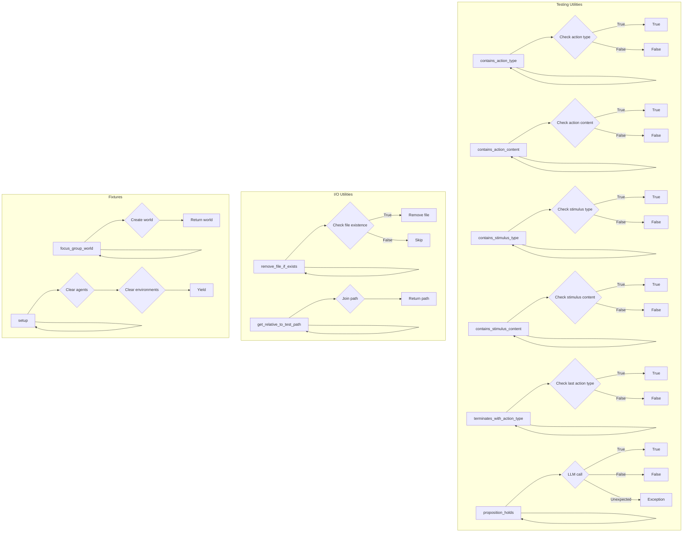

```MD
# <input code>

```python
"""
Testing utilities.
"""
import os
import sys
from time import sleep
sys.path.append('../../tinytroupe/')
sys.path.append('../../')
sys.path.append('..')

import tinytroupe.openai_utils as openai_utils
from tinytroupe.agent import TinyPerson
from tinytroupe.environment import TinyWorld, TinySocialNetwork
import pytest
import importlib

# force caching, in order to save on API usage
openai_utils.force_api_cache(True, "tests_cache.pickle")

def contains_action_type(actions, action_type):
    """
    Checks if the given list of actions contains an action of the given type.
    """
    for action in actions:
        if action["action"]["type"] == action_type:
            return True
    return False

def contains_action_content(actions:list, action_content: str):
    """
    Checks if the given list of actions contains an action with the given content.
    """
    for action in actions:
        if action_content.lower() in action["action"]["content"].lower():
            return True
    return False

def contains_stimulus_type(stimuli, stimulus_type):
    """
    Checks if the given list of stimuli contains a stimulus of the given type.
    """
    for stimulus in stimuli:
        if stimulus["type"] == stimulus_type:
            return True
    return False

def contains_stimulus_content(stimuli, stimulus_content):
    """
    Checks if the given list of stimuli contains a stimulus with the given content.
    """
    for stimulus in stimuli:
        if stimulus_content.lower() in stimulus["content"].lower():
            return True
    return False

def terminates_with_action_type(actions, action_type):
    """
    Checks if the given list of actions terminates with an action of the given type.
    """
    if len(actions) == 0:
        return False
    return actions[-1]["action"]["type"] == action_type

def proposition_holds(proposition: str) -> bool:
    """
    Checks if the given proposition is true according to an LLM call.
    This can be used to check for text properties that are hard to
    verify mechanically, such as "the text contains some ideas for a product".
    """
    system_prompt = f"""
    Check whether the following proposition is true or false. If it is
    true, write "true", otherwise write "false". Don't write anything else!
    """
    user_prompt = f"""
    Proposition: {proposition}
    """
    messages = [{"role": "system", "content": system_prompt},
                {"role": "user", "content": user_prompt}]
    next_message = openai_utils.client().send_message(messages)
    cleaned_message = only_alphanumeric(next_message["content"])
    if cleaned_message.lower().startswith("true"):
        return True
    elif cleaned_message.lower().startswith("false"):
        return False
    else:
        raise Exception(f"LLM returned unexpected result: {cleaned_message}")

def only_alphanumeric(string: str):
    """
    Returns a string containing only alphanumeric characters.
    """
    return ''.join(c for c in string if c.isalnum())

def create_test_system_user_message(user_prompt, system_prompt="You are a helpful AI assistant."):
    """
    Creates a list containing one system message and one user message. 
    """
    messages = [{"role": "system", "content": system_prompt}]
    if user_prompt is not None:
        messages.append({"role": "user", "content": user_prompt})
    return messages

def agents_configs_are_equal(agent1, agent2, ignore_name=False):
    """
    Checks if the configurations of two agents are equal.
    """
    ignore_keys = []
    if ignore_name:
        ignore_keys.append("name")
    for key in agent1._configuration.keys():
        if key in ignore_keys:
            continue
        if agent1._configuration[key] != agent2._configuration[key]:
            return False
    return True
############################################################################################################
# I/O utilities
############################################################################################################

def remove_file_if_exists(file_path):
    """
    Removes the file at the given path if it exists.
    """
    if os.path.exists(file_path):
        os.remove(file_path)

def get_relative_to_test_path(path_suffix):
    """
    Returns the path to the test file with the given suffix.
    """
    return os.path.join(os.path.dirname(__file__), path_suffix)


############################################################################################################
# Fixtures
############################################################################################################

@pytest.fixture(scope="function")
def focus_group_world():
    import tinytroupe.examples as examples
    world = TinyWorld("Focus group", [examples.create_lisa_the_data_scientist(), examples.create_oscar_the_architect(), examples.create_marcos_the_physician()])
    return world

@pytest.fixture(scope="function")
def setup():
    TinyPerson.clear_agents()
    TinyWorld.clear_environments()
    yield
```


# <explanation>

**Импорты:**

* `import os`: Импортирует модуль для работы с операционной системой, например, для работы с файлами.
* `import sys`: Импортирует модуль `sys` для взаимодействия с интерпретатором Python, включая добавление путей к модулям.
* `from time import sleep`: Импортирует функцию `sleep` для приостановки выполнения кода.
* `import tinytroupe.openai_utils as openai_utils`: Импортирует утилиты для взаимодействия с OpenAI API из пакета `tinytroupe`.
* `from tinytroupe.agent import TinyPerson`: Импортирует класс `TinyPerson` из пакета `tinytroupe.agent`. Представляет агента в системе.
* `from tinytroupe.environment import TinyWorld, TinySocialNetwork`: Импортирует классы `TinyWorld` и `TinySocialNetwork` из пакета `tinytroupe.environment`. Определяют окружение и социальную сеть для агентов.
* `import pytest`: Импортирует фреймворк для тестирования `pytest`.
* `import importlib`: Импортирует модуль `importlib`, который нужен для динамической загрузки модулей.

Связь с другими пакетами:
Файлы `openai_utils`, `agent`, и `environment` являются частью проекта `tinytroupe`.


**Классы:**

* `TinyPerson`: Представляет агента.  В этом файле, видимо, нет определения атрибутов или методов этого класса.  Возможно, они определены в другом файле, и этот файл лишь использует его.
* `TinyWorld`: Представляет окружение. Аналогично `TinyPerson`, детальное описание атрибутов и методов не приведено в данном файле.
* `TinySocialNetwork`: Представляет социальную сеть. Опять же, это только использование, и описание класса находится в другом файле.

**Функции:**

* `contains_action_type`, `contains_action_content`, `contains_stimulus_type`, `contains_stimulus_content`: Проверяют наличие определенных типов и содержимого в списках действий и стимулов. Используются для валидации.
* `terminates_with_action_type`: Проверяет, завершается ли список действий определенным типом действия.
* `proposition_holds`: Проверяет истинность утверждения с помощью вызова OpenAI API.  Подразумевает наличие некоторого механизма для запроса к OpenAI API (утилиты `openai_utils`).
* `only_alphanumeric`: Возвращает строку, содержащую только буквенно-цифровые символы, удаляя все остальные.
* `create_test_system_user_message`: Создает список сообщений для взаимодействия с OpenAI API. Использует системное сообщение и (при наличии) пользовательское сообщение.
* `agents_configs_are_equal`: Проверяет равенство конфигураций двух агентов, исключая ключ "name", если требуется.
* `remove_file_if_exists`: Удаляет файл, если он существует.
* `get_relative_to_test_path`: Возвращает относительный путь к файлу теста.

**Переменные:**


**Возможные ошибки и улучшения:**

* Отсутствие обработки исключений при вызове OpenAI API (`openai_utils.client().send_message`).
* Недостаточное документирование. Нужно более подробно описать логику работы функций.
* В `proposition_holds`:  Можно добавить вывод логов (например, с помощью `logging`), чтобы отследить полученные ответы от LLM.
* В `agents_configs_are_equal`: Рассмотреть случай, когда один из агентов не имеет определенного ключа.
* Потенциальная проблема с переполнением памяти при работе с очень большими списками действий или стимулов.

**Взаимосвязь с другими частями проекта:**

Этот файл является частью тестового пакета. Функции и классы взаимодействуют с OpenAI API, классами `TinyPerson`, `TinyWorld` и, вероятно, другими компонентами проекта `tinytroupe` для тестирования поведения агентов в определённой среде. `openai_utils` предоставляет интерфейс для доступа к OpenAI API. `TinyPerson` и `TinyWorld` - сущности, которые используются в тестах.  Файл `tinytroupe.examples` определяет примеры объектов для `TinyWorld`, что показывает, как инициализировать объекты `TinyWorld`.

**Вывод:**

Код выполняет различные проверки на действиях и стимулах, используя OpenAI API для проверки сложных утверждений, и является частью тестового набора для проекта `tinytroupe`.  Недостающее описание и/или отсутствие обработки исключений может указывать на необходимость дополнений.