## Анализ кода `testing_utils.py`

### 1. <алгоритм>

**Блок-схема:**

1.  **Импорт модулей:**
    *   Импортируются необходимые модули (`os`, `sys`, `time`, `pytest`, `importlib`) и модули `tinytroupe` (включая `openai_utils`, `TinyPerson`, `TinyWorld`, `TinySocialNetwork`).
    *   Примеры: `os` для работы с файловой системой, `sys` для изменения пути поиска модулей, `time` для временных задержек, `pytest` для тестирования, `importlib` для импорта модулей, и модули `tinytroupe` для работы с агентами и окружениями.
    *   Поток данных: Пути добавляются в `sys.path` для импорта модулей `tinytroupe`.

2.  **Настройка кэша API:**
    *   Вызывается функция `openai_utils.force_api_cache` для включения кэширования API запросов, что уменьшает количество обращений к внешнему API.
    *   Примеры: Кэширование включено с использованием файла "tests_cache.pickle".
    *   Поток данных: Кэш API используется для хранения результатов вызовов OpenAI.

3.  **Функции проверки действий (`contains_action_type`, `contains_action_content`):**
    *   `contains_action_type`: Проверяет, содержит ли список действий действие указанного типа.
        *   Пример: `contains_action_type(actions, "talk")` проверяет, есть ли в списке действий действие типа "talk".
    *   `contains_action_content`: Проверяет, содержит ли список действий действие с указанным содержимым (без учета регистра).
        *   Пример: `contains_action_content(actions, "hello")` проверяет, есть ли в списке действий действие, содержащее "hello".
    *   Поток данных: Список действий (`actions`) передается в функцию, которая возвращает `True` или `False`.

4.  **Функции проверки стимулов (`contains_stimulus_type`, `contains_stimulus_content`):**
    *   `contains_stimulus_type`: Проверяет, содержит ли список стимулов стимул указанного типа.
        *   Пример: `contains_stimulus_type(stimuli, "visual")` проверяет, есть ли в списке стимул типа "visual".
    *   `contains_stimulus_content`: Проверяет, содержит ли список стимулов стимул с указанным содержимым (без учета регистра).
        *   Пример: `contains_stimulus_content(stimuli, "image")` проверяет, есть ли в списке стимул, содержащий "image".
    *   Поток данных: Список стимулов (`stimuli`) передается в функцию, которая возвращает `True` или `False`.

5.  **Функция `terminates_with_action_type`:**
    *   Проверяет, заканчивается ли список действий действием указанного типа.
        *   Пример: `terminates_with_action_type(actions, "move")` проверяет, заканчивается ли список действий действием типа "move".
    *   Поток данных: Список действий (`actions`) передается в функцию, которая возвращает `True` или `False`.

6.  **Функция `proposition_holds`:**
    *   Отправляет пропозицию в LLM и возвращает `True`, если LLM считает ее истинной, и `False` в противном случае.
        *   Пример: `proposition_holds("the text is about AI")` вызывает LLM для проверки истинности этого утверждения.
    *   Поток данных: Пропозиция (`proposition`) передается в функцию, которая вызывает LLM и возвращает `True` или `False`.

7.  **Функция `only_alphanumeric`:**
    *   Удаляет все символы, кроме буквенно-цифровых, из входной строки.
        *   Пример: `only_alphanumeric("hello! 123")` вернет "hello123".
    *   Поток данных: Строка (`string`) передается в функцию, возвращается строка только с буквенно-цифровыми символами.

8.  **Функция `create_test_system_user_message`:**
    *   Создает список сообщений для LLM, содержащий системное и пользовательское сообщения.
        *   Пример: `create_test_system_user_message("Write a short story", "You are a story writer")`
    *   Поток данных: Системное сообщение (`system_prompt`) и пользовательское сообщение (`user_prompt`) передаются в функцию, которая возвращает список сообщений.

9.  **Функция `agents_configs_are_equal`:**
    *   Проверяет, равны ли конфигурации двух агентов. Можно игнорировать поле 'name'.
        *   Пример: `agents_configs_are_equal(agent1, agent2, ignore_name=True)`
    *   Поток данных: Два агента (`agent1`, `agent2`) передаются в функцию, которая возвращает `True` или `False`.

10. **Функции I/O (`remove_file_if_exists`, `get_relative_to_test_path`):**
    *   `remove_file_if_exists`: Удаляет файл по указанному пути, если он существует.
        *   Пример: `remove_file_if_exists("test.txt")`
    *   `get_relative_to_test_path`: Возвращает путь к файлу, относительно текущего файла.
        *   Пример: `get_relative_to_test_path("data/test.json")`
    *   Поток данных: Путь к файлу передается в функции, которые изменяют файловую систему (удаление) или возвращают путь.

11. **Фикстуры pytest (`focus_group_world`, `setup`):**
    *   `focus_group_world`: Создает тестовый мир с несколькими агентами (Lisa, Oscar, Marcos).
    *   `setup`: Очищает агентов и окружения перед тестом.
    *   Поток данных: Фикстуры инициализируют переменные или объекты, используемые в тестах.

```mermaid
graph LR
    A[Начало] --> B(Импорт модулей);
    B --> C{Настройка кэша API};
    C --> D(Функции проверки действий);
    D --> E(Функции проверки стимулов);
    E --> F(Функция terminates_with_action_type);
    F --> G(Функция proposition_holds);
    G --> H(Функция only_alphanumeric);
    H --> I(Функция create_test_system_user_message);
    I --> J(Функция agents_configs_are_equal);
    J --> K(Функции I/O);
    K --> L(Фикстуры pytest);
    L --> M[Конец];
    
    style A fill:#f9f,stroke:#333,stroke-width:2px
    style M fill:#f9f,stroke:#333,stroke-width:2px

    classDef import fill:#ccf,stroke:#333,stroke-width:1px
    class B,C import
    classDef functions fill:#aaf,stroke:#333,stroke-width:1px
    class D,E,F,G,H,I,J functions
    classDef io fill:#aaffaa,stroke:#333,stroke-width:1px
    class K io
    classDef fixtures fill:#aaffff,stroke:#333,stroke-width:1px
    class L fixtures

   
    
    
    
    
```

### 2. <mermaid>

**Объяснение:**
*   Диаграмма показывает поток управления и зависимостей между различными частями кода.
*   Импортированные модули не представлены явно на диаграмме, но их роль обозначена в блоке "Импорт модулей".
*   Используются осмысленные имена блоков, чтобы было понятно, какая часть кода представлена.
*   `A` - начало программы, `M` - конец программы.
*   `B` - импорт необходимых модулей и добавление путей к модулям `tinytroupe` и `src`
*   `C` - настройка кэша OpenAI API для уменьшения количества обращений к API и повышения скорости тестов
*   `D`-`J` - различные функции для проверки действий, стимулов, пропозиций и конфигураций агентов.
*   `K` - набор функций ввода-вывода для работы с файловой системой.
*   `L` - фикстуры для `pytest`, которые подготавливают тестовое окружение.
*   `classDef` используется для стилизации блоков.

### 3. <объяснение>

**Импорты:**

*   `os`: Используется для работы с файловой системой, например, для проверки существования и удаления файлов (`remove_file_if_exists`), а также для конструирования путей к файлам (`get_relative_to_test_path`).
*   `sys`: Используется для добавления путей поиска модулей (`sys.path.append`), что позволяет импортировать модули из других директорий (`tinytroupe`).
*   `time`: Используется для временных задержек (может быть использовано в тестах). В данном коде не используется явно, но импортируется.
*   `tinytroupe.openai_utils`: Содержит функции для взаимодействия с OpenAI API, включая настройку кэширования запросов (`force_api_cache`), а также для отправки сообщений через API.
*   `tinytroupe.agent`: Импортирует класс `TinyPerson`, используемый для создания и управления агентами.
*   `tinytroupe.environment`: Импортирует классы `TinyWorld` и `TinySocialNetwork`, используемые для моделирования окружения агентов.
*   `pytest`: Используется для написания и запуска тестов. Импортируется для использования декоратора `@pytest.fixture` для создания фикстур.
*   `importlib`: Используется для динамического импорта модулей во время выполнения (не используется явно в данном коде, но импортируется).

**Функции:**

*   **`contains_action_type(actions, action_type)`**:
    *   Аргументы:
        *   `actions`: Список словарей, каждый из которых представляет действие.
        *   `action_type`: Строка, представляющая тип действия.
    *   Возвращаемое значение: `True`, если хотя бы одно действие в списке имеет указанный тип, иначе `False`.
    *   Назначение: Проверяет наличие действия заданного типа в списке.
    *   Пример: Если `actions = [{"action": {"type": "talk", "content": "hello"}}, {"action": {"type": "move", "content": "left"}}]`, то `contains_action_type(actions, "talk")` вернет `True`.
*   **`contains_action_content(actions, action_content)`**:
    *   Аргументы:
        *   `actions`: Список словарей, каждый из которых представляет действие.
        *   `action_content`: Строка, представляющая содержимое, которое нужно найти.
    *   Возвращаемое значение: `True`, если хотя бы одно действие в списке содержит указанное содержимое (без учета регистра), иначе `False`.
    *   Назначение: Проверяет наличие действия с заданным содержимым в списке.
    *   Пример: Если `actions = [{"action": {"type": "talk", "content": "Hello world"}}, {"action": {"type": "move", "content": "left"}}], то `contains_action_content(actions, "hello")` вернет `True`.
*   **`contains_stimulus_type(stimuli, stimulus_type)`**:
    *   Аргументы:
        *   `stimuli`: Список словарей, каждый из которых представляет стимул.
        *   `stimulus_type`: Строка, представляющая тип стимула.
    *   Возвращаемое значение: `True`, если хотя бы один стимул в списке имеет указанный тип, иначе `False`.
    *   Назначение: Проверяет наличие стимула заданного типа в списке.
*    **`contains_stimulus_content(stimuli, stimulus_content)`**:
    *   Аргументы:
        *    `stimuli`: Список словарей, каждый из которых представляет стимул.
        *    `stimulus_content`: Строка, представляющая содержимое, которое нужно найти.
    *   Возвращаемое значение: `True`, если хотя бы один стимул в списке содержит указанное содержимое (без учета регистра), иначе `False`.
    *   Назначение: Проверяет наличие стимула с заданным содержимым в списке.
*   **`terminates_with_action_type(actions, action_type)`**:
    *   Аргументы:
        *   `actions`: Список словарей, каждый из которых представляет действие.
        *   `action_type`: Строка, представляющая тип действия.
    *   Возвращаемое значение: `True`, если последнее действие в списке имеет указанный тип, иначе `False`.
    *   Назначение: Проверяет, заканчивается ли список действий действием указанного типа.
*   **`proposition_holds(proposition)`**:
    *   Аргументы:
        *   `proposition`: Строка, представляющая пропозицию для проверки.
    *   Возвращаемое значение: `True`, если LLM считает пропозицию истинной, иначе `False`.
    *   Назначение: Использует LLM для проверки истинности пропозиции.
*   **`only_alphanumeric(string)`**:
    *   Аргументы:
        *   `string`: Строка, из которой нужно удалить небуквенно-цифровые символы.
    *   Возвращаемое значение: Строка, содержащая только буквенно-цифровые символы.
    *   Назначение: Очищает строку от нежелательных символов.
*   **`create_test_system_user_message(user_prompt, system_prompt)`**:
    *   Аргументы:
        *   `user_prompt`: Строка, представляющая пользовательское сообщение.
        *    `system_prompt`: Строка, представляющая системное сообщение (по умолчанию "You are a helpful AI assistant.").
    *   Возвращаемое значение: Список словарей, представляющих системное и пользовательское сообщения.
    *   Назначение: Создает сообщения для передачи в LLM.
*   **`agents_configs_are_equal(agent1, agent2, ignore_name)`**:
    *   Аргументы:
        *   `agent1`: Первый агент.
        *   `agent2`: Второй агент.
        *    `ignore_name`: Логическое значение, указывающее, нужно ли игнорировать поле "name" при сравнении (по умолчанию `False`).
    *   Возвращаемое значение: `True`, если конфигурации агентов равны (с учетом `ignore_name`), иначе `False`.
    *   Назначение: Сравнивает конфигурации агентов.
*   **`remove_file_if_exists(file_path)`**:
    *   Аргументы:
        *   `file_path`: Путь к файлу.
    *   Возвращаемое значение: Нет.
    *   Назначение: Удаляет файл по указанному пути, если он существует.
*   **`get_relative_to_test_path(path_suffix)`**:
    *   Аргументы:
        *   `path_suffix`: Суффикс пути.
    *   Возвращаемое значение: Абсолютный путь к файлу, относительно текущего файла.
    *   Назначение: Возвращает путь к файлу, относительно текущего файла.

**Фикстуры:**

*   **`focus_group_world()`**:
    *   Создает экземпляр `TinyWorld` с несколькими тестовыми агентами (Lisa, Oscar, Marcos).
    *   Используется как фикстура для тестов.
*   **`setup()`**:
    *   Очищает агентов и окружения перед каждым тестом, вызывая `TinyPerson.clear_agents()` и `TinyWorld.clear_environments()`.
    *    Используется для подготовки тестового окружения.

**Переменные:**

*   `messages`: Список словарей, представляющих сообщения для LLM, в основном используется для форматирования системных и пользовательских сообщений, а также для хранения результатов работы LLM.
*   `system_prompt`: Строка, представляющая системное сообщение для LLM, используется в функции `proposition_holds` и `create_test_system_user_message`.
*   `user_prompt`: Строка, представляющая пользовательское сообщение для LLM, используется в функции `proposition_holds` и `create_test_system_user_message`.
*   `next_message`: Словарь, содержащий ответ LLM, используется в функции `proposition_holds`.
*   `cleaned_message`: Строка, представляющая ответ LLM, очищенный от не буквенно-цифровых символов, используется в функции `proposition_holds`.
*  `ignore_keys`: Список, содержащий ключи, которые необходимо пропустить при сравнении конфигураций агентов.
*  `key`: Ключ в конфигурации агента, используемый для сравнения.
*   `file_path`: Строка, представляющая путь к файлу, используется в функциях `remove_file_if_exists` и `get_relative_to_test_path`.
*  `path_suffix`: Строка, представляющая суффикс пути к файлу, используется в функции `get_relative_to_test_path`.
*   `world`: Экземпляр `TinyWorld`, созданный в фикстуре `focus_group_world`, используется для тестов.

**Потенциальные ошибки и области для улучшения:**

*   В функции `proposition_holds` не производится проверка на успешность запроса к LLM. Может понадобится добавить обработку ошибок API.
*   В функции `proposition_holds` происходит вызов функции `only_alphanumeric` перед проверкой, что может привести к неправильному определению истинности пропозиции, если в ответе LLM есть не буквенно-цифровые символы.
*   Функции проверки наличия действий и стимулов можно переписать, используя генераторы или более компактный код.
*   Необходимо добавить тесты для каждой функции и случая, в том числе для проверки корректности работы с ошибками.
*  В коде не хватает type hints для переменных, что может привести к трудностям с чтением и поддержкой кода.

**Взаимосвязи с другими частями проекта:**

*   Этот файл является частью тестового набора (`tests`) для проекта `TinyTroupe`.
*   Использует модули из `src/tinytroupe`, такие как `openai_utils`, `agent`, `environment`, что демонстрирует его зависимость от основной логики проекта.
*   Использует `pytest` для написания тестов, что делает этот файл важной частью процесса тестирования.
*   Функция `proposition_holds` использует `openai_utils` для взаимодействия с LLM, демонстрируя связь с внешними сервисами.
*  Фикстуры используют `examples.py` для создания объектов тестовой среды.

Этот анализ предоставляет всестороннее Разбор кода `testing_utils.py`, включая его функциональность, зависимости и потенциальные улучшения.