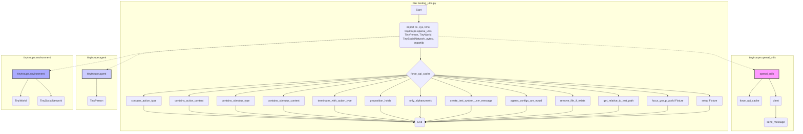

## <алгоритм>

**Блок-схема:**

1. **Импорт библиотек:**
   - Импортируются необходимые библиотеки: `os`, `sys`, `time`, `tinytroupe.openai_utils`, `tinytroupe.agent`, `tinytroupe.environment`, `pytest`, `importlib`.
   - `sys.path.append()` добавляет пути к директориям, содержащим модули проекта, что обеспечивает возможность импорта модулей `tinytroupe`.

   _Пример:_ Импорт `os` позволяет работать с файловой системой, например, для проверки существования файлов и их удаления.

2. **`force_api_cache`:**
   - Функция `openai_utils.force_api_cache(True, "tests_cache.pickle")` активирует кэширование API-запросов OpenAI для тестов, что уменьшает использование API.

3. **Функции проверки действий и стимулов:**
   - `contains_action_type(actions, action_type)`: Проверяет, содержит ли список действий действие заданного типа. Возвращает `True`, если такое действие найдено, иначе `False`.
     - _Пример:_ `contains_action_type(actions, "talk")` вернет `True` если в списке `actions` есть действие типа "talk".
   - `contains_action_content(actions, action_content)`: Проверяет, содержит ли список действий действие с заданным содержимым (без учета регистра). Возвращает `True`, если такое действие найдено, иначе `False`.
     - _Пример:_ `contains_action_content(actions, "hello")` вернет `True` если в списке `actions` есть действие, содержание которого содержит "hello".
   - `contains_stimulus_type(stimuli, stimulus_type)`: Проверяет, содержит ли список стимулов стимул заданного типа. Возвращает `True`, если такой стимул найден, иначе `False`.
     - _Пример:_ `contains_stimulus_type(stimuli, "observation")` вернет `True` если в списке `stimuli` есть стимул типа "observation".
   - `contains_stimulus_content(stimuli, stimulus_content)`: Проверяет, содержит ли список стимулов стимул с заданным содержимым (без учета регистра). Возвращает `True`, если такой стимул найден, иначе `False`.
     - _Пример:_ `contains_stimulus_content(stimuli, "the sky is blue")` вернет `True` если в списке `stimuli` есть стимул, содержание которого содержит "the sky is blue".
   - `terminates_with_action_type(actions, action_type)`: Проверяет, завершается ли список действий действием заданного типа. Возвращает `True` если список не пуст и последний элемент соответствует требуемому типу, иначе `False`.
     - _Пример:_ `terminates_with_action_type(actions, "leave")` вернет `True`, если последнее действие в `actions` имеет тип "leave".

4.  **`proposition_holds(proposition)`:**
    -   Формирует системное и пользовательское сообщение для LLM, чтобы проверить, является ли заданное утверждение истинным.
    -   Отправляет запрос в LLM через `openai_utils.client().send_message()`.
    -   Обрабатывает ответ, извлекая из него только буквенно-цифровые символы.
    -   Возвращает `True`, если ответ LLM начинается с "true" (без учета регистра), `False`, если ответ начинается с "false", или выбрасывает исключение, если ответ не соответствует ожидаемому формату.
    - _Пример:_ `proposition_holds("the text contains some ideas for a product")` отправит запрос LLM для проверки этого утверждения.

5.  **`only_alphanumeric(string)`:**
    -  Удаляет все не буквенно-цифровые символы из строки.
    -  Возвращает новую строку с только буквенно-цифровыми символами.
    -   _Пример:_ `only_alphanumeric("Hello, world! 123")` вернет `"Helloworld123"`.

6. **`create_test_system_user_message(user_prompt, system_prompt)`:**
    - Создает список сообщений, содержащий системное сообщение и, если указано, пользовательское сообщение.
    - _Пример:_ `create_test_system_user_message("What is your name?", "You are an AI assistant")` создает список из двух сообщений, системное и пользовательское, для отправки в LLM.

7. **`agents_configs_are_equal(agent1, agent2, ignore_name)`:**
    - Сравнивает конфигурации двух агентов на равенство. По умолчанию сравниваются все параметры, если `ignore_name` = `True` то поле "name" игнорируется.
     -  _Пример:_ `agents_configs_are_equal(agent1, agent2)` вернет True если у агентов совпадают все параметры конфигурации, иначе False.

8.  **`remove_file_if_exists(file_path)`:**
    -  Проверяет существование файла по указанному пути.
    -  Удаляет файл, если он существует.
    - _Пример:_ `remove_file_if_exists("test_file.txt")` удалит файл, если он существует.

9.  **`get_relative_to_test_path(path_suffix)`:**
     -  Формирует абсолютный путь к файлу относительно текущего файла, используя переданный `path_suffix`.
     -   _Пример:_ `get_relative_to_test_path("data/example.json")` вернет абсолютный путь к файлу `example.json`, находящегося в поддиректории `data`.

10. **Фикстуры `focus_group_world` и `setup`:**
    - `focus_group_world`: Фикстура `pytest`, создающая тестовый мир `TinyWorld` с тремя агентами (Lisa, Oscar и Marcos).
    - `setup`: Фикстура `pytest`, очищающая списки агентов и миров перед каждым тестом, обеспечивая чистую среду для тестов.

## <mermaid>

**Объяснение `mermaid`:**

-   **File: `testing_utils.py`**: Главный граф представляет файл `testing_utils.py`.
    -   **Start**: Начало выполнения скрипта.
    -   **Импорт**:  Импорт необходимых модулей и библиотек: `os`, `sys`, `time`, `tinytroupe.openai_utils`, `TinyPerson`, `TinyWorld`, `TinySocialNetwork`, `pytest`, `importlib`.
    -   **Функции**: Далее следуют функции, описанные в разделе `<алгоритм>`, которые используются для тестирования.
    -   **Фикстуры**: `focus_group_world` и `setup` - это фикстуры `pytest`.
    -   **End**: Конец выполнения скрипта.
-   **`tinytroupe.openai_utils`**: Представлены функции для работы с API OpenAI: `force_api_cache`, `client`, `send_message`.
-  **`tinytroupe.agent`**:  Представлен класс `TinyPerson`.
-   **`tinytroupe.environment`**: Представлены классы `TinyWorld` и `TinySocialNetwork`.
-   Стрелки `-.->` обозначают импорт модулей.

## <объяснение>

**Импорты:**

-   `os`: Предоставляет функции для взаимодействия с операционной системой, используется для работы с путями к файлам и удаления файлов.
-   `sys`: Предоставляет доступ к некоторым переменным и функциям, связанным с интерпретатором Python, используется для добавления путей поиска модулей.
-   `time`: Предоставляет функции для работы со временем, используется в тестах, если необходимо.
-   `tinytroupe.openai_utils`: Содержит утилиты для работы с API OpenAI, используется для кэширования запросов и отправки сообщений LLM.
-   `tinytroupe.agent`: Содержит классы, связанные с агентами (например, `TinyPerson`).
-   `tinytroupe.environment`: Содержит классы, связанные с окружением агентов (`TinyWorld`, `TinySocialNetwork`).
-   `pytest`: Библиотека для написания и запуска тестов.
-  `importlib`: Предоставляет инструменты для управления импортом модулей.

**Классы:**

-   `TinyPerson`: Представляет агента в `tinytroupe`, используется для создания экземпляров агентов в тестах.
-   `TinyWorld`: Представляет мир, в котором действуют агенты, используется для создания тестовых окружений.
-   `TinySocialNetwork`: Класс, представляющий социальную сеть агентов. В коде не используется напрямую, но импортируется из модуля `tinytroupe.environment`.

**Функции:**

-   `contains_action_type(actions, action_type)`:
    -   **Аргументы**:
        -   `actions` (list): Список действий, каждое из которых представляет собой словарь с ключом "action".
        -   `action_type` (str): Тип действия, который нужно найти.
    -   **Возвращаемое значение**: `True`, если действие с заданным типом найдено, иначе `False`.
    -   **Назначение**: Проверяет, есть ли в списке действий действие с определенным типом.
-   `contains_action_content(actions, action_content)`:
    -   **Аргументы**:
        -   `actions` (list): Список действий, каждое из которых представляет собой словарь с ключом "action" и под ключом "content"
        -   `action_content` (str): Содержание действия, которое нужно найти.
    -   **Возвращаемое значение**: `True`, если действие с заданным содержанием найдено, иначе `False`.
    -   **Назначение**: Проверяет, есть ли в списке действий действие с определенным содержанием.
-   `contains_stimulus_type(stimuli, stimulus_type)`:
    -   **Аргументы**:
        -   `stimuli` (list): Список стимулов, каждый из которых представляет собой словарь с ключом "type".
        -   `stimulus_type` (str): Тип стимула, который нужно найти.
    -   **Возвращаемое значение**: `True`, если стимул с заданным типом найден, иначе `False`.
    -   **Назначение**: Проверяет, есть ли в списке стимулов стимул с определенным типом.
-   `contains_stimulus_content(stimuli, stimulus_content)`:
    -   **Аргументы**:
        -   `stimuli` (list): Список стимулов, каждый из которых представляет собой словарь с ключом "content".
        -   `stimulus_content` (str): Содержание стимула, которое нужно найти.
    -   **Возвращаемое значение**: `True`, если стимул с заданным содержанием найден, иначе `False`.
    -   **Назначение**: Проверяет, есть ли в списке стимулов стимул с определенным содержанием.
-   `terminates_with_action_type(actions, action_type)`:
    -   **Аргументы**:
        -   `actions` (list): Список действий.
        -   `action_type` (str): Тип действия, которым должен заканчиваться список.
    -   **Возвращаемое значение**: `True`, если список заканчивается действием заданного типа, иначе `False`.
    -   **Назначение**: Проверяет, заканчивается ли список действий определенным типом действия.
-   `proposition_holds(proposition)`:
    -   **Аргументы**:
        -   `proposition` (str): Предложение, истинность которого нужно проверить с помощью LLM.
    -   **Возвращаемое значение**: `True`, если LLM подтверждает истинность предложения, `False` в противном случае.
    -   **Назначение**: Проверяет истинность предложений, которые трудно проверить автоматически.
-   `only_alphanumeric(string)`:
    -   **Аргументы**:
        -   `string` (str): Строка для обработки.
    -   **Возвращаемое значение**: Строка, содержащая только буквенно-цифровые символы.
    -   **Назначение**: Очищает строку от не буквенно-цифровых символов.
-  `create_test_system_user_message(user_prompt, system_prompt)`:
    -   **Аргументы**:
         -   `user_prompt` (str): Сообщение пользователя.
         -   `system_prompt` (str): Сообщение системы (по умолчанию "You are a helpful AI assistant.").
    -   **Возвращаемое значение**: Список, содержащий системное сообщение и, если указано, пользовательское сообщение.
    -   **Назначение**: Создает список сообщений для LLM.
-   `agents_configs_are_equal(agent1, agent2, ignore_name)`:
    -  **Аргументы**:
        -  `agent1`: Первый агент для сравнения.
        -  `agent2`: Второй агент для сравнения.
        -  `ignore_name` (bool): Если True, поле "name" не будет учитываться при сравнении.
    -   **Возвращаемое значение**: `True`, если конфигурации агентов равны, иначе `False`.
    -   **Назначение**: Сравнивает конфигурации двух агентов.
-   `remove_file_if_exists(file_path)`:
    -   **Аргументы**:
        -   `file_path` (str): Путь к файлу.
    -   **Возвращаемое значение**: None
    -   **Назначение**: Удаляет файл, если он существует.
-   `get_relative_to_test_path(path_suffix)`:
    -   **Аргументы**:
        -   `path_suffix` (str): Суффикс пути.
    -   **Возвращаемое значение**: Абсолютный путь к файлу.
    -   **Назначение**: Возвращает путь к файлу относительно текущего файла.

**Переменные:**

-   `messages`: Список словарей, представляющий сообщения для LLM.
-   `next_message`: Ответ LLM.
-   `cleaned_message`: Очищенный ответ LLM.
-   `world`: Экземпляр `TinyWorld`, созданный в фикстуре `focus_group_world`.
-   `system_prompt`: Шаблон системного сообщения для LLM.
-   `user_prompt`: Шаблон пользовательского сообщения для LLM.
-   `ignore_keys`: Список ключей для игнорирования при сравнении конфигураций агентов.

**Потенциальные ошибки и области для улучшения:**

-   **Обработка ошибок LLM**: В функции `proposition_holds` не производится детальная обработка ошибок от LLM, кроме проверки начала сообщения на "true" или "false", что может привести к непредсказуемым результатам. Следует добавить более надежную проверку формата ответа.
-   **Отсутствие документации:** Не все функции имеют docstring, что затрудняет их понимание. Необходимо добавить docstring ко всем функциям.
-  **Жестко заданные пути**: Использование `sys.path.append` для добавления путей может привести к проблемам с переносимостью кода. Стоит рассмотреть более гибкие способы организации импорта модулей.
- **Магические строки**: в функции `proposition_holds` используются "true" и "false" в виде строк, лучше использовать константы или перечисления для избежания опечаток и улучшению читаемости.
- **Тестирование**: Файл содержит много полезных функций для тестирования, но сами тесты в нем не написаны. Следует написать тесты для всех функций.

**Взаимосвязи с другими частями проекта:**

-   Этот модуль тесно связан с модулями `tinytroupe.openai_utils`, `tinytroupe.agent` и `tinytroupe.environment`. Он использует их для создания тестовых окружений и агентов, а также для взаимодействия с LLM через API OpenAI.

В целом, файл `testing_utils.py` представляет собой набор вспомогательных функций и фикстур, которые используются для облегчения написания и запуска тестов для проекта `tinytroupe`. Он предоставляет инструменты для проверки действий агентов, стимулов, а также для проверки текстовых свойств с помощью LLM.