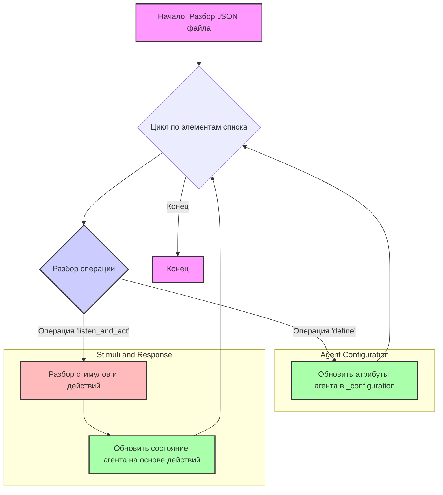

## ИНСТРУКЦИЯ:

Анализируй предоставленный код подробно и объясни его функциональность. Ответ должен включать три раздела:

1. **<алгоритм>**: Опиши рабочий процесс в виде пошаговой блок-схемы, включая примеры для каждого логического блока, и проиллюстрируй поток данных между функциями, классами или методами.
2. **<mermaid>**: Напиши код для диаграммы в формате `mermaid`, проанализируй и объясни все зависимости,
    которые импортируются при создании диаграммы.
    **ВАЖНО!** Убедитесь, что все имена переменных, используемые в диаграмме `mermaid`,
    имеют осмысленные и описательные имена. Имена переменных вроде `A`, `B`, `C`, и т.д., не допускаются!

    **Дополнительно**: Если в коде есть импорт `import header`, добавьте блок `mermaid` flowchart, объясняющий `header.py`:\
    ```mermaid
    flowchart TD
        Start --> Header[<code>header.py</code><br> Determine Project Root]

        Header --> import[Import Global Settings: <br><code>from src import gs</code>]
    ```

3. **<объяснение>**: Предоставьте подробные объяснения:
   - **Импорты**: Их назначение и взаимосвязь с другими пакетами `src.`.
   - **Классы**: Их роль, атрибуты, методы и взаимодействие с другими компонентами проекта.
   - **Функции**: Их аргументы, возвращаемые значения, назначение и примеры.
   - **Переменные**: Их типы и использование.
   - Выделите потенциальные ошибки или области для улучшения.

Дополнительно, постройте цепочку взаимосвязей с другими частями проекта (если применимо).

Это обеспечивает всесторонний и структурированный анализ кода.
## Формат ответа: `.md` (markdown)
**КОНЕЦ ИНСТРУКЦИИ**

## <алгоритм>
1. **Начало**: JSON файл представляет собой список, где каждый элемент — это список из четырех элементов.
2. **Обработка каждого элемента**:
   - Первый элемент списка — это хеш-код (строка), служащий идентификатором изменения или операции.
   - Второй элемент — это строка, представляющая собой код операции определения (`define`) и значения, которые нужно установить, например, `('define', (TinyPerson(name='Oscar'), 'age', 30), {})`.
   - Третий элемент всегда `null`.
   - Четвертый элемент — это словарь (объект JSON), содержащий состояние агентов, сред и фабрик.
3.  **Разбор операции "define"**:
    -  Строка операции `define` содержит информацию о том, какой именно атрибут агента должен быть изменён и на какое значение.
    - `TinyPerson(name='Oscar')` идентифицирует агента, атрибут которого будет изменён.
    -  В зависимости от атрибута, происходит обновление  соответствующих свойств в словаре `_configuration` объекта агента.
      -  Примеры изменения:
          -  `('define', (TinyPerson(name='Oscar'), 'age', 30), {})`: устанавливает возраст Оскара в 30 лет.
          -  `('define', (TinyPerson(name='Oscar'), 'nationality', 'German'), {})`: устанавливает национальность Оскара как "German".
          -  `('define', (TinyPerson(name='Oscar'), 'occupation', 'Architect'), {})`: устанавливает профессию Оскара как "Architect".
          - `('define', (TinyPerson(name='Oscar'), 'routine', 'Every morning, you wake up, feed your dog, and go to work.'), {'group': 'routines'})`: добавляет рутину Оскару.
          - `('define', (TinyPerson(name='Oscar'), 'occupation_description', 'You are an architect...'), {})`: устанавливает описание профессии Оскара.
          - `('define', (TinyPerson(name='Oscar'),), {'key': None, 'value': {'trait': 'You are fast paced...'}, 'group': 'personality_traits'})`: устанавливает черту характера Оскара.
          - `('define', (TinyPerson(name='Oscar'),), {'key': None, 'value': {'interest': 'Modernist architecture and design.'}, 'group': 'professional_interests'})`: устанавливает профессиональный интерес.
          - `('define', (TinyPerson(name='Oscar'),), {'key': None, 'value': {'interest': 'Playing the guitar.'}, 'group': 'personal_interests'})`: устанавливает личный интерес.
          - `('define', (TinyPerson(name='Oscar'),), {'key': None, 'value': {'skill': 'You are very familiar with AutoCAD, and use it for most of your work.'}, 'group': 'skills'})`: устанавливает навык Оскара.
          - `('define', (TinyPerson(name='Oscar'),), {'key': None, 'value': {'name': 'Richard', 'description': 'your colleague...'}, 'group': 'relationships'})`: устанавливает отношения Оскара.
4.  **Разбор операции "listen_and_act"**:
     - Строка операции `listen_and_act` содержит информацию о том, какое сообщение было отправлено агенту, например,  `('listen_and_act', (TinyPerson(name='Oscar'), 'How are you doing?'), {})`
     - Далее в JSON файле можно найти стимул от пользователя (ключ "user")
     -  после стимула идут ответ агента, и т.д..
5. **Обновление состояния агента**: На основе полученных данных из операций `define` и `listen_and_act` происходит обновление свойств агента, таких как возраст, национальность, профессия, и т.д.
6. **Конец**: Процесс повторяется для каждого элемента списка.

## <mermaid>


**Описание `mermaid` диаграммы:**

-   `A[Начало: Разбор JSON файла]` :  Начало процесса, представляющее собой начало чтения и разбора JSON файла.
-   `B{Цикл по элементам списка}`:  Представляет цикл, в котором происходит итерация по каждому элементу списка в JSON файле.
-   `C{Разбор операции}`:  Решение, которое определяет тип операции (`define` или `listen_and_act`).
-   `D[Обновить атрибуты агента в _configuration]`: Блок, который обновляет атрибуты агента, хранящиеся в поле `_configuration`, на основе данных из операции `define`.
-   `E[Разбор стимулов и действий]`: Блок, который разбирает стимулы и формирует действия агента в ответ на сообщение из операции `listen_and_act`
-   `F[Обновить состояние агента на основе действий]`: Блок, который обновляет внутреннее состояние агента (`_actions_buffer`, `_displayed_communications_buffer` и `episodic_memory`) на основе данных из операции `listen_and_act`.
-   `B -- Конец --> G[Конец]`: Указывает на конец цикла и всего процесса.
-  `style A fill:#f9f,stroke:#333,stroke-width:2px`  и другие style блоки: Указывают на стилизацию соответствующих блоков, например, цвет заливки и толщина границ
- `subgraph Agent Configuration` ... `end` и `subgraph Stimuli and Response` ... `end`: создают визуальные подгруппы, чтобы отделить разные этапы процесса

## <объяснение>
### Общее описание
Представленный JSON-файл - это кэш, который содержит историю изменений состояния агента "Oscar" в рамках симуляции. Каждое изменение представлено в виде списка, где:
- Первый элемент – это хеш, идентифицирующий изменение.
- Второй элемент – это строка с описанием действия (`define` или `listen_and_act`) и его параметров.
- Третий – всегда `null`.
- Четвертый – JSON-объект, представляющий собой текущее состояние агентов.

Структура предназначена для хранения и восстановления состояния симуляции агента в определенный момент времени, позволяя воспроизводить последовательность изменений.

### Разбор JSON-объектов:

**Импорты:**
В данном коде нет явных импортов Python-модулей, но есть обращения к `TinyPerson`, который является классом, определенным в `src`.

**Структура данных:**
- **Массив (список) изменений**:
  - Содержит список всех изменений состояния агента.
-   **Каждое изменение**:
    -   Состоит из хеша, строки операции, `null` и JSON-объекта состояния.
    -  **Строка операции**:
        -  Либо "define" для изменения свойств агента.
        -  Либо "listen_and_act" - описывает взаимодействие с агентом и его ответ.
    - **JSON-объект состояния**:
       - Ключ `agents` – это список, обычно содержащий один объект (словарь), представляющий агента "Oscar".
       -  Атрибуты `name`, `current_messages`, `_actions_buffer`, `_accessible_agents`, `_displayed_communications_buffer`, `episodic_memory`, `semantic_memory`, `_configuration` и др., отражают состояние агента на определенный момент времени.
    -   **Атрибут `_configuration`**: Содержит всю информацию о персонаже, его основные характеристики, навыки, интересы и текущее состояние.
-   **Атрибут `current_messages`**: Список сообщений, которые влияли на состояние агента, включая сообщения от системы, пользователя и сгенерированный ответ.
-   **Атрибут `_actions_buffer`**: Список действий, которые агент должен выполнить.
-  **Атрибут `_displayed_communications_buffer`**: Список коммуникаций, которые должны отображаться пользователю.
-  **Атрибут `episodic_memory`**: Содержит историю взаимодействия агента с внешним миром.
-  **Атрибут `semantic_memory`**: Представляет базу знаний агента.

**Классы:**
- `TinyPerson`: Предположительно класс, представляющий агента в симуляции. Он используется в операции define для указания, чьи атрибуты мы изменяем. Без доступа к определению этого класса точную природу его работы определить сложно. Вероятнее всего, он имеет методы для управления атрибутами, и возможно, является частью более общей иерархии классов.
    - Атрибут `name`  представляет имя агента "Oscar".
  
**Функции:**
- `define` (операция): Представляет собой операцию изменения состояния агента. Принимает имя агента, название изменяемого атрибута, его значение и дополнительные опции (например, group).
-   `listen_and_act` (операция): Представляет взаимодействие с агентом, где он обрабатывает сообщения и выполняет действия.
  
**Переменные:**
-  `name`, `age`, `nationality`, `occupation`, `routine`, `occupation_description`, `trait` и др: Атрибуты агента (имя, возраст, национальность, профессия, рутина, описание профессии, черты характера и т.д.), которые хранятся в объекте `_configuration`.
-   `_actions_buffer`, `_accessible_agents`, `_displayed_communications_buffer`: Внутренние переменные агента для управления его поведением в симуляции.
-  `episodic_memory`, `semantic_memory`:  Отражают когнитивные свойства агента.
-  `simulation_id`: Id симуляции агента.

### Связи с другими частями проекта:
- Предполагается, что этот JSON файл используется для работы с агентами, которые в свою очередь используют классы и функции, определенные в `src.`.
- Вероятнее всего, `TinyPerson` и функции  `define` и `listen_and_act` являются частью фреймворка для симуляции агентов в проекте `tinytroupe`.

### Потенциальные ошибки и улучшения:
- Отсутствие обработки ошибок при разборе строк `define`, что может привести к сбоям при некорректном формате данных.
- Слишком большое количество данных (состояние агента, память, и др.) в одном JSON файле, что может усложнить процесс разбора.
- Стоит ли кэшировать все изменения в таком виде - возможно, лучше сохранять только изменения.
-  Стоит добавить проверку на тип данных, которые загружаются в `_configuration`

**Улучшения:**
- Можно добавить валидацию данных при операциях `define` и `listen_and_act`, чтобы обеспечить целостность данных.
- Рекомендуется разбить большой JSON файл на более мелкие, возможно, храня каждый шаг симуляции в отдельном файле, чтобы упростить процесс загрузки и разбора.
-   Можно разработать класс или функции для загрузки, разбора и применения этих данных к агентам, улучшив тем самым структуру и масштабируемость кода.

### Цепочка взаимосвязей:
Этот JSON-файл — часть системы симуляции агентов. Он хранит состояние агента `Oscar` с историей всех произошедших с ним изменений.
-   Файл используется для восстановления состояния агента в определенный момент времени.
-   `TinyPerson` — класс, определяющий структуру и логику агента.
-   Функции `define` и `listen_and_act` — методы, изменяющие или использующие состояние агента.
-   Данные, представленные в JSON-файле, влияют на поведение агента в симуляции, и, как следствие, на результаты всей симуляции.
-  Взаимодействует с логикой обработки действий агента, влияя на изменения  `_actions_buffer`, `_displayed_communications_buffer` и `episodic_memory`.
-   Данные загружаются из файла, анализируются и применяются к объектам агента, что влияет на их поведение в симуляции.

Этот файл является неотъемлемой частью механизма сохранения и восстановления состояний агента, позволяющего проводить симуляцию в течение длительного времени и воспроизводить предыдущие ситуации.