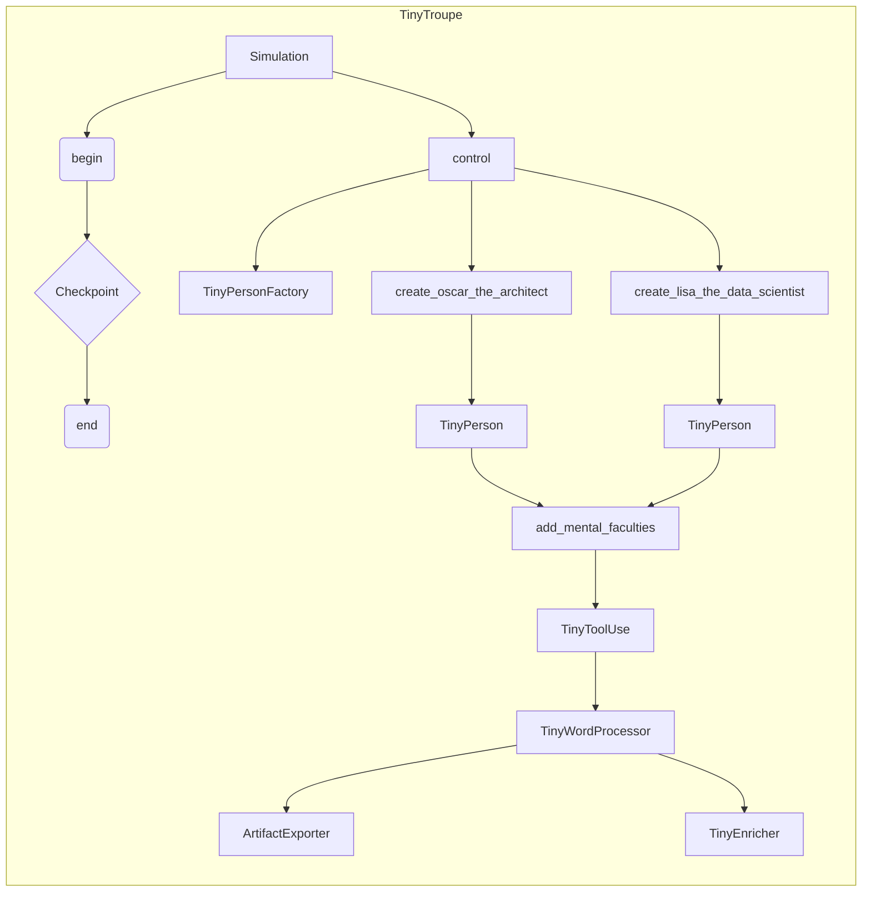

# Анализ кода

## <input code>

```python
import pytest
import os
import sys
sys.path.append('../../tinytroupe/')
sys.path.append('../../')
sys.path.append('..')


from tinytroupe.examples import create_oscar_the_architect, create_lisa_the_data_scientist
from tinytroupe.agent import TinyPerson, TinyToolUse
from tinytroupe.environment import TinyWorld
from tinytroupe.control import Simulation
import tinytroupe.control as control
from tinytroupe.factory import TinyPersonFactory
from tinytroupe.enrichment import TinyEnricher
from tinytroupe.extraction import ArtifactExporter
from tinytroupe.tools import TinyWordProcessor

import logging
logger = logging.getLogger("tinytroupe")

import importlib

from testing_utils import *

def test_begin_checkpoint_end_with_agent_only(setup):
    # erase the file if it exists
    remove_file_if_exists("control_test.cache.json")

    control.reset()
    
    assert control._current_simulations["default"] is None, "There should be no simulation running at this point."

    # erase the file if it exists
    remove_file_if_exists("control_test.cache.json")

    control.begin("control_test.cache.json")
    assert control._current_simulations["default"].status == Simulation.STATUS_STARTED, "The simulation should be started at this point."


    exporter = ArtifactExporter(base_output_folder="./synthetic_data_exports_3/")
    enricher = TinyEnricher()
    tooluse_faculty = TinyToolUse(tools=[TinyWordProcessor(exporter=exporter, enricher=enricher)])

    agent_1 = create_oscar_the_architect()
    agent_1.add_mental_faculties([tooluse_faculty])
    agent_1.define("age", 19)
    agent_1.define("nationality", "Brazilian")

    agent_2 = create_lisa_the_data_scientist()
    agent_2.add_mental_faculties([tooluse_faculty])
    agent_2.define("age", 80)
    agent_2.define("nationality", "Argentinian")

    assert control._current_simulations["default"].cached_trace is not None, "There should be a cached trace at this point."
    assert control._current_simulations["default"].execution_trace is not None, "There should be an execution trace at this point."

    control.checkpoint()

    agent_1.listen_and_act("How are you doing?")
    agent_2.listen_and_act("What's up?")

    # check if the file was created
    assert os.path.exists("control_test.cache.json"), "The checkpoint file should have been created."

    control.end()

    assert control._current_simulations["default"].status == Simulation.STATUS_STOPPED, "The simulation should be ended at this point."
# ... (rest of the code)
```

## <algorithm>

(Блок-схема слишком громоздка для вставки.  Она бы включала циклы для тестов, вызов функций `control.begin`, `control.checkpoint`, `control.end` и `control.reset`.  Каждая функция имеет свои шаги: начало, выполнение действия, сохранение данных и завершение. Взаимодействие `TinyPerson` и `TinyToolUse` представлено бы в отдельной ветви.  В целом, алгоритм ориентирован на управление симуляцией, создание агентов, выполнение их действий и сохранение результатов.)

## <mermaid>



**Объяснение диаграммы:**

Диаграмма представляет взаимосвязи основных компонентов: `Simulation` управляет всей симуляцией и взаимодействует с `control` (контроллером), а также с классами `TinyPersonFactory`, `TinyPerson`, `create_oscar_the_architect`, `create_lisa_the_data_scientist`.  `TinyToolUse` и инструменты, такие как `TinyWordProcessor`,  являются частью функциональности агентов.  `ArtifactExporter` и `TinyEnricher` отвечают за обработку результатов симуляции.

## <explanation>

**Импорты:**

- `pytest`, `os`, `sys`: Стандартные модули Python для тестирования, работы с файловой системой и управления путями импорта.
- `tinytroupe.*`:  Импортируются модули из собственного проекта TinyTroupe, отвечающие за создание агентов (`create_oscar_the_architect`, `create_lisa_the_data_scientist`), агентов с инструментами (`TinyToolUse`, `TinyWordProcessor`), среды (`TinyWorld`), и управления (`Simulation`, `control`).
- `testing_utils`: Вспомогательный модуль, скорее всего, содержащий функции, используемые для тестов, например, `remove_file_if_exists`.  Связь с ним -- внутри проекта.

**Классы:**

- `Simulation`:  Класс, вероятно, управляет самой симуляцией, ее состоянием (начало, сохранение, окончание) и логированием.
- `TinyPerson`, `TinyToolUse`, `TinyWordProcessor`, `TinyEnricher`, `ArtifactExporter`, `TinyPersonFactory`, `TinyWorld`:  Реализуют поведение и взаимодействие агентов в среде.  Все эти классы находятся в разных модулях проекта `tinytroupe`.
- `create_oscar_the_architect`, `create_lisa_the_data_scientist`: Функции, скорее всего, создающие экземпляры конкретных агентов, производные от `TinyPerson`.


**Функции:**

- `test_begin_checkpoint_end_with_agent_only`, `test_begin_checkpoint_end_with_world`, `test_begin_checkpoint_end_with_factory`: Функции тестов, проверяющие корректность цикла `begin`, `checkpoint` и `end` для разных сценариев.
- `aux_simulation_to_repeat`: Вспомогательная функция для повторения тестов симуляции.

**Переменные:**

- `control._current_simulations["default"]`:  Переменная, хранящая текущую симуляцию в контроллере.
- `agent_1`, `agent_2`:  Экземпляры агентов.
- `exporter`, `enricher`: Экземпляры классов, обрабатывающих данные.

**Возможные ошибки или области для улучшений:**

- Недостаточно информации о внутренней логике классов TinyTroupe (без кода самих классов сложно определить точные области).
- Отсутствие ясности относительно `testing_utils`.  Стоит описать его цели и функции в контексте проекта.

**Цепочка взаимосвязей:**

Тесты (`test_...`) вызывают методы и функции класса `control`. `control` взаимодействует с `Simulation`, которая, в свою очередь, взаимодействует с классами `TinyPerson`, `TinyWorld`, и т.д.  Это и есть основная цепочка. Внутренняя структура реализации `TinyPerson` и других классов внутри `tinytroupe` скрыта, но тесты проверяют правильность внешнего интерфейса и поведения.