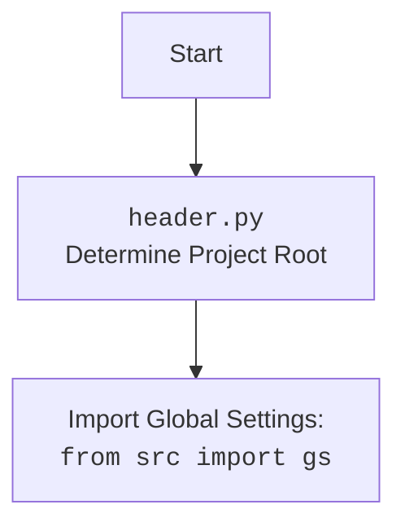

## Анализ кода `test_enrichment.py`

### <алгоритм>

1.  **Начало**: Запускается тест `test_enrich_content`.
2.  **Подготовка данных**:
    *   Определяется переменная `content_to_enrich`, содержащая многострочный текст (исходное содержимое для обогащения) c использованием `textwrap.dedent` для удаления лишних отступов.
        ```python
        content_to_enrich = """
            # WonderCode & Microsoft Partnership: Integration of WonderWand with GitHub
            ## Executive Summary
            ...
            ## Financial Planning
            - **Cost-Benefit Analysis**: ...
        """
        ```
    *   Определяется переменная `requirements`, содержащая текст с требованиями к обогащению контента, также с использованием `textwrap.dedent`
        ```python
        requirements = """
            Turn any draft or outline into an actual and long document, with many, many details. Include tables, lists, and other elements.
            The result **MUST** be at least 3 times larger than the original content in terms of characters - do whatever it takes to make it this long and detailed.
        """
        ```
3.  **Инициализация `TinyEnricher`**: Создается экземпляр класса `TinyEnricher`.
4.  **Вызов `enrich_content`**: Вызывается метод `enrich_content` класса `TinyEnricher` со следующими аргументами:
    *   `requirements`: Требования к обогащению.
    *   `content`: Исходный текст для обогащения.
    *   `content_type`: Тип контента (`"Document"`).
    *   `context_info`: Контекстная информация ("WonderCode was approached by Microsoft to for a partnership.").
    *   `context_cache`: `None`.
    *   `verbose`: `True` (включен режим подробного вывода).
5.  **Проверка результата**:
    *   Проверяется, что результат не равен `None`.
    *   Выводится отладочная информация в лог: обогащенный текст, его длина, длина исходного текста.
    *   Проверяется, что длина обогащенного текста как минимум в 3 раза больше длины исходного текста.
6.  **Завершение**: Тест завершается.

### <mermaid>

```mermaid
flowchart TD
    Start(Start Test: test_enrich_content) --> PrepareData[Prepare content_to_enrich and requirements];
    PrepareData --> CreateEnricher[Create TinyEnricher Instance];
    CreateEnricher --> CallEnrichContent[Call enrich_content(requirements, content, content_type, context_info, context_cache, verbose=True)];
    CallEnrichContent --> CheckResultNotNull[Assert result is not None];
    CheckResultNotNull --> LogDebugInfo[Log enrichment result, lengths to debug];
    LogDebugInfo --> CheckResultLength[Assert len(result) >= len(content_to_enrich) * 3];
    CheckResultLength --> End(End Test);
```

**Объяснение зависимостей:**

*   `Start`: Начало тестовой функции `test_enrich_content`.
*   `PrepareData`: Подготавливает данные `content_to_enrich` и `requirements` для использования в тесте. Используется `textwrap.dedent` для удаления отступов из многострочного текста.
*   `CreateEnricher`: Создает экземпляр класса `TinyEnricher`, который отвечает за обогащение контента.
*   `CallEnrichContent`: Вызывает метод `enrich_content` объекта `TinyEnricher`, передавая подготовленные данные. Это основная функция, которая выполняет обогащение.
*   `CheckResultNotNull`: Проверяет, что результат обогащения не равен `None`, гарантируя, что обогащение вернуло какой-то результат.
*   `LogDebugInfo`: Выводит отладочную информацию о результате обогащения, включая длину результата и исходного текста, для отладки и анализа.
*   `CheckResultLength`: Проверяет, что длина обогащенного текста как минимум в 3 раза больше длины исходного текста, что соответствует требованиям теста.
*    `End`: Конец тестовой функции.



**Объяснение зависимостей:**
*   `Start`: Начало процесса.
*   `Header`: Представляет файл `header.py`, который, по всей видимости, определяет корень проекта.
*   `import`: `header.py` импортирует глобальные настройки проекта из `src.gs`

### <объяснение>

**Импорты:**

*   `pytest`: Используется для создания и запуска тестов.
*   `textwrap`: Используется для работы с многострочными текстами, в частности, для удаления отступов с помощью `textwrap.dedent`.
*    `logging`: Модуль для журналирования событий, используется для отладки и логирования.
*   `sys`: Модуль `sys` используется для изменения путей поиска модулей, добавлены директории: `'../../tinytroupe/'`, `'../../'`, `'../'`, для импорта модулей `testing_utils` и `tinytroupe.enrichment`.
*   `testing_utils`: Предположительно, содержит вспомогательные функции для тестирования (не используется в данном конкретном тесте).
*   `tinytroupe.enrichment.TinyEnricher`: Импортируется класс `TinyEnricher` из модуля `tinytroupe.enrichment`, который отвечает за обогащение текста.

**Классы:**

*   `TinyEnricher`: Класс, предоставляющий функциональность для обогащения контента.  Он имеет метод `enrich_content`, который используется для обработки входного текста в соответствии с заданными требованиями.

**Функции:**

*   `test_enrich_content()`: Тестовая функция, которая выполняет следующие действия:
    *   Подготавливает исходный контент и требования к обогащению.
    *   Создает экземпляр класса `TinyEnricher`.
    *   Вызывает метод `enrich_content` для обогащения текста.
    *   Проверяет, что результат не `None` и длина результирующего текста не менее чем в 3 раза больше длины исходного текста.
    *   Выводит отладочную информацию в лог.
    *   **Аргументы**: Нет
    *   **Возвращаемое значение**: Нет (функция тестирует поведение, а не возвращает значение)

**Переменные:**

*   `content_to_enrich`: Строка (многострочный текст) с исходным содержимым для обогащения.
*   `requirements`: Строка (многострочный текст) с требованиями к процессу обогащения.
*   `result`: Строка, содержащая обогащенный текст, полученный от `TinyEnricher`.
*   `logger`: Экземпляр `logging.Logger` для журналирования сообщений.

**Потенциальные ошибки и улучшения:**

*   **Зависимость от путей**: Использование `sys.path.append` для добавления путей поиска модулей может быть хрупким решением.  Лучше использовать более надежные методы, например, переменные окружения или структуру пакетов Python.
*   **Отсутствие `setup.py`**:  Для более правильной организации проекта следует добавить `setup.py` или `pyproject.toml` для управления зависимостями и путями.
*   **Недостаточный объем проверок**: Тест проверяет только длину и отсутствие `None` в результате.  Было бы полезно добавить проверки на формат, структуру и соответствие содержимого требованиям.
*   **Жесткие требования по длине**:  Требование к увеличению текста ровно в 3 раза может быть слишком жестким и не всегда достижимым. Стоит сделать проверку более гибкой.
*   **Отсутствие `testing_utils`**: Не видно, где используется `testing_utils` в текущем тесте, но его импорт может намекать на потенциальное использование в других тестах.
*   **Логирование**: Логирование в режиме отладки (`logger.debug`) полезно для разработчиков, но может не подойти для обычного использования или автоматизированных тестов.
*   **Неявные допущения**:  Тест предполагает, что класс `TinyEnricher` и его метод `enrich_content` работают так, как ожидается.  Стоит добавить отдельные тесты для `TinyEnricher`, чтобы убедиться в его корректности.

**Цепочка взаимосвязей:**

1.  `test_enrichment.py` зависит от `tinytroupe.enrichment.TinyEnricher` для выполнения основной операции обогащения контента.
2.  Импорт `testing_utils` указывает на то, что в других файлах проекта, возможно, есть вспомогательные функции для тестирования.
3.  Импорт `logging` подразумевает использование журналирования для отладки и трассировки хода выполнения программы.
4.  Изменение `sys.path` говорит о том, что структура проекта, возможно, нестандартная, и `TinyEnricher` не расположен в текущей директории и директориях импорта.
5.  Подразумевается, что проект имеет модуль `header.py` который определяет корень проекта и импортирует глобальные настройки из `src.gs`.

Этот анализ представляет собой подробное объяснение кода `test_enrichment.py`, его функциональности, зависимостей и областей для улучшения.