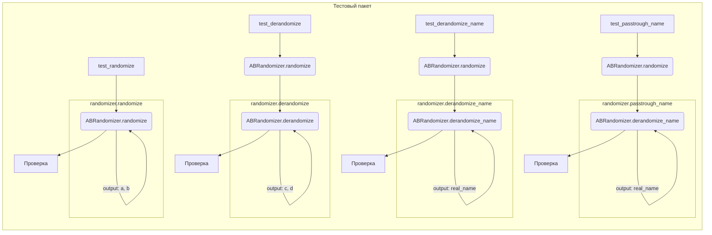

# <input code>

```python
import pytest
import sys
sys.path.append('../../tinytroupe/')
sys.path.append('../../')
sys.path.append('..')

from testing_utils import *

from tinytroupe.experimentation import ABRandomizer

def test_randomize():
    randomizer = ABRandomizer()
    # run multiple times to make sure the randomization is properly tested
    for i in range(20):
        a, b = randomizer.randomize(i, "option1", "option2")

        if randomizer.choices[i] == (0, 1):
            assert (a, b) == ("option1", "option2")
        elif randomizer.choices[i] == (1, 0):
            assert (a, b) == ("option2", "option1")
        else:
            raise Exception(f"No randomization found for item {i}")

def test_derandomize():
    randomizer = ABRandomizer()

    # run multiple times to make sure the randomization is properly tested
    for i in range(20):
        a, b = randomizer.randomize(i, "option1", "option2")
        c, d = randomizer.derandomize(i, a, b)

        assert (c, d) == ("option1", "option2")

def test_derandomize_name():
    randomizer = ABRandomizer()

    for i in range(20):
        a, b = randomizer.randomize(i, "A", "B")
        real_name = randomizer.derandomize_name(i, a)

        if randomizer.choices[i] == (0, 1):
            assert real_name == "control"
        elif randomizer.choices[i] == (1, 0):
            assert real_name == "treatment"
        else:
            raise Exception(f"No randomization found for item {i}")


def test_passtrough_name():
    randomizer = ABRandomizer(passtrough_name=["option3"])
    a, b = randomizer.randomize(0, "option1", "option2")
    real_name = randomizer.derandomize_name(0, "option3")

    assert real_name == "option3"

def test_intervention_1():
    pass # TODO
```

# <algorithm>

**Шаг 1:**  Импортируются необходимые модули. `pytest` для тестирования, `sys` для добавления путей. `testing_utils` — скорее всего, модуль для полезных функций тестирования. `ABRandomizer` из `tinytroupe.experimentation`.

**Шаг 2:**  Функция `test_randomize`:  
   * Создается экземпляр класса `ABRandomizer`.
   * В цикле `for` (20 итераций) вызывается `randomize` для генерации случайных пар.
   * Проверяется, соответствует ли результат ожидаемому.


**Шаг 3:** Функция `test_derandomize`:
   * Создается экземпляр класса `ABRandomizer`.
   * В цикле `for` (20 итераций) вызывается `randomize`, затем `derandomize` для проверки обратного преобразования.
   * Проверяется, что `derandomize` возвращает исходные значения.

**Шаг 4:** Функция `test_derandomize_name`:
    * Создается экземпляр класса `ABRandomizer`.
    * В цикле `for` (20 итераций) вызывается `randomize`, затем `derandomize_name` для проверки имени по случайной переменной.
   * Проверяется, что `derandomize_name` возвращает правильное имя.

**Шаг 5:** Функция `test_passtrough_name`:
   * Создается экземпляр класса `ABRandomizer` с опцией `passtrough_name`.
   * Вызывается `randomize`.
   * Вызывается `derandomize_name` с `option3`.
   * Проверяется, что `derandomize_name` возвращает "option3"


**Пример данных:**

Внутри циклов, для конкретной итерации `i`, данные могут передаваться таким образом:
- `randomizer.randomize(i, "option1", "option2")` возвращает пару (`a`, `b`).
- `randomizer.derandomize(i, a, b)` возвращает пару (`c`, `d`).

В каждом тесте данные проходят через методы `randomize` и `derandomize` или `derandomize_name`.


# <mermaid>



**Описание диаграммы:**

Диаграмма описывает зависимость между тестовыми функциями (A, D, I, M) и методом `ABRandomizer`.  Внутри каждого блока (функция или метод) показано, какие данные принимаются на вход и какие возвращаются в последующие блоки.


# <explanation>

**Импорты:**

- `pytest`: Библиотека для написания тестов.
- `sys`: Модуль для работы с системой, используется для добавления путей к модулям `tinytroupe` и другим. Это важно, если файлы `tinytroupe` лежат в другом каталоге.
- `testing_utils`:  Скорее всего, содержит вспомогательные функции или классы для тестирования (не определены в данном фрагменте кода).
- `tinytroupe.experimentation.ABRandomizer`:  Класс, реализующий логику A/B-тестирования.


**Классы:**

- `ABRandomizer`:  Этот класс отвечает за случайное распределение элементов между группами A и B (control и treatment).  Атрибут `choices` хранит результаты случайной выборки.  Важно, что `choices` является частной переменной.

**Функции:**

- `test_randomize`: Проверяет, что функция `randomize` класса `ABRandomizer` правильно генерирует случайные пары. 
- `test_derandomize`: Проверяет корректность обратного преобразования (`derandomize`).
- `test_derandomize_name`: Проверяет, что функция `derandomize_name` правильно восстанавливает исходное имя элемента.
- `test_passtrough_name`: Проверяет, что если задан параметр `passtrough_name`, то соответствующие элементы остаются без изменения.
- `test_intervention_1`: Заглушка для будущего теста (TODO).

**Переменные:**

- `randomizer`: Экземпляр класса `ABRandomizer`.
- `a`, `b`, `c`, `d`: Переменные для хранения результатов работы функций.
- `i`:  Переменная цикла в тестах.
- `real_name`:  Результат вызова `derandomize_name`.


**Возможные ошибки/улучшения:**

- Отсутствует проверка корректности входных данных для методов `randomize`, `derandomize` и `derandomize_name`. Например, проверка, что `i` является допустимым индексом в `choices`.
- `test_intervention_1`  —  нужно реализовать.
- Не указано, как генерируются случайные числа (`choices`).  В идеале должен быть использован надежный генератор псевдослучайных чисел (например, из `random` модуля), а не просто массив.

**Связь с другими частями проекта:**

Функции `randomize`, `derandomize` и `derandomize_name` из `ABRandomizer`  явно используются для тестирования (в `test_...` функциях).  Зависимость `testing_utils` также является частью тестирующей инфраструктуры проекта.