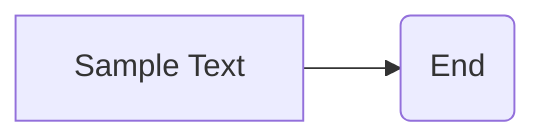

```MD
1. **<input code>**

```
This is a sample text.
```

2. **<algorithm>**

В данном случае предоставленный код не представляет собой программу или фрагмент кода, который можно выполнить.  Это просто текстовая строка.  Поэтому алгоритм не может быть представлен в виде блок-схемы.  Отсутствуют какие-либо переменные, функции или классы для анализа.

3. **<mermaid>**



4. **<explanation>**

Предоставленный код не содержит кода в привычном смысле.  Это просто строка текста "This is a sample text.".  Поэтому нет импортов, классов, функций или переменных для анализа.  Это не код, а данные, скорее всего, часть входных данных или пример текста, предназначенного для использования в каком-то другом контексте, например, для тестирования, документации или демонстрации.

Возможные сценарии использования:

* **Тестирование:** Строка "This is a sample text." может быть частью входных данных для тестирования функции, которая обрабатывает текст.
* **Документация:** Она может служить примером входного текста для описания функции.
* **Демонстрация:** Строка может быть представлена как образец текста для демонстрации.

Отсутствуют зависимости от других частей проекта, так как код не взаимодействует с другими компонентами.  Невозможно определить какие-либо ошибки или области для улучшения, поскольку нет кода, который можно было бы анализировать.