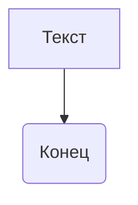

```MD
1. **<input code>**

```
This is a sample text.
```

2. **<algorithm>**

Поскольку предоставленный код представляет собой просто строку текста, алгоритм работы не применим в традиционном понимании.  Нет функций, циклов или других структур, требующих алгоритмического описания.  Данные не перемещаются между функциями или классами.


3. **<mermaid>**



4. **<explanation>**

Этот код не содержит ни одного класса, функции, импорта или переменной. Он представляет собой просто строку текста "This is a sample text."  В отсутствие какой-либо структуры кода нет импортов, классов, функций, переменных или их взаимодействия с другими частями проекта, которые можно проанализировать.

**Возможные ошибки или области для улучшений:**

Код не пригоден для анализа, так как не содержит ни одной исполняемой структуры.  Он не выполняет никаких действий.  Для того, чтобы код можно было проанализировать, он должен содержать, по крайней мере, одну функцию или класс, или, как минимум, переменную с определенным типом.