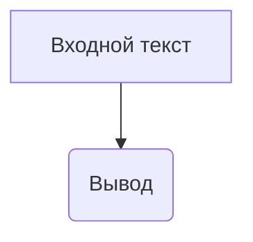

# Анализ кода

## <input code>

```
This is a sample text.
```

## <algorithm>

Данный код представляет собой просто строку текста.  Он не содержит функций, классов или циклов.  Алгоритм его работы сводится к выводу этой строки в консоль или файл.



**Пример:**

Ввод: "This is a sample text."
Вывод: "This is a sample text."


## <mermaid>


## <explanation>

Код представляет собой простую строку текста "This is a sample text.".  Сам по себе этот фрагмент кода не является функциональным в том смысле, что он не выполняет никаких действий, не вычисляет ничего и не взаимодействует с другими частями программы. Он может быть частью большего проекта, и его цель в этом контексте будет определяться этим проектом.

**Импорты:**

Отсутствуют.  Так как это не фрагмент кода с импортами.  В контексте, если это часть большего приложения, импорты определяют, какие модули и классы из других частей приложения могут быть использованы.

**Классы:**

Отсутствуют.

**Функции:**

Отсутствуют.

**Переменные:**

Отсутствуют.

**Возможные ошибки или области для улучшений:**

Нет ошибок и областей для улучшений, поскольку код просто представляет строку. В контексте анализа программного обеспечения, этот фрагмент кода не является "кодом" в том смысле, который предполагает анализ. Необходим больше контекст, чтобы оценить его функциональность и взаимосвязь с другими частями проекта. Без дополнительной информации, анализ ограничен выводом строки текста.