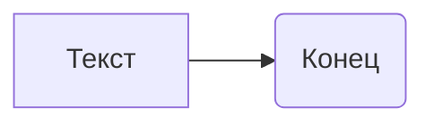

```MD
# Анализ кода

**1. <input code>**

```
This is a sample text.
```

**2. <algorithm>**

Код не содержит никаких функций, классов или структур данных. Это просто строка текста.  Поэтому алгоритм работы не может быть представлен в виде пошаговой блок-схемы.

**3. <mermaid>**



**4. <explanation>**

Код представляет собой простую строку текста `"This is a sample text."`.  Это не Python-код, а просто текст.  Поскольку нет кода в формате Python, нет импортов, классов, функций, переменных или других элементов, которые можно было бы проанализировать.  В данном случае нет взаимосвязей с другими частями проекта, так как сам код не связан с никаким проектом.

**Возможные ошибки или области для улучшений:**

Нет ошибок и улучшений, которые можно предложить, так как нет кода.  Если это часть большего кода, то возможно, этот текст должен быть обработан, например, в качестве входных данных.