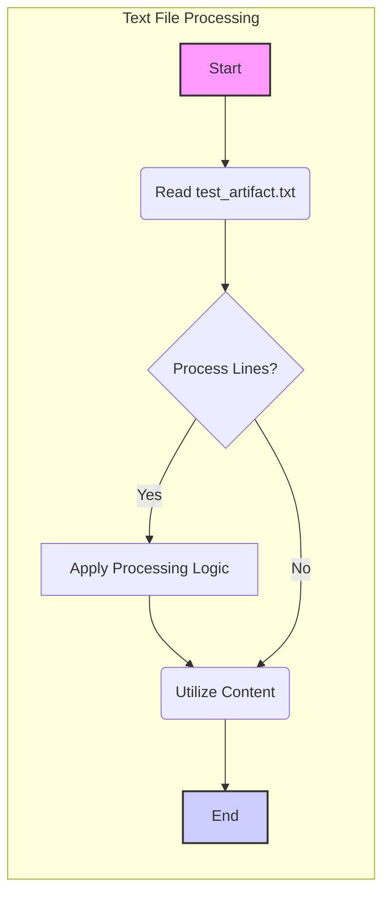

## Анализ кода: `hypotez/src/ai/tiny_troupe/TinyTroupe/tests/unit/test_exports/text/test_artifact.txt`

### 1. <алгоритм>

Поскольку предоставленный код является текстовым файлом (`test_artifact.txt`), а не исполняемым кодом на языке программирования, алгоритм его "обработки" будет заключаться в следующем:

1. **Чтение файла:** Файл `test_artifact.txt` читается построчно.
   * Пример: Содержимое файла "This is a sample text." будет прочитано как одна строка.
2. **Обработка строк (если нужно):**  В данном случае, поскольку это тестовый файл, предполагается, что дальнейшей обработки строк не требуется. Однако, в других сценариях:
   * *Пример фильтрации:* Можно отфильтровать строки, содержащие определенные ключевые слова. 
   * *Пример преобразования:* Можно привести текст к нижнему или верхнему регистру.
3. **Использование содержимого:** Содержимое файла может быть использовано в качестве входных данных для теста,  сравнения или другой операции.
   *  *Пример:* В тестовом окружении можно сравнить содержимое прочитанного файла с ожидаемым результатом.

**Блок-схема:**

```mermaid
graph LR
    A[Начало] --> B(Чтение файла "test_artifact.txt");
    B --> C{Нужна ли обработка строк?};
    C -- Да --> D[Обработка строк];
    D --> E(Использование содержимого);
    C -- Нет --> E;
    E --> F[Конец];
```

### 2. <mermaid>



**Анализ зависимостей:**

- Диаграмма описывает поток обработки текстового файла. Зависимости здесь подразумевают последовательность операций: чтение, опциональная обработка, и использование.
- **Импорты:** В данном случае, импортов нет, поскольку это описание обработки файла, а не код. В реальном коде, читающем этот файл,  могли бы использоваться библиотеки, например:
    - `io` или встроенные функции Python для операций с файлами.
    - `re` для регулярных выражений при обработке текста.
   
### 3. <объяснение>

**Объяснение:**

- **Импорты:**  Этот файл `.txt` не содержит кода и не имеет импортов. В коде, который будет *использовать* этот файл (например, в тестовом модуле), могли бы быть импорты для работы с файлами и текстом.
- **Классы:**  Этот файл `.txt` не содержит классов.
- **Функции:**  Этот файл `.txt` не содержит функций. Он содержит лишь текст, который может быть использован в качестве входных данных для функций, например, при тестировании.
- **Переменные:** В данном файле нет переменных. Однако, переменные могли бы быть использованы для хранения содержимого этого файла в коде, который его считывает, например:
    ```python
    with open("test_artifact.txt", "r") as f:
        file_content = f.read()
    ```
    В этом случае `file_content` - переменная типа `str`, которая будет хранить содержимое файла.
- **Потенциальные ошибки или области для улучшения:**
    - Поскольку это тестовый файл, сложно говорить об ошибках. Но, важно следить за его соответствием ожиданиям тестов. Если тесты ожидают определенного форматирования или структуры текста, это нужно учитывать.
    - Данный файл является статичным. При необходимости тестирования разных сценариев нужно использовать несколько таких файлов, или предусмотреть генерацию файлов.
- **Цепочка взаимосвязей с другими частями проекта:**
    - Этот файл, вероятно, используется в тестовых модулях `test_exports` для проверки функциональности текстового экспорта артефактов (основываясь на имени файла).
    - В проекте `hypotez` вероятно есть модули, которые обрабатывают, преобразовывают и экспортируют артефакты, а этот файл используется для их тестирования.

В заключение, файл `test_artifact.txt` - это просто текстовый файл,  используемый как входные данные для тестов в рамках проекта `hypotez`. Его "обработка" заключается в чтении и опциональном манипулировании содержимым в тестирующем коде.