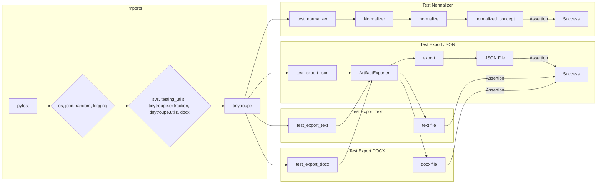

```MD
# <input code>

```python
import pytest
import os
import json
import random

import logging
logger = logging.getLogger("tinytroupe")

import sys
sys.path.append('../../tinytroupe/')
sys.path.append('../../')
sys.path.append('..')

from testing_utils import *
from tinytroupe.extraction import ArtifactExporter, Normalizer
from tinytroupe import utils

@pytest.fixture
def exporter():
    return ArtifactExporter(base_output_folder="./test_exports")

def test_export_json(exporter):
    # Define the artifact data
    artifact_data = {
        "name": "John Doe",
        "age": 30,
        "occupation": "Engineer",
        "content": "This is a sample JSON data."
    }
    
    # Export the artifact data as JSON
    exporter.export("test_artifact", artifact_data, content_type="record", target_format="json")
    
    #check if the JSON file was exported correctly
    assert os.path.exists("./test_exports/record/test_artifact.json"), "The JSON file should have been exported."

    # does it contain the data?
    with open("./test_exports/record/test_artifact.json", "r") as f:
        exported_data = json.load(f)
        assert exported_data == artifact_data, "The exported JSON data should match the original data."

def test_export_text(exporter):
    # Define the artifact data
    artifact_data = "This is a sample text."
    
    # Export the artifact data as text
    exporter.export("test_artifact", artifact_data, content_type="text", target_format="txt")
    
    # check if the text file was exported correctly
    assert os.path.exists("./test_exports/text/test_artifact.txt"), "The text file should have been exported."

    # does it contain the data?
    with open("./test_exports/text/test_artifact.txt", "r") as f:
        exported_data = f.read()
        assert exported_data == artifact_data, "The exported text data should match the original data."

def test_export_docx(exporter):
    # Define the artifact data. Include some fancy markdown formatting so we can test if it is preserved.
    artifact_data ="""
    # This is a sample markdown text
    This is a **bold** text.
    This is an *italic* text.
    This is a [link](https://www.example.com).
    """
    
    # Export the artifact data as a docx file
    exporter.export("test_artifact", artifact_data, content_type="Document", content_format="markdown", target_format="docx")
    
    # check if the docx file was exported correctly
    assert os.path.exists("./test_exports/Document/test_artifact.docx"), "The docx file should have been exported."

    # does it contain the data?
    from docx import Document
    doc = Document("./test_exports/Document/test_artifact.docx")
    exported_data = ""
    for para in doc.paragraphs:
        exported_data += para.text

    assert "This is a sample markdown text" in exported_data, "The exported docx data should contain some of the original content."
    assert "#" not in exported_data, "The exported docx data should not contain Markdown."


def test_normalizer():
    # Define the concepts to be normalized
    concepts = [...] # (list of strings)

    unique_concepts = list(set(concepts))

    normalizer = Normalizer(concepts, n=10, verbose=True)

    assert len(normalizer.normalized_elements) == 10, "The number of normalized elements should be equal to the specified value."

    random_concepts_buckets = [...] # (list of lists of strings)

    assert len(normalizer.normalizing_map.keys()) == 0, "The normalizing map should be empty at the beginning."
    for bucket in random_concepts_buckets:
        init_cache_size = len(normalizer.normalizing_map.keys())
        
        normalized_concept = normalizer.normalize(bucket)
        assert normalized_concept is not None, "The normalized concept should not be None."
        logger.debug(f"Normalized concept: {bucket} -> {normalized_concept}")
        print(f"Normalized concept: {bucket} -> {normalized_concept}")

        next_cache_size = len(normalizer.normalizing_map.keys())

        assert len(normalized_concept) == len(bucket), "The normalized concept should have the same length as the input concept."

        for element in bucket:
            assert element in normalizer.normalizing_map.keys(), f"{element} should be in the normalizing map keys."

        assert next_cache_size > 0, "The cache size should be greater than 0 after normalizing a new concept."
        assert next_cache_size >= init_cache_size, "The cache size should not decrease after normalizing a new concept."
```

# <algorithm>

The code defines unit tests for the `ArtifactExporter` and `Normalizer` classes.  A step-by-step algorithm is as follows:


1. **Import necessary libraries:**  Import `pytest`, `os`, `json`, `random`, `logging`, `sys` and custom modules (`testing_utils`, `tinytroupe.extraction`, `tinytroupe.utils`, `docx`).


2. **Configure logging:** Initialize a logger named `tinytroupe`.


3. **Setup path for import:** Modify `sys.path` to allow importing modules from the `tinytroupe` package and the relevant subdirectories.


4. **Define a fixture `exporter`:** This creates an instance of the `ArtifactExporter` class with a base output folder set to `./test_exports`.


5. **Test `test_export_json`:**
   - Creates sample `artifact_data`.
   - Calls `exporter.export` to export the data as JSON.
   - Asserts that the file `./test_exports/record/test_artifact.json` exists and that its content matches the original data.


6. **Test `test_export_text`:** Similar to `test_export_json`, but exports data as a text file.


7. **Test `test_export_docx`:** Exports data as a docx file (using Markdown).
   - Creates sample `artifact_data` with markdown formatting.
   - Exports the data.
   - Asserts that the `.docx` file exists and that it contains the expected parts of the original content (verifies that Markdown was converted to text).
   - Asserts that no Markdown characters like '#' are present in the docx file.


8. **Test `test_normalizer`:**
   - Defines a list of concepts `concepts`.
   - Creates a `Normalizer` object and checks for the correct number of normalized elements (initializing).
   - Creates several `random_concepts_buckets` that contain samples from `concepts`.
   - Calls `normalizer.normalize` with each `bucket`, checking that the return value is not None, and the output has the same length as input.
   - Verifies that the `normalizer.normalizing_map` is updated with the normalized concepts and each element in the bucket is present as a key in the map.
   - Asserts that the size of the `normalizing_map` increases after each normalization call and does not decrease.


# <mermaid>



# <explanation>

**Импорты:**

- `pytest`: Для написания тестов.
- `os`: Для взаимодействия с операционной системой (проверка существования файлов).
- `json`: Для работы с JSON-данными.
- `random`: Для генерации случайных значений (в тесте `test_normalizer`).
- `logging`: Для ведения логов.
- `sys`: Для работы с путями.
- `testing_utils`, `tinytroupe.extraction`, `tinytroupe.utils`, `docx`:  Импорт собственных модулей проекта.  `testing_utils` вероятно содержит вспомогательные функции для тестирования, `tinytroupe.extraction` содержит классы `ArtifactExporter` и `Normalizer`, и `tinytroupe.utils` включает утилиты. `docx` - для работы с документами Word.


**Классы:**

- `ArtifactExporter`: Экспортирует артефакты в разные форматы (JSON, текст, DOCX).  Атрибут `base_output_folder` определяет базовый каталог для экспорта.  Метод `export` осуществляет сам экспорт.


- `Normalizer`: Нормализует концепты. Атрибуты включают `normalized_elements`, `normalizing_map`, `n` (параметр для ограничения количества нормализованных элементов) и `verbose`.  Метод `normalize` выполняет процесс нормализации.


**Функции:**

- `exporter()`: Фикстура для создания экземпляра `ArtifactExporter`.
- `test_export_json()`, `test_export_text()`, `test_export_docx()`: Функции тестирования экспорта артефактов в разные форматы. Используют `exporter` fixture для создания экземпляра `ArtifactExporter`.
- `test_normalizer()`: Функция тестирования класса `Normalizer`. Создает экземпляр `Normalizer` и вызывает его метод `normalize` с несколькими входными данными.  Производит проверки на корректность работы.


**Переменные:**

- `artifact_data`: Содержит данные для экспорта в разные форматы.
- `concepts`: Список концептов для нормализации.
- `random_concepts_buckets`: Список случайных выборок из списка концептов, используемых для тестирования нормализации.


**Возможные ошибки и области для улучшений:**

- Недостаточно ясны реализации `testing_utils`, `tinytroupe.extraction` и `tinytroupe.utils`.
-  Необходимо указать значения списка `concepts` в `test_normalizer`.
-   Утверждения `assert` в `test_normalizer`  имеют смысл только в контексте конкретного алгоритма и логики нормализации.
- Тесты могли бы быть более эффективными, если бы они проверяли конкретный алгоритм или поведение нормализации.

**Взаимосвязи с другими частями проекта:**

- Код использует `tinytroupe.extraction` и `testing_utils` (возможно, другие модули `tinytroupe`).  `tinytroupe`  вероятно содержит реализацию логики экспорта, а `testing_utils` – вспомогательные функции для тестирования. `docx` - для работы с форматом.

**Общее:**

Код хорошо структурирован, тесты четко проверяют основные функции экспорта и нормализации.  Необходимо уточнить реализацию `testing_utils`, `tinytroupe.extraction` и `tinytroupe.utils`, чтобы полностью понять весь функционал.