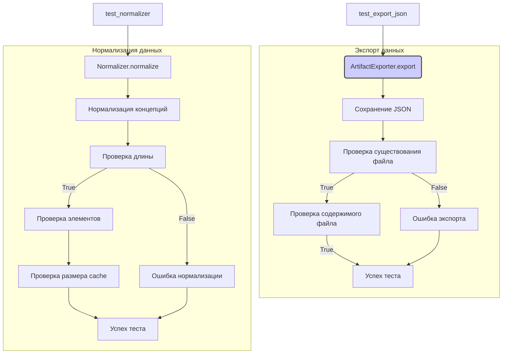

# <input code>

```python
import pytest
import os
import json
import random

import logging
logger = logging.getLogger("tinytroupe")

import sys
sys.path.append('../../tinytroupe/')
sys.path.append('../../')
sys.path.append('..')

from testing_utils import *
from tinytroupe.extraction import ArtifactExporter, Normalizer
from tinytroupe import utils

@pytest.fixture
def exporter():
    return ArtifactExporter(base_output_folder="./test_exports")

def test_export_json(exporter):
    # Define the artifact data
    artifact_data = {
        "name": "John Doe",
        "age": 30,
        "occupation": "Engineer",
        "content": "This is a sample JSON data."
    }

    # Export the artifact data as JSON
    exporter.export("test_artifact", artifact_data, content_type="record", target_format="json")

    #check if the JSON file was exported correctly
    assert os.path.exists("./test_exports/record/test_artifact.json"), "The JSON file should have been exported."

    # does it contain the data?
    with open("./test_exports/record/test_artifact.json", "r") as f:
        exported_data = json.load(f)
        assert exported_data == artifact_data, "The exported JSON data should match the original data."

def test_export_text(exporter):
    # Define the artifact data
    artifact_data = "This is a sample text."

    # Export the artifact data as text
    exporter.export("test_artifact", artifact_data, content_type="text", target_format="txt")

    # check if the text file was exported correctly
    assert os.path.exists("./test_exports/text/test_artifact.txt"), "The text file should have been exported."

    # does it contain the data?
    with open("./test_exports/text/test_artifact.txt", "r") as f:
        exported_data = f.read()
        assert exported_data == artifact_data, "The exported text data should match the original data."

def test_export_docx(exporter):
    # Define the artifact data. Include some fancy markdown formatting so we can test if it is preserved.
    artifact_data ="""
    # This is a sample markdown text
    This is a **bold** text.
    This is an *italic* text.
    This is a [link](https://www.example.com).
    """

    # Export the artifact data as a docx file
    exporter.export("test_artifact", artifact_data, content_type="Document", content_format="markdown", target_format="docx")

    # check if the docx file was exported correctly
    assert os.path.exists("./test_exports/Document/test_artifact.docx"), "The docx file should have been exported."

    # does it contain the data?
    from docx import Document
    doc = Document("./test_exports/Document/test_artifact.docx")
    exported_data = ""
    for para in doc.paragraphs:
        exported_data += para.text

    assert "This is a sample markdown text" in exported_data, "The exported docx data should contain some of the original content."
    assert "#" not in exported_data, "The exported docx data should not contain Markdown."


def test_normalizer():
    # Define the concepts to be normalized
    concepts = [...] # (list of strings)
    unique_concepts = list(set(concepts))

    normalizer = Normalizer(concepts, n=10, verbose=True)

    assert len(normalizer.normalized_elements) == 10, "The number of normalized elements should be equal to the specified value."

    random_concepts_buckets = [...] # (list of lists of strings)

    assert len(normalizer.normalizing_map.keys()) == 0, "The normalizing map should be empty at the beginning."
    for bucket in random_concepts_buckets:
        init_cache_size = len(normalizer.normalizing_map.keys())

        normalized_concept = normalizer.normalize(bucket)
        assert normalized_concept is not None, "The normalized concept should not be None."
        logger.debug(f"Normalized concept: {bucket} -> {normalized_concept}")
        print(f"Normalized concept: {bucket} -> {normalized_concept}")

        next_cache_size = len(normalizer.normalizing_map.keys())

        # check same length
        assert len(normalized_concept) == len(bucket), "The normalized concept should have the same length as the input concept."

        # assert that all elements from normalized concepts are in normalizing map keys
        for element in bucket:
            assert element in normalizer.normalizing_map.keys(), f"{element} should be in the normalizing map keys."

        assert next_cache_size > 0, "The cache size should be greater than 0 after normalizing a new concept."
        assert next_cache_size >= init_cache_size, "The cache size should not decrease after normalizing a new concept."
```

# <algorithm>

**Описание алгоритма:**

Код тестирует две функции: `ArtifactExporter` (экспорт данных в разные форматы) и `Normalizer` (нормализация концепций).

**`ArtifactExporter`:**

1.  **Принимает:** Название артефакта, данные артефакта, тип контента и целевой формат.
2.  **Действия:**
    *   Создает папку для целевого формата, если ее нет.
    *   Сохраняет данные в файл соответствующего формата (json, txt, docx).
3.  **Возвращает:**  Не возвращает ничего напрямую, но изменяет состояние файла.

**`Normalizer`:**

1.  **Принимает:** Список концепций, максимальное количество нормализованных элементов `n` и флаг `verbose`.
2.  **Действия:**
    *   Проверяет, что входной `concepts` не пустой.
    *   Инициализирует `normalizing_map` - словарь для хранения соответствий.
    *   В цикле для каждой группы (bucket) концепций:
        *   Вызывает `normalize()`.
        *   Проверяет, что результат нормализации не `None` и корректен по длине.
        *   Проверяет, что все элементы из `bucket` присутствуют в ключах `normalizing_map`.
        *   Проверяет, что размер `normalizing_map` увеличился после каждой итерации.
    *   Возвращает нормализованные элементы.

**Пример:**

Для `ArtifactExporter`: Экспорт данных `{"name": "John Doe"}` в формате `json` создает файл `test_artifact.json` в папке `./test_exports/record`.

Для `Normalizer`: При нормализации списка `['Antique Book Collection', 'Medical Research']`  увеличивает размер `normalizing_map` и сохраняет соответствия.

# <mermaid>



# <explanation>

**Импорты:**

*   `pytest`:  Фреймворк для написания тестов.
*   `os`, `json`, `random`, `logging`: Стандартные модули Python для работы с файлами, JSON, случайными числами и логированием.
*   `sys`:  Модуль для работы с интерпретатором Python.  `sys.path.append(...)` -  добавляет пути в системный путь поиска модулей, что важно для импорта собственных модулей из папок проекта.
*   `testing_utils`: Скорее всего, это пользовательский модуль, содержащий вспомогательные функции для тестирования (не показан).
*   `tinytroupe.extraction`: Модуль проекта, содержащий классы `ArtifactExporter` и `Normalizer`.
*   `tinytroupe.utils`: Модуль проекта, содержащий вспомогательные функции, не показанные в данном фрагменте кода.

**Классы:**

*   `ArtifactExporter`: Класс для экспорта артефактов в разные форматы.  Не показано его внутреннее устройство, но он, скорее всего, использует методы для работы с файлами, например, для записи JSON, текста или docx.
*   `Normalizer`: Класс для нормализации концепций.  Он содержит `normalizing_map`, атрибут, хранящий соответствия между концепциями и их нормализованными версиями.

**Функции:**

*   `exporter()`:  Fixture, создает экземпляр класса `ArtifactExporter` с указанным параметром. `base_output_folder` - это корневой каталог, куда будут сохраняться экспортированные файлы.
*   `test_export_json`, `test_export_text`, `test_export_docx`: Функции тестирования экспортеров.  Они определяют данные, вызывают метод `export`, проверяют, что файл был создан и его содержимое совпадает с ожидаемым. Важно, что они тестируют работу с разными типами данных и форматов.
*   `test_normalizer`: Функция тестирования нормализатора.  Она проверяет корректность результата нормализации списка концепций, убеждаясь, что длина нормализованного списка совпадает с исходным, а также что все элементы из исходного списка содержатся в `normalizing_map`. Важно, что используются случайные подвыборки из большого списка, демонстрируя устойчивость к различным наборам.

**Переменные:**

Переменные, такие как `artifact_data`, `concepts`, `random_concepts_buckets` содержат данные, используемые в тестах.

**Возможные ошибки или области для улучшений:**

*   **Обработка исключений:** Важно добавить обработку исключений, например, при работе с файлами (если они не существуют или повреждены).
*   **Тестирование edge cases:** Добавление тестов для граничных или крайних случаев (например, пустой список концепций, большие объемы данных, экспорт в нестандартные форматы).
*   **Оптимизация:** Для очень больших наборов данных нормализатор может быть неэффективным. Разработка более эффективных методов хранения и поиска в `normalizing_map` может быть полезной.
*   **Документация:** Добавление подробной документации для классов и функций, чтобы облегчить понимание кода другими разработчиками.

**Взаимосвязь с другими частями проекта:**

`ArtifactExporter` и `Normalizer` являются частью модуля `tinytroupe.extraction`, который, по всей видимости, связан с другими частями проекта, отвечающими за обработку и хранение артефактов, а также их нормализацию для дальнейшего использования. `testing_utils` - модуль для тестирования, подключаемый к общей системе тестирования проекта `tinytroupe`.  Не хватает информации о `utils`, но, скорее всего, это вспомогательный модуль.