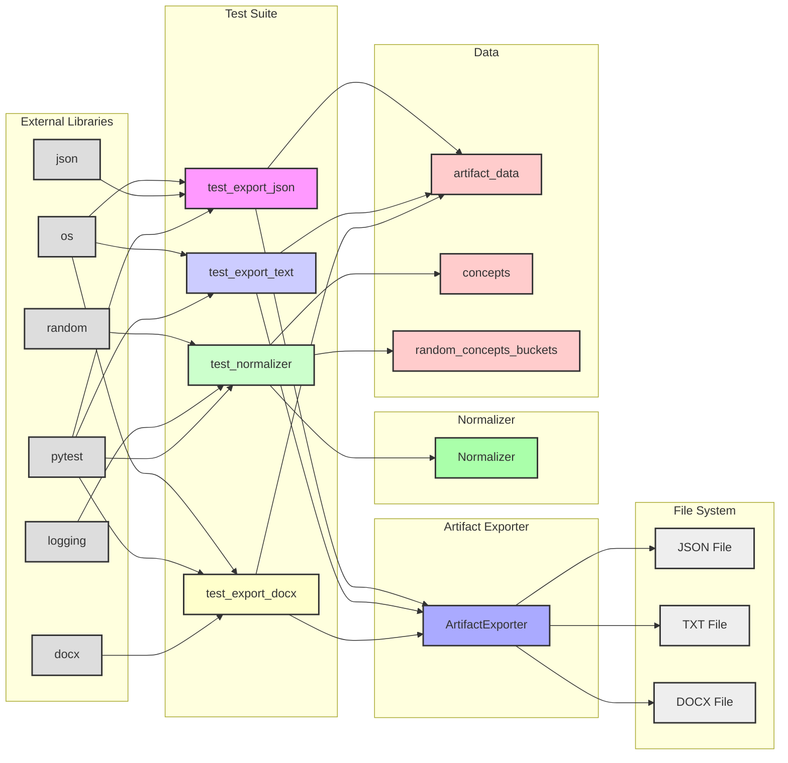

## Анализ кода `test_extraction.py`

### 1. <алгоритм>

**Блок-схема:**

```mermaid
graph LR
    A[Начало тестов] --> B(Фикстура `exporter`: Создание экземпляра `ArtifactExporter`);
    B --> C{Тест `test_export_json`};
    C -- Да --> D(Создание данных `artifact_data` в формате JSON);
    D --> E(Вызов `exporter.export` с параметрами: имя файла, данные, тип контента `record`, формат `json`);
    E --> F(Проверка наличия JSON-файла в директории экспорта);
    F -- Файл существует --> G(Чтение данных из экспортированного JSON-файла);
    G --> H(Сравнение экспортированных данных с исходными);
    H -- Данные совпадают --> I(Тест `test_export_json` пройден);
    F -- Файл не существует --> J(Ошибка: Файл не был экспортирован);
    H -- Данные не совпадают --> K(Ошибка: Экспортированные данные отличаются от исходных);
    I --> L{Тест `test_export_text`};
     L -- Да --> M(Создание данных `artifact_data` в формате текста);
    M --> N(Вызов `exporter.export` с параметрами: имя файла, данные, тип контента `text`, формат `txt`);
    N --> O(Проверка наличия TXT-файла в директории экспорта);
    O -- Файл существует --> P(Чтение данных из экспортированного TXT-файла);
    P --> Q(Сравнение экспортированных данных с исходными);
    Q -- Данные совпадают --> R(Тест `test_export_text` пройден);
    O -- Файл не существует --> S(Ошибка: Файл не был экспортирован);
    Q -- Данные не совпадают --> T(Ошибка: Экспортированные данные отличаются от исходных);
    R --> U{Тест `test_export_docx`};
    U -- Да --> V(Создание данных `artifact_data` в формате Markdown);
     V --> W(Вызов `exporter.export` с параметрами: имя файла, данные, тип контента `Document`, формат контента `markdown`, формат файла `docx`);
    W --> X(Проверка наличия DOCX-файла в директории экспорта);
    X -- Файл существует --> Y(Чтение данных из экспортированного DOCX-файла);
    Y --> Z(Проверка наличия исходного текста в экспортированном файле);
    Z -- Текст есть --> AA(Проверка отсутствия Markdown-разметки в экспортированном файле);
    AA -- Разметка отсутствует --> BB(Тест `test_export_docx` пройден);
    X -- Файл не существует --> CC(Ошибка: Файл не был экспортирован);
     Z -- Текста нет --> DD(Ошибка: Экспортированные данные не содержат исходного текста);
    AA -- Разметка есть --> EE(Ошибка: Экспортированные данные содержат Markdown-разметку);
    BB --> FF{Тест `test_normalizer`};
    FF -- Да --> GG(Создание списка концептов для нормализации);
    GG --> HH(Инициализация объекта `Normalizer`);
    HH --> II(Проверка размера `normalized_elements` объекта `Normalizer`);
    II --> JJ(Создание 5 наборов случайных концептов);
     JJ --> KK(Цикл по наборам случайных концептов);
    KK --> LL(Сохранение размера кэша);
    LL --> MM(Нормализация набора концептов при помощи `normalizer.normalize`);
    MM --> NN(Проверка, что возвращенный концепт не является `None`);
    NN --> OO(Проверка, что длина нормализованного набора равна длине входного);
   OO --> PP(Проверка, что все концепты из набора есть в ключе кэша нормализатора);
    PP --> QQ(Проверка размера кэша);
    QQ --> RR(Проверка, что размер кэша увеличился или остался тем же);
   RR --> SS(Завершен цикл нормализации набора концептов);
   SS --> TT{Все тесты пройдены};
   TT --> UU[Конец тестов];

```



**Примеры для блоков:**

*   **D (Создание данных `artifact_data` в формате JSON):** `artifact_data = {"name": "John Doe", "age": 30, "occupation": "Engineer", "content": "This is a sample JSON data."}`
*   **M (Создание данных `artifact_data` в формате текста):** `artifact_data = "This is a sample text."`
*  **V (Создание данных `artifact_data` в формате Markdown):**  ```artifact_data = """ # This is a sample markdown text This is a **bold** text. This is an *italic* text. This is a [link](https://www.example.com). """ ```
*   **GG (Создание списка концептов для нормализации):** `concepts = ['Antique Book Collection', 'Medical Research', 'Electrical safety', ...]`

**Поток данных:**

1.  Тесты начинаются с создания экземпляра `ArtifactExporter` через фикстуру `exporter`.
2.  Тесты `test_export_json`, `test_export_text`, и `test_export_docx` используют этот экземпляр для экспорта данных в разных форматах.
3.  Данные для экспорта подготавливаются в каждом тестовом методе, а затем передаются в метод `exporter.export()`.
4.  После экспорта, данные читаются из созданных файлов и проверяются на соответствие исходным данным.
5.  Тест `test_normalizer` создает экземпляр `Normalizer` и использует его для нормализации списка концептов.

### 2. <mermaid>



**Анализ зависимостей `mermaid`:**

*   **Test Suite:**  Представлены блоки с тестами (`test_export_json`, `test_export_text`, `test_export_docx`, `test_normalizer`).
*   **Artifact Exporter:** Блок, представляющий класс `ArtifactExporter`, используемый для экспорта артефактов в различные форматы.
*    **Normalizer:** Блок, представляющий класс `Normalizer`, используемый для нормализации текста.
*   **Data:** Блок, представляющий переменные, содержащие тестовые данные (`artifact_data`, `concepts`, `random_concepts_buckets`).
*   **File System:** Блок, представляющий файлы, создаваемые при тестировании (`JSON File`, `TXT File`, `DOCX File`).
*   **External Libraries:** Блок, представляющий внешние библиотеки, используемые в тесте (`os`, `json`, `random`, `logging`, `pytest`, `docx`).

**Зависимости:**

*   Тестовые функции (`test_export_json`, `test_export_text`, `test_export_docx`) зависят от класса `ArtifactExporter`, чтобы экспортировать данные.
*   Тестовая функция `test_normalizer` зависит от класса `Normalizer`, чтобы нормализовать концепции.
*   Класс `ArtifactExporter` взаимодействует с файловой системой (запись и проверка файлов).
*   Различные тесты используют данные, сохраненные в переменных `artifact_data`, `concepts`, `random_concepts_buckets`.
*   Импортируются внешние библиотеки `os`, `json`, `random`, `logging`, `pytest`, `docx` для работы с файлами, JSON, случайными числами, логированием, тестированием и файлами DOCX.

### 3. <объяснение>

**Импорты:**

*   `pytest`: Фреймворк для написания и запуска тестов.
*   `os`: Модуль для работы с операционной системой, в данном случае для проверки существования файлов.
*   `json`: Модуль для работы с JSON-данными, используется при экспорте данных в JSON-формате.
*   `random`: Модуль для генерации случайных чисел, используется при генерации случайных наборов концепций.
*    `logging`: Модуль для логирования, используется для вывода отладочной информации.
*   `sys`: Модуль для доступа к некоторым переменным и функциям, используемым интерпретатором, используется для добавления путей к директориям проекта.
*   `testing_utils`: Локальный модуль, содержащий вспомогательные функции для тестов.
*   `tinytroupe.extraction.ArtifactExporter`: Класс для экспорта артефактов.
*   `tinytroupe.extraction.Normalizer`: Класс для нормализации текстовых концепций.
*   `tinytroupe.utils`: Модуль с общими утилитами проекта.
*   `docx`: Модуль для работы с docx документами, используется для чтения и проверки docx файлов.

**Классы:**

*   `ArtifactExporter`:
    *   **Роль:** Класс отвечает за экспорт данных в различные форматы (JSON, TXT, DOCX).
    *   **Атрибуты:** `base_output_folder` - базовая директория для экспорта файлов.
    *   **Методы:** `export` - принимает имя файла, данные, тип контента, формат контента (для docx) и формат файла, а затем сохраняет данные в файл.
    *   **Взаимодействие:** Используется в тестах для создания файлов различных форматов.
*   `Normalizer`:
    *   **Роль:** Класс отвечает за нормализацию списка текстовых концепций.
    *   **Атрибуты:** `normalized_elements`, `normalizing_map`.
    *   **Методы:** `normalize` - принимает список концепций и возвращает список нормализованных концепций.
    *   **Взаимодействие:** Используется в тесте `test_normalizer` для проверки функциональности нормализации.

**Функции:**

*   `exporter()`:
    *   **Аргументы:** Нет.
    *   **Возвращаемое значение:** Экземпляр `ArtifactExporter`.
    *   **Назначение:**  Фикстура для создания экземпляра `ArtifactExporter` перед каждым тестом.
    *   **Пример:** `exporter = exporter()`.
*   `test_export_json(exporter)`:
    *   **Аргументы:** `exporter` (экземпляр `ArtifactExporter`).
    *   **Возвращаемое значение:** Нет.
    *   **Назначение:** Тестирует экспорт данных в JSON-формате. Создает JSON-файл, читает данные и сравнивает с исходными данными.
    *   **Пример:** Вызывает метод `exporter.export()` для записи json файла, затем считывает файл и сравнивает.
*   `test_export_text(exporter)`:
    *   **Аргументы:** `exporter` (экземпляр `ArtifactExporter`).
    *   **Возвращаемое значение:** Нет.
    *   **Назначение:** Тестирует экспорт данных в текстовом формате. Создает TXT-файл, читает данные и сравнивает с исходными данными.
    *  **Пример:** Вызывает метод `exporter.export()` для записи txt файла, затем считывает файл и сравнивает.
*   `test_export_docx(exporter)`:
    *   **Аргументы:** `exporter` (экземпляр `ArtifactExporter`).
    *   **Возвращаемое значение:** Нет.
    *   **Назначение:** Тестирует экспорт данных в DOCX-формате. Создает DOCX-файл, читает данные и проверяет, что исходный текст содержится в файле без markdown разметки.
    *   **Пример:** Вызывает метод `exporter.export()` для записи docx файла, затем считывает файл и сравнивает.
*   `test_normalizer()`:
    *   **Аргументы:** Нет.
    *   **Возвращаемое значение:** Нет.
    *   **Назначение:** Тестирует работу нормализатора текста `Normalizer`. Создает нормализатор, нормализует данные и проверяет корректность работы.
    *   **Пример:** Создает экземпляр `Normalizer`, вызывает метод `normalize()` и проверяет размер кэша и нормализацию.

**Переменные:**

*   `artifact_data`: Содержит данные для экспорта (JSON, text, markdown).
*   `exporter`: Экземпляр класса `ArtifactExporter`.
*   `exported_data`: Содержит данные, прочитанные из экспортированных файлов.
*   `concepts`: Список концептов для нормализации.
*   `unique_concepts`: Список уникальных концептов для нормализации.
*   `normalizer`: Экземпляр класса `Normalizer`.
*   `random_concepts_buckets`: Набор случайно сгенерированных наборов концепций.
*  `init_cache_size`: Размер кэша перед нормализацией
*   `normalized_concept`: Результат нормализации одного набора концептов.
*   `next_cache_size`: Размер кэша после нормализации.

**Потенциальные ошибки и улучшения:**

*   **Улучшение:** Можно добавить более детальные проверки в `test_export_docx`, например, проверить форматирование.
*   **Улучшение:** Можно добавить проверку на отсутствие ошибок при экспорте.
*   **Улучшение:** Можно вынести путь к тестовым файлам в константы.
*   **Улучшение:** Можно добавить проверку на корректность создания директорий для экспорта.
*   **Улучшение:** Использовать параметризацию для более компактной записи тестов экспорта.
*   **Улучшение:** Добавить обработку ошибок при экспорте и чтении файлов.
*   **Улучшение:** Улучшить тестирование `Normalizer` для различных типов входных данных.

**Взаимосвязи с другими частями проекта:**

*   `ArtifactExporter` используется для экспорта данных в рамках проекта, например, результатов анализа или извлечения данных.
*   `Normalizer` используется для стандартизации текстовых данных, например, перед сохранением в базу данных или обучением модели.
*   `testing_utils` используется в других тестовых модулях проекта.
*   `tinytroupe.utils` используется во всем проекте, а не только в тестах.
*   Модуль `logging` используется во всем проекте для записи информации о работе системы.
*   Тестируемые классы (`ArtifactExporter`, `Normalizer`) импортируются из модуля `tinytroupe.extraction`.