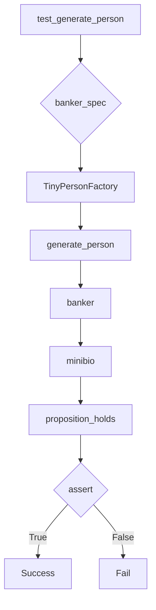
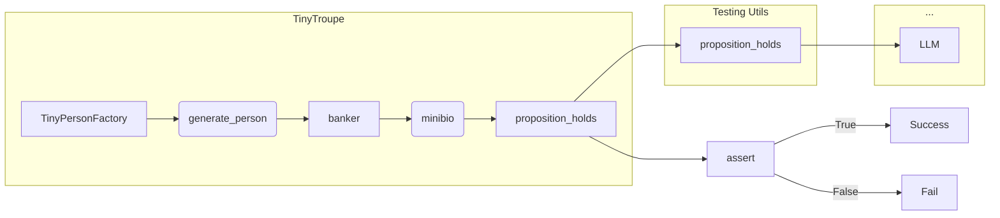

# Анализ кода test_factory.py

## <input code>

```python
import pytest
import os
import sys
sys.path.append('../../tinytroupe/')
sys.path.append('../../')
sys.path.append('..')


from tinytroupe.examples import create_oscar_the_architect
from tinytroupe.control import Simulation
import tinytroupe.control as control
from tinytroupe.factory import TinyPersonFactory

from testing_utils import *

def test_generate_person(setup):
    banker_spec =\\\
    """
    A vice-president of one of the largest brazillian banks. Has a degree in engineering and an MBA in finance. 
    Is facing a lot of pressure from the board of directors to fight off the competition from the fintechs.    
    """

    banker_factory = TinyPersonFactory(banker_spec)

    banker = banker_factory.generate_person()

    minibio = banker.minibio()

    assert proposition_holds(f"The following is an acceptable short description for someone working in banking: \'{minibio}\'"), f"Proposition is false according to the LLM."
```

## <algorithm>



**Пошаговое описание:**

1. **Инициализация:** Функция `test_generate_person` получает на вход данные (в данном случае `setup`, который не определен в данном фрагменте кода).
2. **Создание спецификации:** Переменная `banker_spec` содержит описание персонажа.
3. **Создание фабрики:** Создается объект `TinyPersonFactory` на основе `banker_spec`.
4. **Генерация персонажа:** Метод `generate_person` фабрики создает объект `banker` на основе спецификации.
5. **Получение мини-биографии:** Метод `minibio` объекта `banker` возвращает мини-биографию.
6. **Проверка:** Функция `proposition_holds` (из `testing_utils`) оценивает, является ли полученная мини-биография подходящим описанием.
7. **Проверка утверждения:** Функция `assert` проверяет результат `proposition_holds`. Если утверждение истинно, тест проходит; если ложно, тест терпит неудачу.


## <mermaid>



**Объяснение зависимостей:**

* `TinyPersonFactory` -  класс из модуля `tinytroupe.factory`.
* `generate_person`, `minibio` - методы класса `TinyPersonFactory`.
* `proposition_holds` - функция из модуля `testing_utils`,  вероятно, использующая какой-то внешний инструмент (например, LLM - Large Language Model).
* `test_generate_person` - тестовая функция, которая проверяет функциональность `TinyPersonFactory`.
* Зависимости `testing_utils`  и `tinytroupe` формируются через `sys.path`.


## <explanation>

**Импорты:**

* `pytest`, `os`, `sys` - стандартные библиотеки Python.
* `sys.path.append(...)` - изменяет пути поиска модулей, что позволяет импортировать файлы из папок, не являющихся стандартными.  Важно для работы с модулями, находящимися в подпапках.
* `tinytroupe.examples`, `tinytroupe.control`, `tinytroupe.factory` - импорты из проекта `tinytroupe`. Это указывает на модульную структуру проекта.  `create_oscar_the_architect` вероятно содержит примеры или конфигурации для создания персонажа. `Simulation` и `control` говорят о возможном контроле и моделировании поведения персон.

**Классы:**

* `TinyPersonFactory`: отвечает за создание `TinyPerson` (возможно, это класс не показан целиком в примере). Он имеет метод `generate_person` для создания персонажа на основе спецификации.  Атрибутов класса в примере не показано.

**Функции:**

* `test_generate_person`: Тестовая функция, проверяющая, что `TinyPersonFactory` генерирует корректные объекты. Она принимает параметр `setup` (вероятно, для настройки тестирования), который не определён в данном фрагменте кода.  Функция `assert` проверяет, что результат работы `proposition_holds` соответствует ожидаемому.  `banker_spec` служит для задания характеристик персонажа.
* `proposition_holds`: Вероятно, это функция из модуля `testing_utils`, которая использует какой-то внешний инструмент, например, LLM, для проверки соответствия сгенерированной биографии.


**Переменные:**

* `banker_spec`: Строковая спецификация, описывающая характеристики персонажа.
* `banker_factory`: Объект класса `TinyPersonFactory`.
* `banker`: Объект созданного персонажа.
* `minibio`: Результат выполнения метода `minibio()` персонажа.


**Возможные ошибки/улучшения:**

* Непонятно, как используется параметр `setup` в `test_generate_person`.
* Не определен класс `TinyPerson`.
* Нет информации о работе `proposition_holds`. Вероятно, она использует LLM для оценки, что добавляет внешнюю зависимость.
* Отсутствует описание класса `Simulation` и возможных взаимосвязей с `TinyPersonFactory`.
* Проверка корректности ввода `banker_spec` отсутствует.

**Цепочка взаимосвязей:**

`testing_utils` -> `test_generate_person` -> `TinyPersonFactory` -> `LLM` (косвенно).