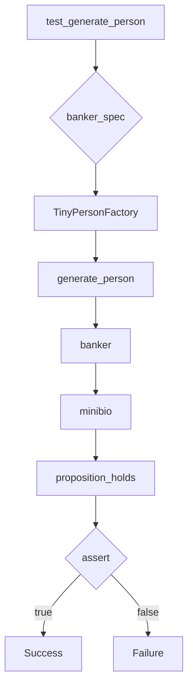

# Анализ кода test_factory.py

## <input code>

```python
import pytest
import os
import sys
sys.path.append('../../tinytroupe/')
sys.path.append('../../')
sys.path.append('..')


from tinytroupe.examples import create_oscar_the_architect
from tinytroupe.control import Simulation
import tinytroupe.control as control
from tinytroupe.factory import TinyPersonFactory

from testing_utils import *

def test_generate_person(setup):
    banker_spec =\\\
    """
    A vice-president of one of the largest brazillian banks. Has a degree in engineering and an MBA in finance. 
    Is facing a lot of pressure from the board of directors to fight off the competition from the fintechs.    
    """

    banker_factory = TinyPersonFactory(banker_spec)

    banker = banker_factory.generate_person()

    minibio = banker.minibio()

    assert proposition_holds(f"The following is an acceptable short description for someone working in banking: \'{minibio}\'"), f"Proposition is false according to the LLM."
```

## <algorithm>



**Пошаговая блок-схема:**

1. **test_generate_person:** Функция принимает `setup` (вероятно, предопределенные данные).
2. **banker_spec:** Определяется строковая спецификация для персонажа банкира.
3. **TinyPersonFactory:** Создается экземпляр класса `TinyPersonFactory` с переданным `banker_spec`.
4. **generate_person:** Метод `generate_person` класса `TinyPersonFactory` создаёт объект `banker` на основе спецификации.
5. **minibio:**  Метод `minibio` объекта `banker` генерирует краткую биографическую справку.
6. **proposition_holds:** Функция `proposition_holds` (из `testing_utils`) проверяет, является ли сгенерированная `minibio` приемлемой.  
7. **assert:**  Проверяется истинность утверждения с использованием `assert`. Если утверждение истинно, тест проходит; если ложно, тест завершается с ошибкой.

**Пример:**

Входные данные: `banker_spec` с описанием банкира.

Выходные данные: Проверка `assert` будет успешной, если `minibio` банка, сгенерированная `TinyPersonFactory`, соответствует ожидаемому описанию.

## <mermaid>

```mermaid
graph LR
    subgraph TinyPersonFactory
        TinyPersonFactory(TinyPersonFactory) --> generate_person[generate_person];
        generate_person --> minibio[minibio];
    end
    test_generate_person(test_generate_person) -.-> TinyPersonFactory;
    test_generate_person -.-> proposition_holds(testing_utils);
    proposition_holds -.-> assert(pytest);
```

## <explanation>

**Импорты:**

- `pytest`: Библиотека для тестирования Python.
- `os`: Модуль для взаимодействия с операционной системой (в данном случае, скорее всего, не используется напрямую).
- `sys`: Модуль для работы со средой выполнения Python.  `sys.path.append(...)` добавляет пути в `sys.path`, что позволяет импортировать модули из нестандартных мест. Это важно, если код используется в качестве части более крупного проекта.
- `tinytroupe.examples`: Вероятно, содержит примеры создания персонажей (например, `create_oscar_the_architect`).
- `tinytroupe.control`: Модуль с классами, контролирующими работу симуляции.
- `tinytroupe.control as control`:  `import ... as ...` создает алиас для модуля, что позволяет сократить имя.
- `tinytroupe.factory`: Содержит `TinyPersonFactory`, класс для создания персонажей.
- `testing_utils`:  Модуль, содержащий вспомогательные функции для тестирования (например, `proposition_holds`).


**Классы:**

- `TinyPersonFactory`: Создаёт объекты `TinyPerson`.  Предполагается, что этот класс использует входной `banker_spec` для генерации персонажей, которые соответствуют этому описанию.  Метод `generate_person` возвращает объект `TinyPerson` на основе переданной спецификации.
- `Simulation`: (По косвенным данным) Вероятно, класс для управления симуляцией, в которой используются сгенерированные персонажи.
- `TinyPerson` (косвенно): предполагаемый класс, представляющий персонажей. Метод `minibio` этого класса генерирует текстовое описание персонажа.


**Функции:**

- `test_generate_person`: Тестовая функция, которая создает объект `TinyPersonFactory` и проверяет, что сгенерированная `minibio` соответствует ожидаемому.
- `proposition_holds`: Функция, вероятно, из `testing_utils`, проверяет, соответствует ли выработанный результат определенному условию/пропозиции.


**Переменные:**

- `banker_spec`: Строковая переменная, содержащая описание персонажа.


**Возможные ошибки и улучшения:**

- Необходима информация о методе `proposition_holds` и том, как он работает. Необходимо убедиться, что он использует корректные критерии для проверки и может проверять различные случаи описания.
- Не указано, как обрабатываются ошибки при генерации `banker`. Нужно добавить обработку исключений, чтобы код был более устойчивым.
- Недостаточно информации о `setup`. Важно знать, какие данные он предоставляет, чтобы понять полный контекст.
- Отсутствует документация к коду.


**Взаимосвязи с другими частями проекта:**

- `TinyPersonFactory` использует `testing_utils` для проверки результата.
- `TinyPersonFactory` связана с `Simulation` по косвенным данным, так как симуляция, вероятно, использует сгенерированных персонажей.
- `tinytroupe.examples` скорее всего определяет данные или типы персонажей, которые будут генерироваться.