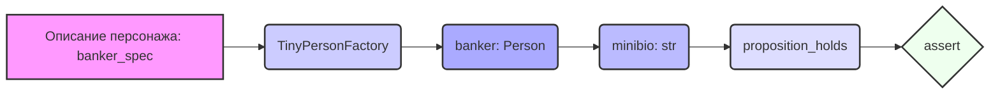

## Анализ кода `test_factory.py`

### 1. <алгоритм>

**Блок-схема:**

1.  **Импорт библиотек:**
    *   Импортируются библиотеки `pytest`, `os` и `sys`. `pytest` используется для тестирования, `os` для работы с файловой системой, `sys` для изменения пути поиска модулей.
    *   Добавляются пути к директориям `../../tinytroupe/`, `../../` и `..` в `sys.path`, чтобы импортировать модули из этих каталогов.
    *   Импортируются `create_oscar_the_architect` из `tinytroupe.examples`, `Simulation` из `tinytroupe.control`, `control` из `tinytroupe.control`, `TinyPersonFactory` из `tinytroupe.factory`, и `proposition_holds` из `testing_utils`.
2.  **Функция `test_generate_person(setup)`:**
    *   Определяется строка `banker_spec`, содержащая описание персонажа "вице-президента банка".
        ```
        banker_spec = """
        A vice-president of one of the largest brazillian banks. Has a degree in engineering and an MBA in finance. 
        Is facing a lot of pressure from the board of directors to fight off the competition from the fintechs.    
        """
        ```
    *   Создается экземпляр `TinyPersonFactory` с описанием `banker_spec`.
        ```
        banker_factory = TinyPersonFactory(banker_spec)
        ```
    *   Генерируется персонаж с помощью `banker_factory.generate_person()`.
        ```
        banker = banker_factory.generate_person()
        ```
    *   Вызывается метод `minibio()` у созданного персонажа для получения краткого описания.
         ```
        minibio = banker.minibio()
        ```
    *   Проверяется утверждение, что описание `minibio` является приемлемым для человека, работающего в банковской сфере, используя функцию `proposition_holds()`.
        ```
        assert proposition_holds(f"The following is an acceptable short description for someone working in banking: '{minibio}'"), f"Proposition is false according to the LLM."
        ```

**Поток данных:**

`banker_spec` -> `TinyPersonFactory` -> `banker` -> `minibio` -> `proposition_holds` -> `assert`

### 2. <mermaid>



**Объяснение зависимостей:**

1.  **`banker_spec`**: Строка, описывающая характеристики персонажа. Это входные данные для `TinyPersonFactory`.
2.  **`TinyPersonFactory`**: Класс, который принимает описание персонажа и генерирует его экземпляр. Зависит от `banker_spec`.
3.  **`banker: Person`**: Экземпляр сгенерированного персонажа. Зависит от `TinyPersonFactory`.
4.  **`minibio: str`**: Краткое описание персонажа. Зависит от `banker`.
5.  **`proposition_holds`**: Функция, проверяющая истинность утверждения о `minibio` с помощью LLM. Зависит от `minibio`.
6.  **`assert`**: Оператор проверки истинности. Использует результат `proposition_holds`.

### 3. <объяснение>

**Импорты:**

*   `pytest`: Фреймворк для тестирования. Используется для организации и запуска тестов.
*   `os`: Библиотека для работы с операционной системой, в данном коде не используется напрямую, но может быть в других частях проекта.
*   `sys`: Библиотека для взаимодействия с интерпретатором Python. Используется для добавления путей поиска модулей.
*   `tinytroupe.examples.create_oscar_the_architect`: Функция для создания примера персонажа (не используется напрямую в тесте, возможно, для будущих тестов).
*   `tinytroupe.control.Simulation`: Класс для моделирования (не используется в данном тесте).
*   `tinytroupe.control`: Модуль для управления симуляцией (используется, но не напрямую в тесте).
*   `tinytroupe.factory.TinyPersonFactory`: Класс, отвечающий за создание персонажей на основе описания.
*   `testing_utils.proposition_holds`: Функция для проверки утверждений с помощью языковой модели.

**Классы:**

*   `TinyPersonFactory`:
    *   Роль: Создает экземпляры персонажей (`Person`) на основе текстового описания.
    *   Атрибуты: Принимает описание персонажа `spec` при инициализации.
    *   Методы:
        *   `generate_person()`: Генерирует и возвращает объект `Person`.
    *   Взаимодействие: Использует `tinytroupe.llm` (неявно через `generate_person()`).

**Функции:**

*   `test_generate_person(setup)`:
    *   Аргументы: `setup` (fixture pytest, не используется в данном тесте, но передается).
    *   Возвращаемое значение: Нет.
    *   Назначение: Тестирует функциональность `TinyPersonFactory` путем генерации персонажа и проверки краткого описания.
    *   Примеры:
        *   Создает `TinyPersonFactory` с описанием банкира.
        *   Генерирует персонажа и получает его мини-биографию.
        *   Проверяет, является ли мини-биография приемлемой.

*   `proposition_holds(proposition)`
     *    Аргументы: строка `proposition`
     *    Возвращаемое значение: Булево значение (True/False)
     *    Назначение: Проверяет  соответствует ли  `proposition` действительности с помощью LLM
     *    Пример:
        *   `proposition_holds(f"The following is an acceptable short description for someone working in banking: '{minibio}'")`  проверяет является ли `minibio` подходящим описанием для банковского работника.

**Переменные:**

*   `banker_spec`: Строка, содержащая описание персонажа.
*   `banker_factory`: Экземпляр класса `TinyPersonFactory`.
*   `banker`: Экземпляр сгенерированного персонажа.
*    `minibio`: Строка с кратким описанием персонажа.

**Потенциальные ошибки и области для улучшения:**

*   **Зависимость от LLM:** Тест полагается на LLM для оценки краткого описания персонажа. Это может привести к непостоянным результатам в зависимости от LLM и его настроек.
*   **Неиспользуемый фикстур `setup`**: В функции `test_generate_person(setup)` аргумент `setup` не используется. Можно удалить, если он не нужен.
*   **Отсутствие конкретных проверок:** Тест проверяет только "приемлемость" описания, но не проверяет конкретные аспекты, такие как наличие конкретных ключевых слов.
*   **Неявные зависимости:** Код зависит от того, что `TinyPersonFactory` и его метод `generate_person()` будут работать как ожидается. Следует добавить unit тесты для `TinyPersonFactory`

**Цепочка взаимосвязей с другими частями проекта:**

1.  `test_factory.py` -> `tinytroupe.factory.TinyPersonFactory`:  Использует класс `TinyPersonFactory` для создания персонажей.
2.  `tinytroupe.factory.TinyPersonFactory` -> `tinytroupe.llm`: (Не явно) Использует LLM для генерации данных персонажа.
3.  `test_factory.py` -> `testing_utils.proposition_holds`: Использует функцию для оценки вывода LLM
4. `testing_utils.proposition_holds` -> LLM (не явно)

В целом, код демонстрирует базовую функциональность создания персонажей с использованием `TinyPersonFactory` и проверяет качество сгенерированных описаний, полагаясь на оценку LLM.