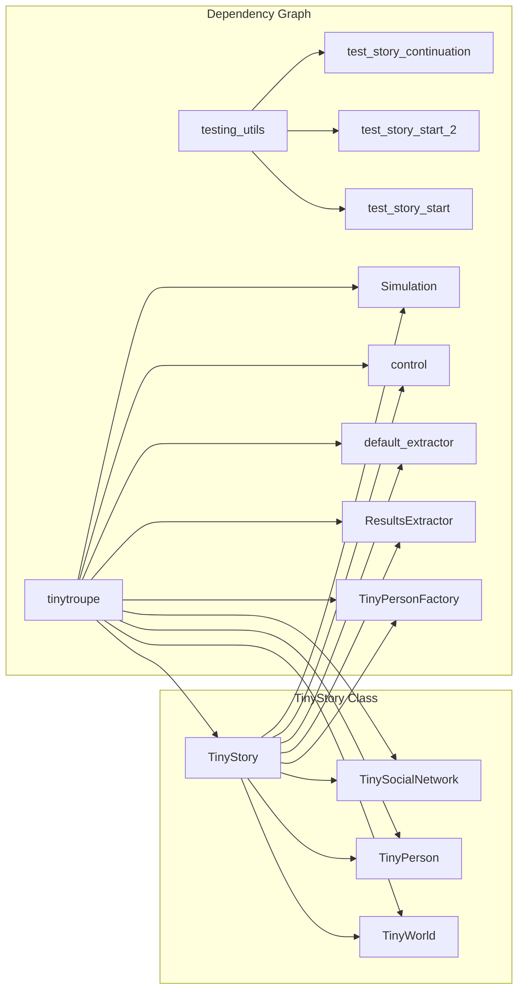

# Анализ кода из файла `hypotez/src/ai/tiny_troupe/TinyTroupe/tests/unit/test_story.py`

## <input code>

```python
import pytest
import logging
logger = logging.getLogger("tinytroupe")

import sys
sys.path.append('../../tinytroupe/')
sys.path.append('../../')
sys.path.append('..')


import tinytroupe
from tinytroupe.agent import TinyPerson
from tinytroupe.environment import TinyWorld, TinySocialNetwork
from tinytroupe.factory import TinyPersonFactory
from tinytroupe.extraction import ResultsExtractor
from tinytroupe.story import TinyStory

from tinytroupe.examples import create_lisa_the_data_scientist, create_oscar_the_architect, create_marcos_the_physician
from tinytroupe.extraction import default_extractor as extractor
import tinytroupe.control as control
from tinytroupe.control import Simulation

from testing_utils import *

def test_story_start(setup, focus_group_world):
    world = focus_group_world

    story = TinyStory(world)

    start = story.start_story()

    print("Story start: ", start)

    assert proposition_holds(f"The following could plausibly be the start of a story involving people named either Lisa, Marcos or Oscar: \'{start}\'"), f"Proposition is false according to the LLM."

def test_story_start_2(setup, focus_group_world):
    world = focus_group_world

    story = TinyStory(world)

    start = story.start_story(requirements="Start a story which is extremely crazy and out of this world.")

    print("Story start: ", start)

    assert proposition_holds(f"The following could plausibly be the start of a very crazy story involving people named either Lisa, Marcos or Oscar: \'{start}\'"), f"Proposition is false according to the LLM."

def test_story_continuation(setup, focus_group_world):
    world = focus_group_world

    story_beginning =\\\
          """
            You were vacationing in the beautiful city of Rio de Janeiro, Brazil. You were walking down the beach when
            the most unexpected thing happened: an Alien spaceship landed right in front of you. The door opened and a
            friendly Alien stepped out. The Alien introduced itself as Zog, and explained that it was on a mission to
            learn more about Earth\'s cultures. You were intrigued by this encounter and decided to help Zog in its mission.
          """

    world.broadcast(story_beginning)
    
    world.run(2)

    story = TinyStory(world)

    continuation = story.continue_story()

    print("Story continuation: ", continuation)

    assert proposition_holds(f"The following two text blocks could belong to the same story: \\n BLOCK 1: \'{story_beginning}\' and \\n BLOCK 2: \'{continuation}\'"), f"Proposition is false according to the LLM."

```

## <algorithm>

```mermaid
graph TD
    A[test_story_start] --> B{Создать TinyStory(world)};
    B --> C[story.start_story()];
    C --> D[Вывод start];
    C --> E{Проверка proposition_holds};
    E --> F[Успешно/Неуспешно];
    
    
    G[test_story_start_2] --> H{Создать TinyStory(world)};
    H --> I[story.start_story(requirements)];
    I --> J[Вывод start];
    I --> K{Проверка proposition_holds (crazy)};
    K --> L[Успешно/Неуспешно];
    
    M[test_story_continuation] --> N{Создать TinyStory(world)};
    N --> O[world.broadcast(story_beginning)];
    N --> P[world.run(2)];
    N --> Q[story.continue_story()];
    Q --> R[Вывод continuation];
    O --> S{Обработка события};
    S --> T{Обновление состояния world};
    Q --> U{Проверка proposition_holds (связь)};
    U --> V[Успешно/Неуспешно];
```

В данном коде реализованы тесты для класса `TinyStory`. Алгоритм работы тестов включает создание экземпляра `TinyStory` с использованием уже подготовленного объекта `world`, запуск метода `start_story()` или `continue_story()`, вывод результата и проверку соответствия полученного результата ожидаемому.  Для `test_story_continuation` происходит инициализация `story_beginning`, его отправка в `world` и запуск симуляции.

## <mermaid>



## <explanation>

**Импорты:**
- `pytest`: Библиотека для тестирования.
- `logging`: Библиотека для логирования. `logger = logging.getLogger("tinytroupe")` - настройка логгера для пакетов tinytroupe.
- `sys`: Модуль для доступа к параметрам системы. Используется для модификации `sys.path`, что позволяет импортировать модули из других директорий проекта.
- `tinytroupe`: Основной пакет, содержащий все необходимые компоненты.
- `tinytroupe.agent`: Содержит класс `TinyPerson`, представляющий агентов.
- `tinytroupe.environment`: Содержит `TinyWorld` (окружение) и `TinySocialNetwork` (социальная сеть) - объекты необходимы для взаимодействия и контекста истории.
- `tinytroupe.factory`: Содержит `TinyPersonFactory` для создания агентов.
- `tinytroupe.extraction`: Содержит `ResultsExtractor` и `default_extractor` для извлечения и обработки результатов.
- `tinytroupe.story`:  Класс `TinyStory`, который отвечает за генерацию и обработку истории.
- `tinytroupe.examples`:  Функции для создания предопределенных агентов (`create_lisa_the_data_scientist`, `create_oscar_the_architect`, `create_marcos_the_physician`).
- `tinytroupe.control`: Модуль, вероятно, для управления симуляцией, содержит `Simulation`.
- `testing_utils`: Вспомогательный модуль для тестов, содержащий функцию `proposition_holds`.

**Классы:**
- `TinyStory`:  Класс, отвечающий за создание и обработку истории. Методы `start_story` и `continue_story` являются ключевыми, генерируя текстовые фрагменты истории.
- `TinyPerson`, `TinyWorld`, `TinySocialNetwork`, `TinyPersonFactory`, `ResultsExtractor`, `Simulation`:  Необходимые компоненты для взаимодействия и создания контекста истории, описанные в импортах.

**Функции:**
- `test_story_start`, `test_story_start_2`, `test_story_continuation`: Функции тестирования, проверяющие правильность работы методов `start_story` и `continue_story` класса `TinyStory`. Эти функции принимают `setup` и `focus_group_world` как аргументы.
- `proposition_holds`:  Функция, предположительно, из `testing_utils`, используется для проверки истории с помощью LLM (Large Language Model).


**Переменные:**
- `world`: Представляет текущее состояние окружения,  необходимое для генерирования истории.
- `story_beginning`: Строковая переменная, содержащая начальную часть истории, используемая для `test_story_continuation`.

**Возможные ошибки/улучшения:**
- Необходимо указать, как обрабатываются возможные ошибки LLM, если он не может сгенерировать корректную историю.
- Необходимо описать логику создания `focus_group_world` в тестах.
- Документация и комментарии внутри кода значительно улучшили бы понимание функциональности.


**Взаимосвязи с другими частями проекта:**

Код тесно связан с другими частями проекта `tinytroupe`, такими как `TinyWorld`, `TinyPerson`, `TinySocialNetwork` и т.д.  Эти классы определяют окружение и персонажей, на основе которых формируется история. Функция `proposition_holds` предполагает наличие внешнего инструмента (LLM), который оценивает качество сгенерированной истории.  Модуль `testing_utils` предоставляет инструменты для взаимодействия с LLM и проведения тестов.