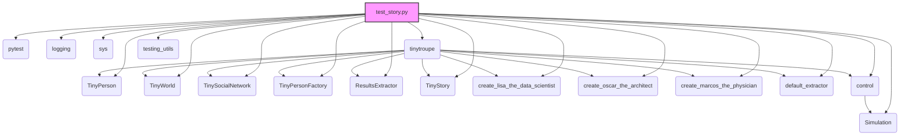

## АНАЛИЗ КОДА

### 1. <алгоритм>

**Блок-схема:**

```mermaid
graph LR
    A[Start Test Function] --> B{Create TinyWorld};
    B --> C{Create TinyStory with world};
    C --> D{Call start_story() or continue_story()};
    D --> E{Get Story Text};
    E --> F{Print Story Text};
    F --> G{Assert text using proposition_holds()};
    G --> H[End Test Function];
    
    style A fill:#f9f,stroke:#333,stroke-width:2px
    style H fill:#f9f,stroke:#333,stroke-width:2px

    subgraph test_story_start
        B
        C
        D_start(Call start_story())
        D --> D_start
        D_start --> E
    end
    
    subgraph test_story_start_2
        B2(Create TinyWorld)
        C2(Create TinyStory with world)
        D2(Call start_story() with requirements)
        B --> B2
        B2 --> C2
        C2 --> D2
        D --> D2
        D2 --> E
    end
    
    subgraph test_story_continuation
        B3(Create TinyWorld)
        I{Broadcast story_beginning}
        J{Run world for 2 steps}
        C3(Create TinyStory with world)
        D3(Call continue_story())
        B --> B3
        B3 --> I
        I --> J
        J --> C3
        C3 --> D3
        D --> D3
        D3 --> E
        
    end
```

**Примеры:**

1.  **`test_story_start`**:
    *   Создается `TinyWorld`.
    *   Создается `TinyStory` с этим миром.
    *   Вызывается `start_story()` без дополнительных параметров.
    *   Полученный текст (начало истории) выводится в консоль.
    *   Проверяется, является ли сгенерированный текст правдоподобным началом истории с именами "Lisa", "Marcos" или "Oscar".

2.  **`test_story_start_2`**:
    *   Аналогично `test_story_start`, но вызывается `start_story()` с параметром `requirements`, задающим более специфичные требования к началу истории (она должна быть "extremely crazy and out of this world").
    *   Аналогично, проверяется правдоподобность сгенерированного текста.

3.  **`test_story_continuation`**:
    *   Создается `TinyWorld`.
    *   В мир транслируется начало истории `story_beginning`.
    *   Мир запускается на 2 шага.
    *   Создается `TinyStory` с текущим состоянием мира.
    *   Вызывается `continue_story()`, чтобы получить продолжение истории.
    *   Проверяется, что начальный фрагмент и сгенерированное продолжение могут принадлежать одной истории.

### 2. <mermaid>



**Объяснение `mermaid`:**

*   **`test_story.py`**: Основной тестовый файл, который зависит от других библиотек и модулей для выполнения своих задач.

*   **`pytest`**: Используется для запуска и организации тестов.

*   **`logging`**: Предоставляет функционал для логирования событий, помогает отслеживать процесс выполнения программы и выявлять ошибки.

*   **`sys`**: Модуль Python, предоставляющий доступ к некоторым переменным и функциям, взаимодействующим с интерпретатором. В этом коде используется для добавления путей к директориям, где расположены модули `tinytroupe`.

*   **`tinytroupe`**: Основной пакет, содержащий классы и функции для симуляции истории.

*   **`TinyPerson`**: Класс, представляющий персонажа в симуляции.

*   **`TinyWorld`**: Класс, представляющий мир, в котором происходит симуляция.

*   **`TinySocialNetwork`**: Класс, представляющий социальную сеть внутри мира.

*   **`TinyPersonFactory`**: Класс, создающий экземпляры `TinyPerson`.

*   **`ResultsExtractor`**: Класс, извлекающий результаты из симуляции.

*  **`TinyStory`**: Класс, отвечающий за генерацию и продолжение истории.

*   **`create_lisa_the_data_scientist`**, **`create_oscar_the_architect`**, **`create_marcos_the_physician`**: Функции для создания предопределенных персонажей.

*   **`default_extractor`**: Экстрактор результатов по умолчанию.

*   **`control`**: Модуль для управления симуляцией.
    *   **`Simulation`**: Класс для запуска симуляции.

*   **`testing_utils`**: Модуль с утилитами для тестирования, например, `proposition_holds` для проверки утверждений.

### 3. <объяснение>

**Импорты:**

*   `pytest`: Фреймворк для тестирования. Используется для определения тестовых функций и их запуска.
*   `logging`: Модуль для логирования, позволяет записывать события и отлаживать код.
*   `sys`: Модуль для взаимодействия с интерпретатором Python. Здесь используется для добавления путей к директориям, где находятся модули `tinytroupe`.
*   `tinytroupe`: Основной пакет, который содержит все модули для симуляции.
*   `tinytroupe.agent`: Модуль, содержащий класс `TinyPerson` для представления персонажей.
*   `tinytroupe.environment`: Модуль, содержащий классы `TinyWorld` и `TinySocialNetwork` для представления мира и социальной сети.
*   `tinytroupe.factory`: Модуль, содержащий класс `TinyPersonFactory` для создания персонажей.
*   `tinytroupe.extraction`: Модуль для извлечения результатов из симуляции, импортирует `ResultsExtractor` и `default_extractor`.
*   `tinytroupe.story`: Модуль, содержащий класс `TinyStory` для работы с историей.
*  `tinytroupe.examples`:  Модуль, содержащий функции для создания готовых персонажей (Lisa, Oscar, Marcos).
*  `tinytroupe.control`: Модуль для управления симуляцией, импортирует `Simulation`.
*   `testing_utils`: Внешний модуль, содержащий вспомогательные функции для тестирования.

**Функции:**

*   `test_story_start(setup, focus_group_world)`:
    *   Аргументы: `setup` (фикстура pytest) и `focus_group_world` (экземпляр `TinyWorld`).
    *   Создает экземпляр `TinyStory` с заданным миром.
    *   Вызывает метод `start_story()` для генерации начала истории.
    *   Выводит начало истории в консоль.
    *   Использует `proposition_holds()` из `testing_utils` для проверки, что полученный текст является правдоподобным началом истории.
    *   Не возвращает ничего.

*   `test_story_start_2(setup, focus_group_world)`:
    *   Аналогично `test_story_start`, но вызывает `start_story` с параметром `requirements`, который указывает LLM сгенерировать "сумасшедшую" историю.
    *   Аргументы и поведение аналогично `test_story_start`, но с дополнительным требованием к генерируемой истории.

*   `test_story_continuation(setup, focus_group_world)`:
    *   Аргументы: `setup` (фикстура pytest) и `focus_group_world` (экземпляр `TinyWorld`).
    *   В начале истории `story_beginning` транслируется в `TinyWorld`.
    *   Мир запускается на 2 шага, чтобы симуляция немного продвинулась.
    *   Создается экземпляр `TinyStory` с текущим состоянием мира.
    *   Вызывается метод `continue_story()` для генерации продолжения истории.
    *   Выводит продолжение истории в консоль.
    *   Проверяет, что начальный фрагмент и сгенерированное продолжение могут принадлежать одной истории, используя `proposition_holds()`.
    *   Не возвращает ничего.

**Классы:**

*   `TinyStory`:
    *   Отвечает за генерацию и продолжение истории.
    *   Имеет методы `start_story()` и `continue_story()`.
    *   Зависит от объекта `TinyWorld` для доступа к состоянию мира.
    *   Взаимодействует с языковой моделью (LLM) для генерации текста.

**Переменные:**

*   `logger`: Экземпляр логгера.
*   `world`: Экземпляр `TinyWorld`, передаваемый в тестовые функции.
*   `story`: Экземпляр `TinyStory`, созданный в тестовых функциях.
*   `start`: Переменная, в которую сохраняется сгенерированное начало истории.
*    `requirements`: Параметр, передаваемый в `start_story` для задания особых требований к началу истории.
*   `story_beginning`:  Начало истории, которая передается в `broadcast`.
*   `continuation`: Переменная, в которую сохраняется сгенерированное продолжение истории.

**Объяснение кода:**

Этот файл содержит модульные тесты для класса `TinyStory`. Тесты проверяют возможность генерации начала истории (`start_story()`) и её продолжения (`continue_story()`).

1.  Тесты используют фикстуры pytest для инициализации `TinyWorld`.
2.  `test_story_start` проверяет, что `start_story()` генерирует правдоподобное начало истории.
3.  `test_story_start_2` проверяет, что `start_story()` учитывает заданные требования.
4.  `test_story_continuation` проверяет, что `continue_story()` генерирует продолжение, логически связанное с предыдущим фрагментом истории.
5.  В тестах используется функция `proposition_holds()` для проверки утверждений о тексте, сгенерированном языковой моделью.
6.  Перед выполнением тестов, добавляются пути к директориям с файлами проекта, чтобы импорт модулей был корректным.

**Потенциальные ошибки и области для улучшения:**

*   Тесты полагаются на языковую модель (LLM), что делает результаты тестов не детерминированными. То есть, каждый раз запуская тесты, мы можем получить разные результаты, в зависимости от LLM. Можно добавить больше тестовых случаев и более жесткие проверки, чтобы повысить надежность тестов.
*   Функция `proposition_holds()` является "черным ящиком" (black box). Было бы полезно увидеть, как именно она проверяет утверждения.
*   Можно добавить больше тестов для различных сценариев и требований к генерации историй.
*   Тесты должны быть более подробными. Например, проверить длину генерируемых текстов, а также синтаксис и грамматику.

**Взаимосвязь с другими частями проекта:**

*   `TinyStory` является частью системы симуляции `tinytroupe`.
*   `TinyStory` взаимодействует с `TinyWorld`, чтобы получить контекст для генерации истории.
*   `TinyStory` использует языковую модель для генерации текста, эта часть неявно присутствует в коде, но не показана напрямую.
*   `testing_utils` используется для тестирования и проверок.

Этот файл является важной частью системы, так как он тестирует основную функциональность класса `TinyStory`, который, в свою очередь, отвечает за генерацию историй в рамках проекта `tinytroupe`.