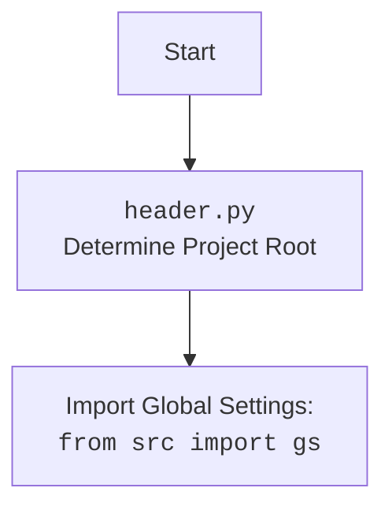

## АНАЛИЗ КОДА:

### 1. <алгоритм>

1.  **Начало теста `test_story_start`**:
    *   Инициализация: Получение экземпляра `focus_group_world` (предположительно, объекта, представляющего виртуальный мир) из фикстуры `setup`.
    *   Создание экземпляра `TinyStory`: Создание объекта `TinyStory`, связанного с полученным миром (`focus_group_world`).
    *   Запуск истории: Вызов метода `start_story()` объекта `TinyStory` для генерации начального предложения для истории.
    *   Проверка: Проверка с помощью `assert proposition_holds()`, что сгенерированное начало истории (`start`) является правдоподобным началом истории с участием персонажей Лизы, Маркоса или Оскара.
2.  **Начало теста `test_story_start_2`**:
    *   Инициализация: Получение экземпляра `focus_group_world` из фикстуры `setup`.
    *   Создание экземпляра `TinyStory`: Создание объекта `TinyStory`, связанного с полученным миром.
    *   Запуск истории с требованиями: Вызов `start_story()` с дополнительным параметром `requirements`, который задает требование, что история должна быть "очень сумасшедшей и не от мира сего".
    *   Проверка: Проверка с помощью `assert proposition_holds()`, что сгенерированное начало истории (`start`) соответствует требованию "очень сумасшедшей истории" с участием персонажей Лизы, Маркоса или Оскара.
3.  **Начало теста `test_story_continuation`**:
    *   Инициализация: Получение экземпляра `focus_group_world` из фикстуры `setup`.
    *   Задание начала истории: Создание многострочной строки `story_beginning`, представляющей начало истории про встречу с инопланетянином.
    *   Трансляция начала истории: Вызов метода `broadcast()` у объекта `focus_group_world` для распространения начала истории среди агентов в мире.
    *   Симуляция: Запуск симуляции мира на 2 шага с помощью метода `run()`.
    *   Создание экземпляра `TinyStory`: Создание объекта `TinyStory`, связанного с миром.
    *   Продолжение истории: Вызов метода `continue_story()` объекта `TinyStory` для генерации продолжения истории.
    *   Проверка: Проверка с помощью `assert proposition_holds()`, что начало истории (`story_beginning`) и продолжение (`continuation`) могут принадлежать одной и той же истории.

### 2. <mermaid>

```mermaid
flowchart TD
    subgraph Test_Story_Start
        A[Получение world] --> B(Создание TinyStory);
        B --> C(start_story());
        C --> D{Проверка правдоподобности начала};
    end
    
    subgraph Test_Story_Start_2
        E[Получение world] --> F(Создание TinyStory);
        F --> G(start_story(requirements));
         G --> H{Проверка соответствия требованиям};
    end
    
    subgraph Test_Story_Continuation
        I[Получение world] --> J{Задание story_beginning};
        J --> K(broadcast(story_beginning));
        K --> L(world.run(2));
        L --> M(Создание TinyStory);
        M --> N(continue_story());
        N --> O{Проверка принадлежности к одной истории};
    end
    
    style Test_Story_Start fill:#f9f,stroke:#333,stroke-width:2px
    style Test_Story_Start_2 fill:#ccf,stroke:#333,stroke-width:2px
    style Test_Story_Continuation fill:#aaf,stroke:#333,stroke-width:2px
    
    A -- fixture setup --> E
     A -- fixture setup --> I
```



### 3. <объяснение>

**Импорты:**

*   `pytest`:  Используется для создания и запуска тестов.
*   `logging`:  Используется для логирования событий. В данном случае, создаётся логгер с именем "tinytroupe".
*   `sys`: Модуль, предоставляющий доступ к некоторым переменным и функциям, которые используются или поддерживаются интерпретатором.
    *   `sys.path.append(...)`:  Добавление директорий в `sys.path`, чтобы импортировать модули `tinytroupe`. Это необходимо для того, чтобы Python мог найти модули, находящиеся в других директориях.
*   `tinytroupe`: Основной пакет, содержащий все необходимые модули.
*   `tinytroupe.agent`:  Содержит класс `TinyPerson`, представляющий агента в симуляции.
*   `tinytroupe.environment`: Содержит классы `TinyWorld` (представляющий мир) и `TinySocialNetwork` (социальная сеть).
*   `tinytroupe.factory`: Содержит класс `TinyPersonFactory` для создания агентов.
*   `tinytroupe.extraction`:  Содержит класс `ResultsExtractor` для извлечения результатов из симуляции и `default_extractor`.
*   `tinytroupe.story`: Содержит класс `TinyStory` для генерации и продолжения историй.
*   `tinytroupe.examples`: Содержит функции для создания примеров персонажей.
    * `create_lisa_the_data_scientist`
    * `create_oscar_the_architect`
    * `create_marcos_the_physician`
*   `tinytroupe.control`: Содержит класс `Simulation` для управления симуляцией и другие функции управления.
*   `testing_utils`: Пользовательский модуль, содержащий вспомогательные функции для тестирования. `proposition_holds()` проверяет истинность утверждения с помощью LLM (большой языковой модели).

**Функции:**

*   `test_story_start(setup, focus_group_world)`:
    *   `setup`:  Фикстура Pytest, которая, вероятно, настраивает тестовую среду.
    *   `focus_group_world`:  Экземпляр мира (`TinyWorld`).
    *   Функция создает объект `TinyStory` и вызывает метод `start_story()`, генерируя начало истории. Проверяет, что сгенерированный текст правдоподобен как начало истории.
*   `test_story_start_2(setup, focus_group_world)`:
    *   Аналогична `test_story_start`, но `start_story()` вызывается с параметром `requirements`, что требует, чтобы история была "очень сумасшедшей и не от мира сего".
    *   Также проверяет, что сгенерированный текст соответствует требованиям.
*   `test_story_continuation(setup, focus_group_world)`:
    *   `story_beginning`:  Многострочная строка с заданным началом истории.
    *   Функция транслирует начало истории в мир, запускает симуляцию на 2 шага, затем создает `TinyStory` и генерирует продолжение истории с помощью `continue_story()`. Проверяет, что начало и продолжение могут принадлежать одной истории.

**Классы:**

*   `TinyStory`:
    *   Класс для работы с историями.
    *   Имеет методы `start_story()` для генерации начала и `continue_story()` для генерации продолжения истории.
*   `TinyWorld`:
    *   Класс, представляющий виртуальный мир симуляции.
    *   Имеет методы `broadcast()` для распространения информации среди агентов в мире и `run()` для запуска симуляции.
*   `TinyPerson`, `TinySocialNetwork`, `TinyPersonFactory`, `ResultsExtractor`, `Simulation`  (описаны в импортах) - эти классы участвуют в настройке и проведении симуляции, но непосредственно не вызываются в коде.

**Переменные:**

*   `logger`: Экземпляр логгера.
*   `world`: Экземпляр `TinyWorld`.
*   `story`: Экземпляр `TinyStory`.
*   `start`: Сгенерированное начало истории.
*   `continuation`: Сгенерированное продолжение истории.
*  `story_beginning`: Начало истории в виде многострочной строки.

**Взаимосвязи:**

*   `TinyStory` зависит от `TinyWorld`, поскольку он работает в контексте определенного мира.
*   `testing_utils.proposition_holds` использует LLM для проверки правдоподобности сгенерированного текста, что показывает интеграцию с языковыми моделями.
*   Тесты используют `pytest` фикстуры для настройки тестовой среды.

**Потенциальные ошибки и улучшения:**

*   Зависимость от LLM:  Тесты полагаются на LLM для оценки правдоподобности, что может быть нестабильно. Возможно, следует добавить тесты на основе эталонных данных, чтобы обеспечить предсказуемость.
*   Жесткое кодирование:  Начало истории в `test_story_continuation` жестко закодировано, возможно, стоит использовать другой метод для генерации разнообразных начальных историй.
*   Отсутствие моковых объектов: Для тестирования класса `TinyStory` целесообразно использовать моковые объекты, чтобы изолировать тесты от влияния других зависимостей.

Этот код представляет собой набор тестов для класса `TinyStory`, который предназначен для генерации и продолжения историй в контексте симуляции `TinyTroupe`.