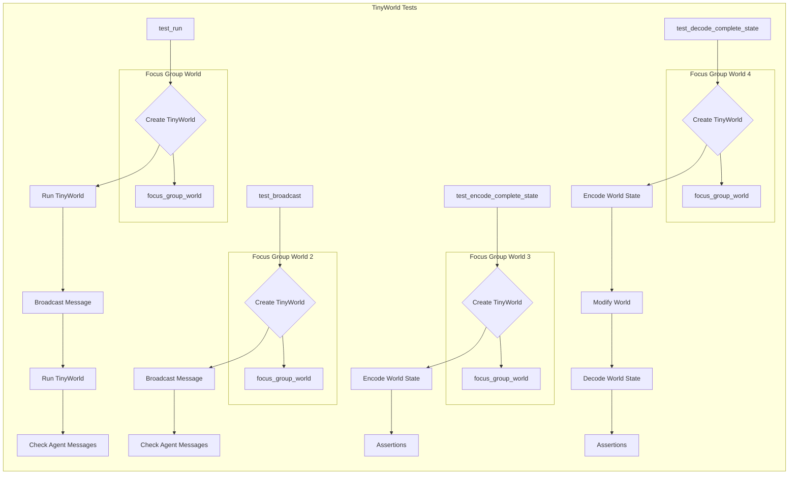

# <input code>

```python
import pytest
import logging
logger = logging.getLogger("tinytroupe")

import sys
sys.path.append('../../tinytroupe/')
sys.path.append('../../')
sys.path.append('..')

from tinytroupe.examples import create_lisa_the_data_scientist, create_oscar_the_architect, create_marcos_the_physician
from tinytroupe.environment import TinyWorld
from testing_utils import *

def test_run(setup, focus_group_world):

    # empty world
    world_1 = TinyWorld("Empty land", [])   
    world_1.run(2)

    # world with agents
    world_2 = focus_group_world
    world_2.broadcast("Discuss ideas for a new AI product you'd love to have.")
    world_2.run(2)

    # check integrity of conversation
    for agent in world_2.agents:
        for msg in agent.episodic_memory.retrieve_all():
            if 'action' in msg['content'] and 'target' in msg['content']['action']:
                assert msg['content']['action']['target'] != agent.name, f"{agent.name} should not have any messages with itself as the target."
            
            # TODO stimulus integrity check?


def test_broadcast(setup, focus_group_world):

    world = focus_group_world
    world.broadcast("""
                Folks, we need to brainstorm ideas for a new baby product. Something moms have been asking for centuries and never got.

                Please start the discussion now.
                """)
    
    for agent in focus_group_world.agents:
        # did the agents receive the message?
        assert "Folks, we need to brainstorm" in agent.episodic_memory.retrieve_first(1)[0]['content']['stimuli'][0]['content'], f"{agent.name} should have received the message."


def test_encode_complete_state(setup, focus_group_world):
    world = focus_group_world

    # encode the state
    state = world.encode_complete_state()
    
    assert state is not None, "The state should not be None."
    assert state['name'] == world.name, "The state should have the world name."
    assert state['agents'] is not None, "The state should have the agents."


def test_decode_complete_state(setup, focus_group_world):
    world = focus_group_world

    name_1 = world.name
    n_agents_1 = len(world.agents)

    # encode the state
    state = world.encode_complete_state()
    
    # screw up the world
    world.name = "New name"
    world.agents = []

    # decode the state back into the world
    world_2 = world.decode_complete_state(state)

    assert world_2 is not None, "The world should not be None."
    assert world_2.name == name_1, "The world should have the same name."
    assert len(world_2.agents) == n_agents_1, "The world should have the same number of agents."


```

# <algorithm>

The code defines unit tests for the `TinyWorld` class.  The algorithm can be broken down into steps for each test function:

**`test_run`:**

1. Creates an empty `TinyWorld` object (`world_1`).
2. Runs the world for 2 time steps.
3. Creates a `TinyWorld` object (`world_2`) from the `focus_group_world` fixture, which likely holds pre-populated agents.
4. Broadcasts a message to the agents in `world_2`.
5. Runs the world for 2 more time steps.
6. Iterates through agents in `world_2`.
7. Iterates through messages in agent's memory.
8. Checks if the messages have action and target fields, and ensures the target is not the agent itself.

**`test_broadcast`:**

1. Creates a `TinyWorld` object (`world`) from the `focus_group_world` fixture.
2. Broadcasts a message to the agents.
3. Iterates through agents.
4. Checks if the broadcast message is present in the first message retrieved from each agent's memory.


**`test_encode_complete_state`:**

1. Creates a `TinyWorld` object (`world`) from the `focus_group_world` fixture.
2. Encodes the current state of the world using `world.encode_complete_state()`.
3. Asserts that the encoded state is not None, contains the world name, and contains agent information.


**`test_decode_complete_state`:**

1. Creates a `TinyWorld` object (`world`) from the `focus_group_world` fixture.
2. Gets the initial world name and number of agents.
3. Encodes the state of the world using `world.encode_complete_state()`.
4. Modifies the world object (name and agents).
5. Decodes the state back into a new world object (`world_2`) using `world.decode_complete_state(state)`.
6. Asserts that the decoded world (`world_2`) is not None, has the original name, and the same number of agents as the original world.


# <mermaid>



# <explanation>

**Imports:**

- `pytest`: Used for writing and running unit tests.
- `logging`: Used for logging messages to the console, allowing for debugging purposes, with a logger named `tinytroupe`.
- `sys`: Enables modifying the Python path to import modules from specific locations (`../../tinytroupe/`, `../../`, and `..`).  This is a common practice in project structures where related code exists in subfolders.
- `tinytroupe.examples`: Likely contains functions to create sample agents (Lisa, Oscar, Marcos).
- `tinytroupe.environment`: Defines the `TinyWorld` class, core to the project's simulation/agent-based environment.
- `testing_utils`: A helper module containing potentially useful testing functions or fixtures, which is crucial for testing code, providing data and simplifying setup.

**Classes:**

- `TinyWorld`: Represents an environment or world in which agents interact. Methods like `run` and `broadcast` are key in running the simulation and controlling agent interactions.  `encode_complete_state()` and `decode_complete_state()` are critical for saving and loading the state of the world.  This demonstrates the architecture's ability to persist and restore simulation states.

**Functions:**

- `test_run`: Tests the `run` method of the `TinyWorld` class.  It checks the agent behavior in different world scenarios.
- `test_broadcast`: Tests broadcasting a message in the `TinyWorld` environment, making sure agents can receive and process those messages.
- `test_encode_complete_state`: Tests the encoding of the `TinyWorld` state, checking that the encoded data is not None, the world name is correctly preserved, and agent data is correctly encoded in the process.
- `test_decode_complete_state`: Tests the decoding of the `TinyWorld` state, verifying that the decoded state accurately represents the encoded version and that the world and agent data are restored correctly.  It's a crucial test to confirm data integrity after a world state is saved.

**Variables:**

- `world_1`, `world_2`: Instances of the `TinyWorld` class used to hold different world configurations.
- `name_1`, `n_agents_1`: Used to store initial state of the `TinyWorld` object before manipulation.
- `state`: The encoded state of the `TinyWorld` instance, facilitating simulation persistence and data transfer.

**Possible Errors/Improvements:**

- The `TODO stimulus integrity check?` comment in `test_run` suggests a missing or incomplete test case.
- The code assumes the existence of `setup` and `focus_group_world` fixtures.  These should be defined elsewhere (likely in `conftest.py`) to properly set up the tests.  This is standard test-driven development best practice.

**Relationships with Other Parts of the Project:**

- The code depends heavily on the `TinyWorld` class and related functions defined within `tinytroupe.environment`.
- The `testing_utils` module's functions provide support or context in testing.
- The code relies on agents (Lisa, Oscar, Marcos) and their interaction logic, implying the existence of these agents' definitions in `tinytroupe.examples`.


The code's overall structure suggests a unit testing suite for the `TinyWorld` class within the `tinytroupe` project, meticulously checking interaction, state persistence, and agent functionality.  Thorough testing with different conditions is key for verifying the `TinyWorld`'s robustness.