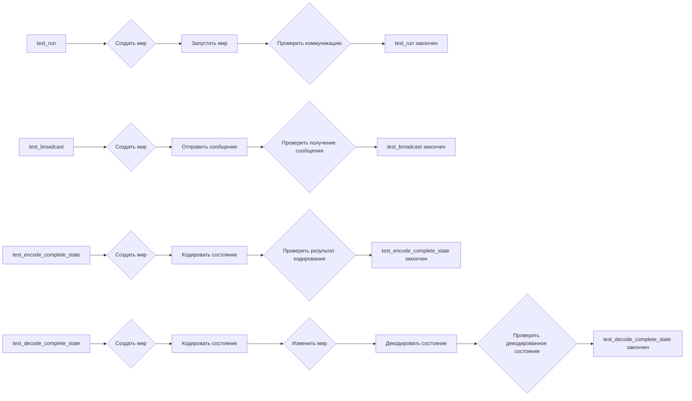

# <input code>

```python
import pytest
import logging
logger = logging.getLogger("tinytroupe")

import sys
sys.path.append('../../tinytroupe/')
sys.path.append('../../')
sys.path.append('..')

from tinytroupe.examples import create_lisa_the_data_scientist, create_oscar_the_architect, create_marcos_the_physician
from tinytroupe.environment import TinyWorld
from testing_utils import *

def test_run(setup, focus_group_world):

    # empty world
    world_1 = TinyWorld("Empty land", [])   
    world_1.run(2)

    # world with agents
    world_2 = focus_group_world
    world_2.broadcast("Discuss ideas for a new AI product you'd love to have.")
    world_2.run(2)

    # check integrity of conversation
    for agent in world_2.agents:
        for msg in agent.episodic_memory.retrieve_all():
            if 'action' in msg['content'] and 'target' in msg['content']['action']:
                assert msg['content']['action']['target'] != agent.name, f"{agent.name} should not have any messages with itself as the target."
            
            # TODO stimulus integrity check?


def test_broadcast(setup, focus_group_world):

    world = focus_group_world
    world.broadcast("""
                Folks, we need to brainstorm ideas for a new baby product. Something moms have been asking for centuries and never got.

                Please start the discussion now.
                """)
    
    for agent in focus_group_world.agents:
        # did the agents receive the message?
        assert "Folks, we need to brainstorm" in agent.episodic_memory.retrieve_first(1)[0]['content']['stimuli'][0]['content'], f"{agent.name} should have received the message."


def test_encode_complete_state(setup, focus_group_world):
    world = focus_group_world

    # encode the state
    state = world.encode_complete_state()
    
    assert state is not None, "The state should not be None."
    assert state['name'] == world.name, "The state should have the world name."
    assert state['agents'] is not None, "The state should have the agents."


def test_decode_complete_state(setup, focus_group_world):
    world = focus_group_world

    name_1 = world.name
    n_agents_1 = len(world.agents)

    # encode the state
    state = world.encode_complete_state()
    
    # screw up the world
    world.name = "New name"
    world.agents = []

    # decode the state back into the world
    world_2 = world.decode_complete_state(state)

    assert world_2 is not None, "The world should not be None."
    assert world_2.name == name_1, "The world should have the same name."
    assert len(world_2.agents) == n_agents_1, "The world should have the same number of agents."


```

# <algorithm>

**Описание алгоритма работы кода в виде блок-схемы:**

(Необходимо визуальное представление, к сожалению, не могу создать блок-схему. Ниже приведен текстовый эквивалент, который, надеюсь, понятен)

**test_run:** Создаёт мир с агентами или без них, запускает его и проверяет корректность коммуникации между агентами (проверяет, что агенты не отправляют сообщения сами себе).

**test_broadcast:** Создаёт мир с агентами, отправляет сообщение в мир, проверяет, получили ли агенты сообщение.

**test_encode_complete_state:** Кодирует состояние мира, проверяет, что результат кодирования не пуст и содержит имя мира и список агентов.

**test_decode_complete_state:** Кодирует состояние мира, затем изменяет его, декодирует состояние обратно в новый мир и проверяет, что новый мир имеет первоначальное состояние, включая имя и количество агентов.

**Пошаговое описание:**


1. **Импорт необходимых библиотек:** `pytest`, `logging`, `sys` и другие.  

2. **Добавление путей поиска модулей:**  `sys.path.append(...)`.

3. **Создание миров с агентами или без них (test_run, test_broadcast, test_encode_complete_state, test_decode_complete_state):**  создаются объекты `TinyWorld`, которые содержат набор агентов (например, Lisa, Oscar, Marcos).

4. **Запуск миров (test_run, test_broadcast):** `world.run(2)` запускает симуляцию на 2 шага.

5. **Отправка сообщений (test_run, test_broadcast):** `world.broadcast(...)` отправляет сообщение всем агентам.

6. **Чтение сообщений от агентов:** `agent.episodic_memory.retrieve_all()` - запрос памяти агента.

7. **Проверка корректности данных (test_run):**  Проверка, что агенты не отправляют сообщения сами себе.

8. **Проверка получения сообщения агентами (test_broadcast):** Проверка содержания сообщений, полученных агентами.

9. **Кодирование и декодирование состояния (test_encode_complete_state, test_decode_complete_state):**  `world.encode_complete_state()`, `world.decode_complete_state()`.

10. **Проверка состояния после декодирования (test_decode_complete_state):**  Проверка, что состояние после декодирования соответствует исходному состоянию.


# <mermaid>



**Подключаемые зависимости:**

* `pytest`: для запуска тестов.
* `logging`: для логирования.
* `sys`: для работы с системными переменными, в частности с путями.
* `tinytroupe.examples`: модуль, создающий агентов (Lisa, Oscar, Marcos).
* `tinytroupe.environment`: модуль, представляющий собой класс `TinyWorld`, который моделирует мир.
* `testing_utils`: модуль, вероятно, содержащий вспомогательные функции для тестирования.

# <explanation>

**Импорты:**

* `pytest`: Используется для запуска юнит-тестов.
* `logging`: Используется для ведения журнала, например, при отладке.
* `sys`: Используется для манипуляции путём поиска файлов Python.
* `tinytroupe.examples`: Содержит функции для создания агентов (Lisa, Oscar, Marcos) - это  части приложения, которые создают объекты (агентов).
* `tinytroupe.environment`: Определяет класс `TinyWorld`, представляющий окружение для агентов.
* `testing_utils`: Вспомогательный модуль, который содержит функции, вероятно, упрощающие написание и выполнение тестов.


**Классы:**

* `TinyWorld`:  Представляет мир, в котором взаимодействуют агенты.  
    * Имеет атрибуты `name` (имя мира) и `agents` (список агентов в мире).
    * Имеет методы `run`, `broadcast`, `encode_complete_state`, `decode_complete_state`.


**Функции:**

* `test_run`, `test_broadcast`, `test_encode_complete_state`, `test_decode_complete_state`:  Функции, которые представляют собой юнит-тесты для проверки работы класса `TinyWorld`.  
    * Каждый тест проверяет разные аспекты работы `TinyWorld`.
    * `setup` и `focus_group_world` - это, вероятно, аргументы, которые предоставляют тестируемому коду необходимые объекты или данные для работы.

**Переменные:**

* `world_1`, `world_2`, `world`:  Переменные, хранящие объекты `TinyWorld`.
* `agent`: Переменная, хранящая объект класса агента.
* `msg`: Переменная, хранящая сообщение (словарь).
* `state`: Переменная, хранящая состояние мира, сериализованное в структуру данных.
* `name_1`, `n_agents_1`: Вспомогательные переменные для проверки целостности состояния.


**Возможные ошибки или области для улучшений:**

* **`TODO stimulus integrity check?`**: Необходимо реализовать проверку целостности стимулов в сообщениях.
* **Спецификация `setup` и `focus_group_world`**: В коде не указано, что это за переменные и как они инициализируются.  Необходимо уточнить, как они используются в тестировании.
* **Подробные проверки при decode:** В тесте `decode_complete_state`  необходимо добавить проверки на корректность изменения атрибутов объекта, а не только на количестве агентов и имени.


**Взаимосвязи:**

Код тесно связан с классом `TinyWorld` и, вероятно, другими классами, которые определены в модулях `tinytroupe.examples` и `testing_utils`.  Тестируемый код предполагает, что `TinyWorld` определяет логику для взаимодействия агентов в мире и сериализации/десериализации данных.