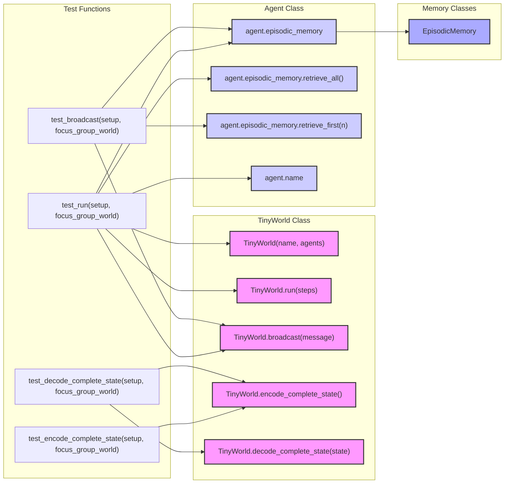

## Анализ кода `test_tinyworld.py`

### 1. **<алгоритм>**

Этот код представляет собой набор модульных тестов для класса `TinyWorld`, который, вероятно, является частью системы моделирования взаимодействия агентов. Тесты проверяют различные аспекты работы `TinyWorld`, такие как запуск мира, широковещательную рассылку сообщений, кодирование и декодирование состояния мира.

**Блок-схема:**

1.  **`test_run(setup, focus_group_world)`:**
    *   **Вход:** Фикстуры `setup` и `focus_group_world`.
    *   **Действие 1:** Создание `world_1` - пустой экземпляр `TinyWorld`.
        *   Пример: `world_1 = TinyWorld("Empty land", [])`
    *   **Действие 2:** Запуск `world_1` на 2 шага.
        *   Пример: `world_1.run(2)`
    *   **Действие 3:** Создание `world_2` используя фикстуру `focus_group_world`.
        *   Пример: `world_2 = focus_group_world`
    *   **Действие 4:** Широковещательная рассылка сообщения в `world_2`.
        *   Пример: `world_2.broadcast("Discuss ideas...")`
    *   **Действие 5:** Запуск `world_2` на 2 шага.
         *   Пример: `world_2.run(2)`
    *   **Действие 6:** Проверка целостности сообщений в памяти агентов.
        *   Итерация по агентам в `world_2.agents`.
        *   Итерация по сообщениям в `agent.episodic_memory`.
        *   Проверка, что если сообщение содержит действие, то цель действия не является именем самого агента.
        *   Пример: `assert msg['content']['action']['target'] != agent.name`
    *   **Выход:** Нет явного возврата, успешность определяется отсутствием ошибок.

2.  **`test_broadcast(setup, focus_group_world)`:**
    *   **Вход:** Фикстуры `setup` и `focus_group_world`.
    *   **Действие 1:** Создание `world` используя фикстуру `focus_group_world`.
        *   Пример: `world = focus_group_world`
    *   **Действие 2:** Широковещательная рассылка сообщения в `world`.
        *   Пример: `world.broadcast("Folks, we need to brainstorm...")`
    *   **Действие 3:** Проверка, что каждый агент получил сообщение.
        *   Итерация по агентам в `focus_group_world.agents`.
        *   Проверка, что первое сообщение в памяти агента содержит широковещательное сообщение.
        *   Пример: `assert "Folks, we need to brainstorm" in agent.episodic_memory.retrieve_first(1)[0]['content']['stimuli'][0]['content']`
    *   **Выход:** Нет явного возврата, успешность определяется отсутствием ошибок.

3.  **`test_encode_complete_state(setup, focus_group_world)`:**
    *   **Вход:** Фикстуры `setup` и `focus_group_world`.
    *   **Действие 1:** Создание `world` используя фикстуру `focus_group_world`.
        *   Пример: `world = focus_group_world`
    *   **Действие 2:** Кодирование состояния `world`.
        *   Пример: `state = world.encode_complete_state()`
    *   **Действие 3:** Проверка, что состояние не `None`, содержит имя мира и агентов.
        *   Пример: `assert state is not None`, `assert state['name'] == world.name`, `assert state['agents'] is not None`
    *   **Выход:** Нет явного возврата, успешность определяется отсутствием ошибок.

4.  **`test_decode_complete_state(setup, focus_group_world)`:**
    *   **Вход:** Фикстуры `setup` и `focus_group_world`.
    *   **Действие 1:** Создание `world` используя фикстуру `focus_group_world`.
        *   Пример: `world = focus_group_world`
    *   **Действие 2:** Сохранение начального имени и количества агентов.
        *   Пример: `name_1 = world.name`, `n_agents_1 = len(world.agents)`
    *   **Действие 3:** Кодирование состояния `world`.
        *   Пример: `state = world.encode_complete_state()`
    *   **Действие 4:** Изменение состояния `world` (имя и список агентов).
        *   Пример: `world.name = "New name"`, `world.agents = []`
    *   **Действие 5:** Декодирование состояния обратно в `world_2`.
        *   Пример: `world_2 = world.decode_complete_state(state)`
    *   **Действие 6:** Проверка, что `world_2` не `None`, имя и количество агентов восстановились.
         *   Пример: `assert world_2 is not None`, `assert world_2.name == name_1`, `assert len(world_2.agents) == n_agents_1`
    *   **Выход:** Нет явного возврата, успешность определяется отсутствием ошибок.

### 2. **<mermaid>**

**Объяснение `mermaid`:**

*   **`graph LR`**: Определяет тип диаграммы как направленный граф, идущий слева направо.
*   **`subgraph`**: Используется для группировки связанных узлов, что делает диаграмму более читаемой.  Группы:
    *   `Test Functions`: Содержит тестовые функции.
    *   `TinyWorld Class`: Содержит методы класса `TinyWorld`.
    *    `Agent Class`: Содержит методы и атрибуты класса `Agent`.
    *   `Memory Classes`: Содержит классы связанные с памятью.
*   **`-->`**: Обозначает связь между узлами. Например, `test_run --> TinyWorld_init` означает, что функция `test_run` использует метод `TinyWorld_init`.
*   **Узлы**: Каждый узел представляет собой функцию, метод класса или класс. Имена узлов отражают их функциональность.
*   **Стили**: Стили применяются для выделения классов `TinyWorld`, `Agent` и `EpisodicMemory`.

**Зависимости:**

Диаграмма показывает зависимости между тестовыми функциями и классами `TinyWorld` и `Agent`, а так же `EpisodicMemory`. Тестовые функции используют методы `TinyWorld` для создания и управления миром, а так же методы `Agent` для доступа к памяти агента. `EpisodicMemory` используется для хранения сообщений.

### 3. **<объяснение>**

**Импорты:**

*   `import pytest`: Импортирует библиотеку `pytest` для написания и запуска тестов.
*   `import logging`: Импортирует библиотеку `logging` для ведения журнала событий.
    *   `logger = logging.getLogger("tinytroupe")`: Создает логгер для модуля `tinytroupe`.
*   `import sys`: Импортирует модуль `sys`, позволяющий взаимодействовать с интерпретатором Python.
    *   `sys.path.append(...)`:  Добавляет пути к директориям, содержащим код проекта, для импорта модулей из них. Это нужно для корректного импорта `tinytroupe` и других компонентов из разных директорий.
*   `from tinytroupe.examples import create_lisa_the_data_scientist, create_oscar_the_architect, create_marcos_the_physician`: Импортирует функции для создания предустановленных агентов. Эти функции предоставляют удобный способ создания агентов для тестирования.
*   `from tinytroupe.environment import TinyWorld`: Импортирует класс `TinyWorld`, который представляет собой среду для взаимодействия агентов.
*   `from testing_utils import *`: Импортирует все определения из модуля `testing_utils`, скорее всего, это фикстуры для настройки тестовой среды.

**Классы:**

*   **`TinyWorld`**: Этот класс представляет собой среду, в которой взаимодействуют агенты.
    *   **Атрибуты**:
        *   `name`: Название мира.
        *   `agents`: Список агентов, находящихся в мире.
    *   **Методы**:
        *   `__init__(self, name, agents)`: Инициализирует мир, принимая имя и список агентов.
        *   `run(self, steps)`: Запускает симуляцию мира на заданное количество шагов.
        *   `broadcast(self, message)`: Рассылает сообщение всем агентам в мире.
        *   `encode_complete_state(self)`: Кодирует полное состояние мира в словарь.
        *   `decode_complete_state(self, state)`: Декодирует состояние мира из словаря.
        *   **Взаимодействие**: `TinyWorld` взаимодействует с классом `Agent`,  используя его для взаимодействия и обмена сообщениями.

*   **`Agent`**:  Хотя класс `Agent` не определен в этом коде, он подразумевается как класс, который:
     * Имеет атрибут `episodic_memory`, который является экземпляром `EpisodicMemory`.
     * Имеет атрибут `name` который хранит имя агента.
     * Имеет методы для получения доступа к `episodic_memory` такие как `retrieve_all` и `retrieve_first`.

*   **`EpisodicMemory`**:
     * Хранит сообщения агента.
     * Имеет методы `retrieve_all` и `retrieve_first` для доступа к сообщениям.

**Функции:**

*   **`test_run(setup, focus_group_world)`**:
    *   **Аргументы**:
        *   `setup`: Фикстура, предоставляющая настройку для теста.
        *   `focus_group_world`: Фикстура, предоставляющая `TinyWorld` с предустановленными агентами.
    *   **Назначение**: Тестирует запуск мира, широковещательную рассылку сообщений и проверку целостности диалогов агентов.
    *   **Примеры**:
        *   Создает пустой мир `world_1` и запускает его.
        *   Создает мир `world_2` с агентами, отправляет им сообщение и запускает его, проверяя, что агенты не отправляют сообщения самим себе.
*   **`test_broadcast(setup, focus_group_world)`**:
    *   **Аргументы**:
        *   `setup`: Фикстура, предоставляющая настройку для теста.
        *   `focus_group_world`: Фикстура, предоставляющая `TinyWorld` с предустановленными агентами.
    *   **Назначение**: Тестирует широковещательную рассылку сообщений и проверяет, что все агенты получили сообщение.
    *   **Примеры**:
        *   Широковещательно отправляет сообщение и проверяет, что каждый агент сохранил его в памяти.
*   **`test_encode_complete_state(setup, focus_group_world)`**:
    *   **Аргументы**:
        *   `setup`: Фикстура, предоставляющая настройку для теста.
        *   `focus_group_world`: Фикстура, предоставляющая `TinyWorld` с предустановленными агентами.
    *   **Назначение**: Тестирует кодирование состояния мира в словарь.
    *   **Примеры**:
        *   Кодирует состояние мира и проверяет, что оно не `None` и содержит необходимые данные.
*   **`test_decode_complete_state(setup, focus_group_world)`**:
    *   **Аргументы**:
        *   `setup`: Фикстура, предоставляющая настройку для теста.
        *   `focus_group_world`: Фикстура, предоставляющая `TinyWorld` с предустановленными агентами.
    *   **Назначение**: Тестирует декодирование состояния мира из словаря,  восстанавливая изначальное состояние.
    *   **Примеры**:
        *   Кодирует состояние мира, меняет его, декодирует состояние и проверяет, что мир восстановлен в исходное состояние.

**Переменные:**

*   `world_1`, `world_2`, `world`: Экземпляры класса `TinyWorld`.
*   `state`:  Словарь, содержащий закодированное состояние мира.
*   `name_1`: Строка, хранящая имя мира до изменения.
*    `n_agents_1`: Целое число, хранящее начальное количество агентов мира.
*   `msg`: Словарь, содержащий сообщение агента.
*   `agent`: Экземпляр класса `Agent`.
*   `logger`:  Объект логгера, используемый для ведения журнала.

**Потенциальные ошибки и области для улучшения:**

*   **TODO stimulus integrity check?**: Отсутствует проверка целостности стимулов в сообщениях агентов,  что может привести к непредсказуемому поведению системы.
*   **Обработка исключений**: Отсутствует обработка потенциальных исключений во время работы с памятью агентов, что может привести к сбоям тестов.
*   **Тесты на отрицательные сценарии**: Отсутствуют тесты для проверки обработки некорректных данных, таких как `None` или пустые строки.
*   **Уточнение фикстур**: Фикстуры `setup` и `focus_group_world` не определены в этом файле, что делает их сложно анализировать без контекста модуля `testing_utils`. Необходимо предоставить их код для полноценного анализа.

**Цепочка взаимосвязей:**

Этот код является частью системы моделирования взаимодействия агентов. Класс `TinyWorld` является центральным компонентом,  обеспечивающим среду для взаимодействия агентов. Он зависит от классов `Agent` и `EpisodicMemory`,  которые хранят и обрабатывают информацию агентов. Этот код  использует `pytest` для написания и запуска тестов.

Данный анализ предоставляет полную картину функциональности кода, его зависимостей и потенциальных проблем.