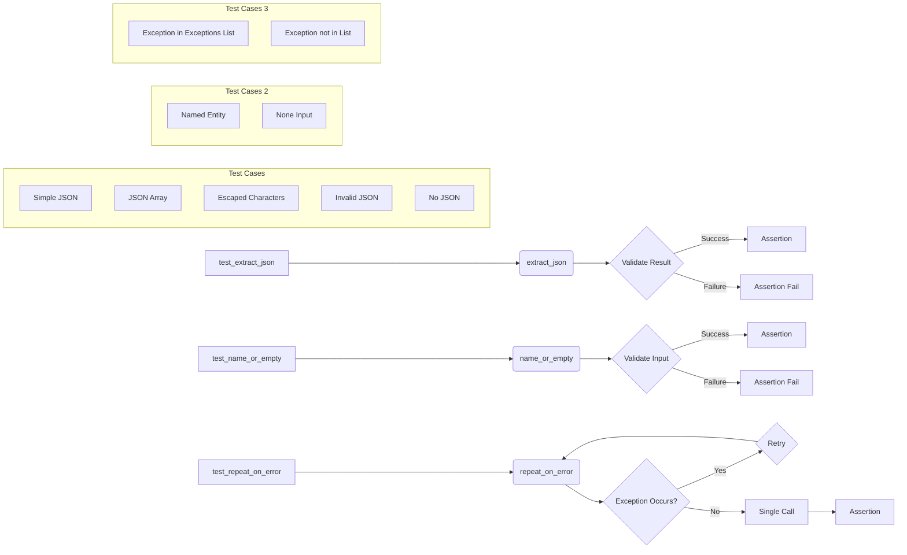

# <input code>

```python
import pytest
from unittest.mock import MagicMock

import sys
sys.path.append('../../tinytroupe/')
sys.path.append('../../')
sys.path.append('..')


from tinytroupe.utils import name_or_empty, extract_json, repeat_on_error
from testing_utils import *

def test_extract_json():
    # Test with a simple JSON string
    text = 'Some text before {"key": "value"} some text after'
    result = extract_json(text)
    assert result == {"key": "value"}

    # Test with a JSON array
    text = 'Some text before [{"key": "value"}, {"key2": "value2"}] some text after'
    result = extract_json(text)
    assert result == [{"key": "value"}, {"key2": "value2"}]

    # Test with escaped characters
    text = 'Some text before {"key": "\\\'value\\\'"} some text after'
    result = extract_json(text)
    assert result == {"key": "\'value\'"}

    # Test with invalid JSON
    text = 'Some text before {"key": "value",} some text after'
    result = extract_json(text)
    assert result == {}

    # Test with no JSON
    text = 'Some text with no JSON'
    result = extract_json(text)
    assert result == {}


def test_name_or_empty():
    class MockEntity:
        def __init__(self, name):
            self.name = name

    # Test with a named entity
    entity = MockEntity("Test")
    result = name_or_empty(entity)
    assert result == "Test"

    # Test with None
    result = name_or_empty(None)
    assert result == ""


def test_repeat_on_error():
    class DummyException(Exception):
        pass

    # Test with retries and an exception occurring
    retries = 3
    dummy_function = MagicMock(side_effect=DummyException())
    with pytest.raises(DummyException):
        @repeat_on_error(retries=retries, exceptions=[DummyException])
        def decorated_function():
            dummy_function()
        decorated_function()
    assert dummy_function.call_count == retries

    # Test without any exception occurring
    retries = 3
    dummy_function = MagicMock()  # no exception raised
    @repeat_on_error(retries=retries, exceptions=[DummyException])
    def decorated_function():
        dummy_function()
    decorated_function()
    assert dummy_function.call_count == 1

    # Test with an exception that is not specified in the exceptions list
    retries = 3
    dummy_function = MagicMock(side_effect=RuntimeError())
    with pytest.raises(RuntimeError):
        @repeat_on_error(retries=retries, exceptions=[DummyException])
        def decorated_function():
            dummy_function()
        decorated_function()
    assert dummy_function.call_count == 1


# TODO
#def test_json_serializer():
```

# <algorithm>

**test_extract_json:**

1. **Initialization**: Input text is provided.
2. **Extract**: `extract_json` function parses the input text for JSON.
3. **Validation**: Results are compared against expected JSON objects.
4. **Repeat**: The steps 2-3 are repeated for various test cases (valid JSON, JSON array, escaped characters, invalid JSON, no JSON).


**test_name_or_empty:**

1. **Initialization**: A `MockEntity` object (or `None`) is provided.
2. **Check**: The `name_or_empty` function checks if the input is an object with a `name` attribute or `None`.
3. **Return**: It returns the `name` attribute value or an empty string if the input is `None` or not an entity with a `name` attribute


**test_repeat_on_error:**

1. **Initialization**:  A function (`dummy_function`) is decorated with `repeat_on_error`. The decorator is aware of the number of `retries` and a list of exceptions.
2. **Try**: `dummy_function` is called. If an exception in `exceptions` list occurs, the function is called again (up to `retries`).
3. **Check**: The number of calls to `dummy_function` is checked. If an exception is raised, the function is called the correct number of times, otherwise, only once.
4. **Validation**:  If the exception is not in the list the `dummy_function` should be called only once and the exception is raised as expected


# <mermaid>



# <explanation>

**Импорты:**

- `pytest`: Библиотека для тестирования.
- `unittest.mock`: Для создания Mock-объектов, позволяющих имитировать поведение функций и методов.
- `sys`: Для манипуляции с системными переменными, в данном случае, добавления путей к модулям. `sys.path.append()` позволяет Python находить модули в указанных директориях,  необходимы для работы с `tinytroupe` модулем.
- `tinytroupe.utils`: Содержит функции `name_or_empty`, `extract_json` и `repeat_on_error`, необходимые для работы тестов.
- `testing_utils`:  (не описан в предоставленном коде) скорее всего, содержит вспомогательные функции и классы для тестирования, которые используются в тесте,  и определяет `MockEntity` класс, необходимый для тестирования `name_or_empty`.

**Классы:**

- `MockEntity`:  Простой класс, используемый для имитации сущности с именем. Он нужен для тестирования функции `name_or_empty`.  Он создает объекты, которые содержат поле `name`.


**Функции:**

- `name_or_empty(entity)`: Возвращает имя сущности (`entity`) если оно есть и пустую строку в противном случае.
- `extract_json(text)`:  Извлекает JSON из строки. Возвращает `dict` или `list` соответствующие JSON структуре.  Умеет справляться с ошибками при разборе и возвращает пустой словарь.
- `repeat_on_error(retries=3, exceptions=[Exception])`: Декоратор, который позволяет повторять выполнение функции несколько раз при возникновении определённых исключений.  Указывает максимальное число повторов и список ожидаемых исключений.


**Переменные:**

- `text`, `result`: Переменные для хранения входных данных и результатов тестирования, используется для проверки поведения `extract_json`
- `entity`: Переменная для хранения экземпляра класса `MockEntity`. Используется при тестировании `name_or_empty`.
- `retries`: Целочисленное значение, определяющее сколько раз функция будет повторяться, используемое при тестировании `repeat_on_error`.


**Возможные ошибки или области для улучшений:**

- Отсутствует документация. Необходимо добавить комментарии к функциям и классам, поясняющие их назначение.
- Тестирование `json_serializer` не реализовано и помечено как TODO.
- Возможно, стоит добавить больше тестов для `extract_json` для различных типов ошибок в JSON строках.
-  Не указано, как обрабатывается `testing_utils`, хотя код использует его классы.  Необходимо уточнить его роль и местоположение в проекте.
-  `sys.path.append` может быть не оптимальным решением для управления путями к модулям. Вместо `sys.path.append` лучше использовать установку проекта как виртуальной среды.

**Цепочка взаимосвязей:**

Тесты (`test_*.py`) в папке `tests` проверяют корректность работы функций в `tinytroupe.utils`, проверяя, соответствует ли поведение этих функций ожидаемому.


**Примечание:**  Для лучшего анализа необходимо контекст `testing_utils` модуля, в частности, определить, как он взаимодействует с другими частями проекта.