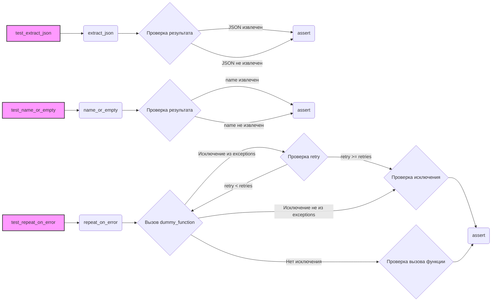

# Анализ кода `test_utils.py`

## 1. <алгоритм>

**test_extract_json**:
1.  **Вход:** Строка `text`, которая может содержать JSON.
2.  **Вызов `extract_json(text)`:** Функция пытается извлечь JSON из `text`.
3.  **Проверка:** Результат сравнивается с ожидаемым JSON.
4.  **Примеры:**
    *   `text = '... {"key": "value"} ...'` → `{"key": "value"}`
    *   `text = '... [{"key": "value"}, {"key2": "value2"}] ...'` → `[{"key": "value"}, {"key2": "value2"}]`
    *   `text = '... {"key": "\'value\'"} ...'` → `{"key": "'value'"}`
    *   `text = '... {"key": "value",} ...'` → `{}` (некорректный JSON)
    *   `text = '... no JSON ...'` → `{}`
5.  **Выход:** None (тест завершается с `assert`).

**test_name_or_empty**:
1.  **Вход:** Объект `entity` (может быть `None` или объектом с атрибутом `name`).
2.  **Вызов `name_or_empty(entity)`:** Функция возвращает `entity.name`, если `entity` существует, иначе возвращает "".
3.  **Проверка:** Результат сравнивается с ожидаемой строкой.
4.  **Примеры:**
    *   `entity` с `entity.name = "Test"` → `"Test"`
    *   `entity = None` → `""`
5.  **Выход:** None (тест завершается с `assert`).

**test_repeat_on_error**:
1.  **Вход:** Функция `dummy_function`, количество повторов `retries` и список исключений `exceptions`.
2.  **Определение `decorated_function`:** Декорируется `decorated_function` с помощью `@repeat_on_error`.
3.  **Вызов `decorated_function`:**
    *   Если `dummy_function` вызывает исключение, которое есть в `exceptions`, `dummy_function` будет повторяться до `retries` раз.
    *   Если `dummy_function` не вызывает исключения, или вызывается исключение, которое не включено в `exceptions`, то выполняется один раз.
4.  **Проверка:**
    *   Сравнивается количество вызовов `dummy_function.call_count` с ожидаемым значением.
    *   Проверка, что, если в случае ошибки, вызывается исключение.
5.  **Примеры:**
    *   `dummy_function` вызывает `DummyException`, `retries = 3` → `dummy_function` вызывается 3 раза
    *   `dummy_function` не вызывает исключений, `retries = 3` → `dummy_function` вызывается 1 раз.
    *   `dummy_function` вызывает `RuntimeError`, `retries = 3`  → вызывается `RuntimeError`, и `dummy_function` вызывается 1 раз.
6.  **Выход:** None (тест завершается с `assert`).

## 2. <mermaid>

**Объяснение зависимостей в `mermaid`:**

*   `test_extract_json` вызывает функцию `extract_json`, которая возвращает извлеченный `json`. Затем идет проверка результата с помощью assert.
*   `test_name_or_empty` вызывает функцию `name_or_empty`, которая возвращает имя или пустую строку. Затем идет проверка результата с помощью assert.
*   `test_repeat_on_error` вызывает декоратор `repeat_on_error`, который повторяет вызов  `dummy_function`. После идет проверка количества вызовов и исключений.

## 3. <объяснение>

### Импорты:

*   `pytest`: Используется для написания и запуска тестов.
*   `unittest.mock.MagicMock`: Используется для создания mock-объектов, позволяющих имитировать поведение функций или методов для тестирования.
*   `sys`:  Используется для работы с системными переменными и путями.
*   `sys.path.append(...)`:  Добавляет в sys.path путь до директорий `../../tinytroupe/`, `../../` и `../`. Это необходимо для импорта модулей `tinytroupe.utils` и `testing_utils`.

    *   `src/ai/tiny_troupe/TinyTroupe/tests/unit/test_utils.py`
    *   `src/ai/tiny_troupe/TinyTroupe/tinytroupe/utils.py` - `tinytroupe.utils`
    *   `src/ai/tiny_troupe/TinyTroupe/tests/testing_utils.py` - `testing_utils`

*   `tinytroupe.utils`: Импортирует функции `name_or_empty`, `extract_json` и `repeat_on_error` из модуля `utils` пакета `tinytroupe`.
*   `testing_utils`: Импортирует дополнительные инструменты для тестирования (не показано в коде).

### Функции:

*   **`test_extract_json()`**:
    *   **Назначение**: Тестирует функцию `extract_json`.
    *   **Алгоритм**: Функция вызывает `extract_json` с разными входными данными и проверяет, правильно ли извлекается JSON.
    *   **Примеры**:
        *   `text = '... {"key": "value"} ...'`: Проверяет извлечение простого JSON-объекта.
        *   `text = '... [{"key": "value"}, {"key2": "value2"}] ...'`: Проверяет извлечение JSON-массива.
        *   `text = '... {"key": "\\\'value\\\'"} ...'`: Проверяет извлечение JSON с экранированными символами.
        *   `text = '... {"key": "value",} ...'`: Проверяет случай с некорректным JSON.
        *   `text = '... no JSON ...'`: Проверяет случай, когда JSON отсутствует.
    *   **Тип данных**:
        *   Входные данные - строка `text`
        *   Выходные данные - `None`
    *   **Связь**: Функция тестирует функцию `extract_json` из `tinytroupe.utils`.

*   **`test_name_or_empty()`**:
    *   **Назначение**: Тестирует функцию `name_or_empty`.
    *   **Алгоритм**: Функция вызывает `name_or_empty` с разными входными данными (экземпляром класса с `name` атрибутом и `None`) и проверяет правильность возвращаемого значения.
    *    **Примеры**:
         *   `entity = MockEntity("Test")`: Проверяет работу на экземпляре класса `MockEntity`
         *   `entity = None`: Проверяет обработку `None` значения.
    *   **Тип данных**:
        *   Входные данные - экземпляр класса `MockEntity` или `None`
        *   Выходные данные - `None`
    *   **Связь**: Функция тестирует функцию `name_or_empty` из `tinytroupe.utils`.

*   **`test_repeat_on_error()`**:
    *   **Назначение**: Тестирует декоратор `repeat_on_error`.
    *   **Алгоритм**: Функция вызывает `repeat_on_error` с разными параметрами и проверяет, правильно ли происходит повторение вызовов в случае возникновения ошибок.
    *   **Примеры**:
         *   `dummy_function` вызывает исключение `DummyException`, и происходит повторение вызовов.
         *    `dummy_function` не вызывает исключение, вызов происходит один раз.
        *   `dummy_function` вызывает исключение `RuntimeError` которое не является исключениями, которые должны быть обработаны, вызов происходит один раз и выбрасывает исключение `RuntimeError`.
    *   **Тип данных**:
        *   Входные данные - количество повторов `retries` и список исключений `exceptions`
        *   Выходные данные - `None`
    *   **Связь**: Функция тестирует декоратор `repeat_on_error` из `tinytroupe.utils`.

### Переменные:

*   `text`: Строка, представляющая текст для извлечения JSON.
*    `result`: Результат вызова тестируемой функции.
*    `entity`: Экземпляр класса, содержащий атрибут `name` или None.
*    `retries`: Количество попыток повторения функции.
*   `dummy_function`: Mock-объект функции, используемый для тестирования декоратора.
*  `exceptions`: Список исключений, которые должны обрабатываться декоратором `repeat_on_error`.
*    `decorated_function`: Функция, которая декорируется декоратором `repeat_on_error`.

### Классы:
*   **`MockEntity`**:
    *   **Назначение**: Используется для эмуляции сущности с атрибутом `name` в тесте `test_name_or_empty`.
    *   **Атрибуты**: `name`.
    *   **Методы**: `__init__(self, name)`.
    *   **Связь**: Используется исключительно в рамках теста `test_name_or_empty`.

*   **`DummyException`**:
    *   **Назначение**: Пользовательское исключение, используемое для тестирования декоратора `repeat_on_error`.
    *   **Атрибуты**: Отсутствуют.
    *   **Методы**: Отсутствуют.
    *   **Связь**: Используется исключительно в рамках теста `test_repeat_on_error`.

### Потенциальные ошибки и области для улучшения:

*   **TODO**: Закомментированный тест `test_json_serializer` указывает на недостающую функциональность или на то, что тест не был дописан.
*   **Обработка ошибок в `extract_json`**: Функция `extract_json` просто возвращает пустой словарь `{}` при некорректном JSON. Возможно, стоит добавить логирование ошибок или выбрасывание исключения, чтобы было легче отлаживать.

**Взаимосвязь с другими частями проекта**:
    *   Функции `extract_json`, `name_or_empty` и `repeat_on_error` используются в других частях проекта. Тесты обеспечивают их корректную работу.
    *   Директория `testing_utils` (не показана в коде) может содержать другие вспомогательные функции, которые используют протестированные `utils`.

Этот анализ предоставляет подробную картину функциональности кода, его компонентов и связей, а также указывает на возможные области для улучшения.