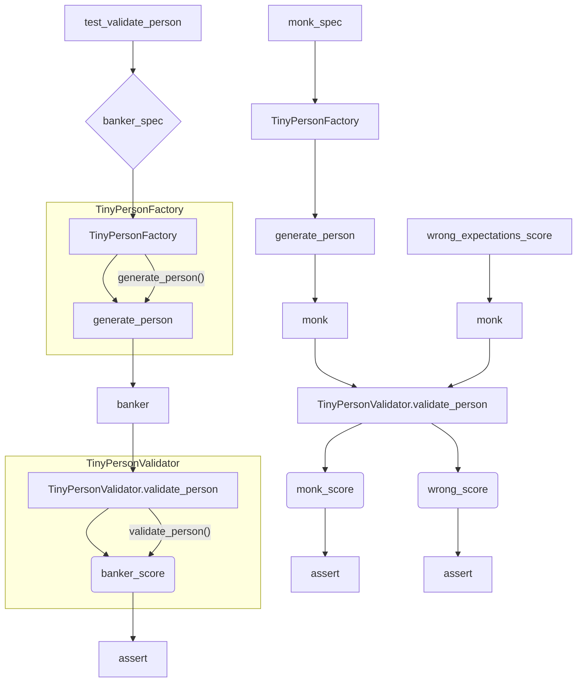

# <input code>

```python
import pytest
import os

import sys
sys.path.append('../../tinytroupe/')
sys.path.append('../../')
sys.path.append('..')


from tinytroupe.examples import create_oscar_the_architect
from tinytroupe.control import Simulation
import tinytroupe.control as control
from tinytroupe.factory import TinyPersonFactory
from tinytroupe.validation import TinyPersonValidator

from testing_utils import *

def test_validate_person(setup):

    ##########################
    # Banker
    ##########################
    banker_spec =\\
    """
    A vice-president of one of the largest brazillian banks. Has a degree in engineering and an MBA in finance. 
    Is facing a lot of pressure from the board of directors to fight off the competition from the fintechs.    
    """
    banker_factory = TinyPersonFactory(banker_spec)
    banker = banker_factory.generate_person()
    banker_expectations =\\
    """
    He/she is:
    - Wealthy
    - Very intelligent and ambitious
    - Has a lot of connections
    - Is in his 40s or 50s

    Tastes:
    - Likes to travel to other countries
    - Either read books, collect art or play golf
    - Enjoy only the best, most expensive, wines and food
    - Dislikes communists, unions and the like

    Other notable traits:
    - Has some stress issues, and might be a bit of a workaholic
    - Deep knowledge of finance, economics and financial technology
    - Is a bit of a snob
    - Might pretend to be a hard-core woke, but in reality that's just a facade to climb the corporate ladder  
    """
    banker_score, banker_justification = TinyPersonValidator.validate_person(banker, expectations=banker_expectations, include_agent_spec=False, max_content_length=None)
    print("Banker score: ", banker_score)
    print("Banker justification: ", banker_justification)

    assert banker_score > 0.5, f"Validation score is too low: {banker_score:.2f}"


    ##########################
    # Busy Knowledge Worker   
    ########################## 
    monk_spec =\\
    """
    A poor buddhist monk living alone and isolated in a remote montain.
    """
    monk_spec_factory = TinyPersonFactory(monk_spec)
    monk = monk_spec_factory.generate_person()
    monk_expectations =\\
    """
    Some characteristics of this person:
    - Is very poor, and in fact do not seek money
    - Has no formal education, but is very wise
    - Is very calm and patient
    - Is very humble and does not seek attention
    - Honesty is a core value    
    """

    monk_score, monk_justification = TinyPersonValidator.validate_person(monk, expectations=monk_expectations, include_agent_spec=False, max_content_length=None)
    print("Monk score: ", monk_score)
    print("Monk justification: ", monk_justification)
          

    assert monk_score > 0.5, f"Validation score is too low: {monk_score:.2f}"

    # Now, let's check the score for the busy knowledge worker with the wrong expectations! It has to be low!
    wrong_expectations_score, wrong_expectations_justification = TinyPersonValidator.validate_person(monk, expectations=banker_expectations, include_agent_spec=False, max_content_length=None)

    assert wrong_expectations_score < 0.5, f"Validation score is too high: {wrong_expectations_score:.2f}"
    print("Wrong expectations score: ", wrong_expectations_score)
    print("Wrong expectations justification: ", wrong_expectations_justification)
```

# <algorithm>

**Шаг 1:**  Импортируются необходимые модули, включая `pytest`, `os`,  и модули из проекта `tinytroupe`.  `sys.path.append` добавляет пути к каталогам для поиска модулей.


**Шаг 2:**  `test_validate_person` (функция):
    * Создает спецификации для "Банкера" и "Монаха" с помощью `TinyPersonFactory`.
    * Генерирует объекты `banker` и `monk` с помощью `generate_person()`.
    * Устанавливает ожидания (`expectations`) для каждого типа персонажа.
    * Вызывает `TinyPersonValidator.validate_person`, передавая созданные объекты, ожидания и другие параметры.
    * Сохраняет результат валидации (`score` и `justification`).
    * Выводит результаты в консоль.
    * Проверяет `score` с помощью `assert`.  Ожидается, что `score` Банкера будет больше 0.5, а `score` Монаха тоже будет больше 0.5.
    * Проверяет `score` Монаха при неправильных ожиданиях (`banker_expectations`). Ожидается, что он будет меньше 0.5.

**Пример:**  Если ожидания для `banker` соответствуют спецификации, то функция `validate_person` вернёт высокий балл. Если ожидания не соответствуют спецификации, то низкий балл.

**Поток данных:**  Спецификации персонажа -> `TinyPersonFactory` ->  `generate_person` -> `banker` или `monk` ->  `TinyPersonValidator.validate_person` -> результат валидации.

# <mermaid>



# <explanation>

**Импорты:**

* `pytest`: Модуль для написания и запуска тестов.
* `os`: Модуль для работы с операционной системой (не используется напрямую в этом фрагменте).
* `sys`: Модуль для работы с интерпретатором Python. `sys.path.append` добавляет пути к каталогам, где Python ищет модули.  Важно, так как код работает с модулями из папки `tinytroupe`.
* `tinytroupe.examples`, `tinytroupe.control`, `tinytroupe.factory`, `tinytroupe.validation`:  Модули из проекта `tinytroupe`, содержащие классы и функции для создания, управления и валидации персонажей.
* `testing_utils`:  Вероятно, модуль, созданный для тестирования `tinytroupe` содержащий вспомогательные функции, не показанные в этом фрагменте.


**Классы:**

* `TinyPersonFactory`: Создает объекты персонажей на основе спецификаций.
* `TinyPersonValidator`:  Проверяет соответствие персонажа ожиданиям.


**Функции:**

* `test_validate_person(setup)`: Функция тестирования. Принимает `setup` (возможно, fixture из pytest), генерирует персонажей, вызывает валидацию и сравнивает результат с ожидаемыми значениями.


**Переменные:**

* `banker_spec`, `monk_spec`: Строковые описания характеристик персонажа.
* `banker_expectations`, `monk_expectations`:  Описания ожидаемых характеристик персонажа.
* `banker`, `monk`: Объекты, созданные с помощью `TinyPersonFactory`.
* `banker_score`, `banker_justification`, `monk_score`, `monk_justification`: Результаты валидации (вероятнее всего, числа и строки).

**Возможные ошибки/улучшения:**

* Недостаточно информации о внутренней реализации `TinyPersonValidator`.  Непонятно, как именно происходит оценка соответствия `expectations` и `banker`/`monk`.
* `include_agent_spec=False` и `max_content_length=None` – это параметры, скорее всего, для `validate_person`, и их назначение неясно без контекста.  Необходимо определить их значение и назначение.
* Тесты слишком конкретны для банкера и монаха. Возможна рефакторизация с использованием более абстрактных тестов на валидацию.

**Связь с другими частями проекта:**

Функция `test_validate_person` напрямую взаимодействует с `TinyPersonFactory` и `TinyPersonValidator`, которые, скорее всего, определены в других файлах проекта `tinytroupe`.