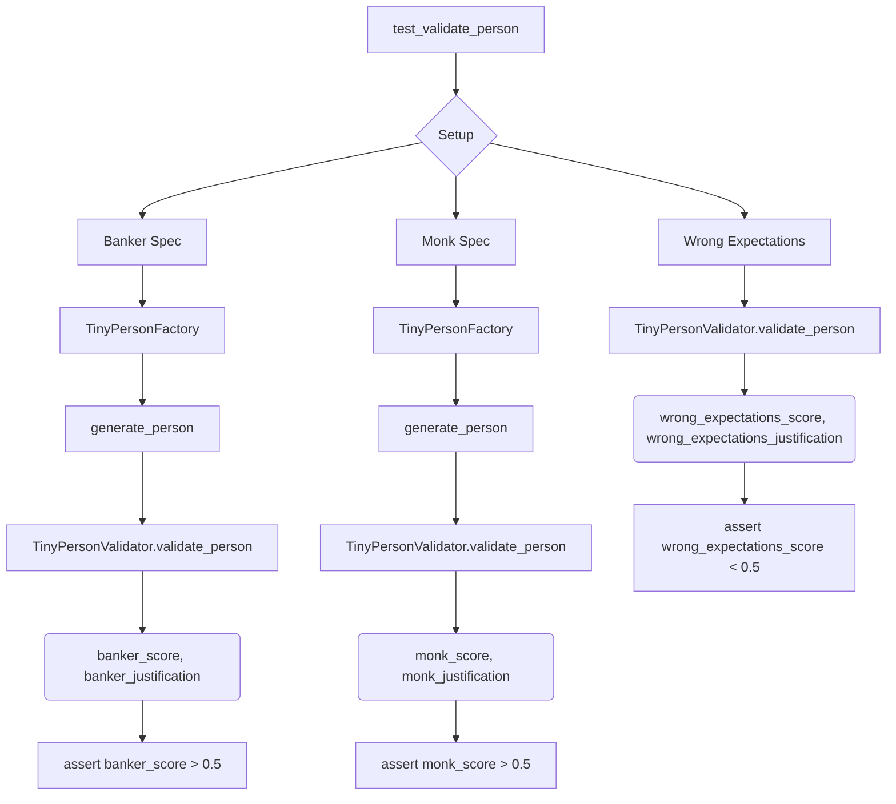
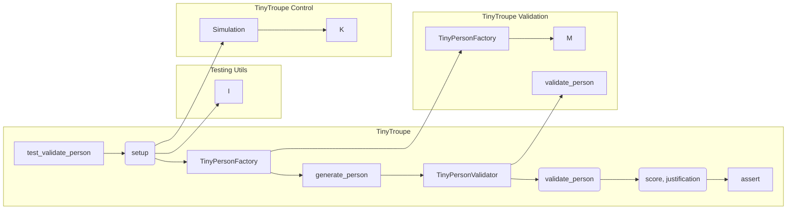

# Анализ кода test_validation.py

## <input code>

```python
import pytest
import os
import sys
sys.path.append('../../tinytroupe/')
sys.path.append('../../')
sys.path.append('..')


from tinytroupe.examples import create_oscar_the_architect
from tinytroupe.control import Simulation
import tinytroupe.control as control
from tinytroupe.factory import TinyPersonFactory
from tinytroupe.validation import TinyPersonValidator

from testing_utils import *

def test_validate_person(setup):

    ##########################
    # Banker
    ##########################
    banker_spec ="""
    A vice-president of one of the largest brazillian banks. Has a degree in engineering and an MBA in finance. 
    Is facing a lot of pressure from the board of directors to fight off the competition from the fintechs.    
    """
    banker_factory = TinyPersonFactory(banker_spec)
    banker = banker_factory.generate_person()
    banker_expectations ="""
    He/she is:
    - Wealthy
    - Very intelligent and ambitious
    - Has a lot of connections
    - Is in his 40s or 50s

    Tastes:
    - Likes to travel to other countries
    - Either read books, collect art or play golf
    - Enjoy only the best, most expensive, wines and food
    - Dislikes communists, unions and the like

    Other notable traits:
    - Has some stress issues, and might be a bit of a workaholic
    - Deep knowledge of finance, economics and financial technology
    - Is a bit of a snob
    - Might pretend to be a hard-core woke, but in reality that's just a facade to climb the corporate ladder  
    """
    banker_score, banker_justification = TinyPersonValidator.validate_person(banker, expectations=banker_expectations, include_agent_spec=False, max_content_length=None)
    print("Banker score: ", banker_score)
    print("Banker justification: ", banker_justification)

    assert banker_score > 0.5, f"Validation score is too low: {banker_score:.2f}"


    ##########################
    # Busy Knowledge Worker   
    ########################## 
    monk_spec ="""
    A poor buddhist monk living alone and isolated in a remote montain.
    """
    monk_spec_factory = TinyPersonFactory(monk_spec)
    monk = monk_spec_factory.generate_person()
    monk_expectations ="""
    Some characteristics of this person:
    - Is very poor, and in fact do not seek money
    - Has no formal education, but is very wise
    - Is very calm and patient
    - Is very humble and does not seek attention
    - Honesty is a core value    
    """

    monk_score, monk_justification = TinyPersonValidator.validate_person(monk, expectations=monk_expectations, include_agent_spec=False, max_content_length=None)
    print("Monk score: ", monk_score)
    print("Monk justification: ", monk_justification)
          

    assert monk_score > 0.5, f"Validation score is too low: {monk_score:.2f}"

    # Now, let's check the score for the busy knowledge worker with the wrong expectations! It has to be low!
    wrong_expectations_score, wrong_expectations_justification = TinyPersonValidator.validate_person(monk, expectations=banker_expectations, include_agent_spec=False, max_content_length=None)

    assert wrong_expectations_score < 0.5, f"Validation score is too high: {wrong_expectations_score:.2f}"
    print("Wrong expectations score: ", wrong_expectations_score)
    print("Wrong expectations justification: ", wrong_expectations_justification)
```

## <algorithm>



**Пример:**  Для банковского работника:
1. Выполняется `setup`.
2. Определяется `banker_spec`.
3. `TinyPersonFactory` создает объект `banker` на основе `banker_spec`.
4. `TinyPersonValidator` оценивает `banker` по `banker_expectations`.
5. Результаты (баллы и обоснование) записываются в `banker_score` и `banker_justification`.
6. Проверяется, что `banker_score` больше 0.5.
7. Аналогичные действия выполняются для `monk`.
8. Проверяется, что `monk_score` больше 0.5.
9. Проверяется, что `monk` не соответствует `banker_expectations`.

## <mermaid>



**Описание зависимостей:**
* `test_validate_person` зависит от `setup` (скорее всего, это функция, которая выполняется перед тестами, для инициализации данных),  `TinyPersonFactory`, `TinyPersonValidator`, и других классов, импортированных из пакетов `tinytroupe.examples`, `tinytroupe.control`, `tinytroupe.factory`, `tinytroupe.validation`.
* `testing_utils` -  подключаемый модуль с дополнительными функциями, вероятно для тестирования.

## <explanation>

**Импорты:**
- `pytest`:  фреймворк для написания тестов.
- `os`: для работы с операционной системой (не используется напрямую в этом фрагменте).
- `sys`: для работы с systema (используется для добавления путей в sys.path, что позволяет импортировать модули из пакетов).
- `tinytroupe`: основной пакет, содержащий модули для работы с tinytroupe, имеет вложенные подпакеты `examples`, `control`, `factory`, `validation`.
- `testing_utils`: вероятно, вспомогательный модуль, предоставляющий функции, используемые для тестирования.

**Классы:**
- `TinyPersonFactory`: отвечает за создание объектов `TinyPerson` на основе спецификаций.
- `TinyPersonValidator`:  валидирует объекты `TinyPerson`, оценивая их соответствие ожидаемым характеристикам.

**Функции:**
- `test_validate_person`: функция тестирования. Принимает `setup` как аргумент (вероятно, объект для инициализации).
    - Содержит два примера валидации: `banker` и `monk`, с разными ожиданиями.
    - `validate_person`:  валидирует конкретную `TinyPerson` относительно заданных `expectations`. Возвращает `score` и `justification` (обоснование результата).

**Переменные:**
- `banker_spec`, `monk_spec`: строковые описания характеристик персонажей.
- `banker_expectations`, `monk_expectations`: строковые описания ожидаемых характеристик персонажей.
- `banker`, `monk`: объекты `TinyPerson`, созданные с помощью `TinyPersonFactory`.
- `banker_score`, `banker_justification`, `monk_score`, `monk_justification`, `wrong_expectations_score`, `wrong_expectations_justification`: переменные, содержащие результаты валидации.

**Возможные ошибки/улучшения:**
- Отсутствие подробного описания `TinyPerson` внутри `TinyPersonValidator` может привести к сложностям в анализе и понимании логики валидации.
- Недостаточно комментариев внутри кода, затрудняющих понимание логики.
- Отсутствие четкой структуры данных для хранения характеристик `TinyPerson` может затруднить расширение и изменение системы валидации в будущем.


**Взаимосвязь с другими частями проекта:**
- `TinyPersonValidator` взаимодействует с `TinyPersonFactory`, получая объекты для проверки.
- `TinyPersonFactory`  взаимодействует с `tinytroupe` модулями для создания `TinyPerson`.
- Взаимодействие с `testing_utils`  модулем.