## АНАЛИЗ КОДА

### <алгоритм>

1. **Начало теста:**
   -  Импортируются необходимые библиотеки и модули, включая `pytest`, `os`, `sys`, и модули из проекта `tinytroupe`.
   -  Добавляются пути к директориям, где находятся модули `tinytroupe`.
2. **Настройка:**
    - Функция `test_validate_person(setup)` начинает выполнение теста.
    -  Аргумент `setup` в функции `test_validate_person` является фикстурой `pytest`.
3. **Тест банкира:**
    -   Определение спецификации банкира в виде строки `banker_spec`.
        ```python
        banker_spec = """
        A vice-president of one of the largest brazillian banks. Has a degree in engineering and an MBA in finance. 
        Is facing a lot of pressure from the board of directors to fight off the competition from the fintechs.    
        """
        ```
    -   Создание экземпляра `TinyPersonFactory` для банкира.
         ```python
          banker_factory = TinyPersonFactory(banker_spec)
         ```
    -   Генерация персоны банкира с помощью `banker_factory.generate_person()`.
         ```python
         banker = banker_factory.generate_person()
         ```
    -   Определение ожиданий для банкира в виде строки `banker_expectations`.
        ```python
          banker_expectations = """
        He/she is:
        - Wealthy
        - Very intelligent and ambitious
        - Has a lot of connections
        - Is in his 40s or 50s

        Tastes:
        - Likes to travel to other countries
        - Either read books, collect art or play golf
        - Enjoy only the best, most expensive, wines and food
        - Dislikes communists, unions and the like

        Other notable traits:
        - Has some stress issues, and might be a bit of a workaholic
        - Deep knowledge of finance, economics and financial technology
        - Is a bit of a snob
        - Might pretend to be a hard-core woke, but in reality that's just a facade to climb the corporate ladder  
        """
        ```
    -   Вызов `TinyPersonValidator.validate_person()` для оценки соответствия банкира ожиданиям. Результаты – оценка (`banker_score`) и обоснование (`banker_justification`).
         ```python
         banker_score, banker_justification = TinyPersonValidator.validate_person(banker, expectations=banker_expectations, include_agent_spec=False, max_content_length=None)
         ```
    -   Вывод оценки и обоснования в консоль.
         ```python
           print("Banker score: ", banker_score)
           print("Banker justification: ", banker_justification)
         ```
    -   Проверка, что оценка выше 0.5.
         ```python
         assert banker_score > 0.5, f"Validation score is too low: {banker_score:.2f}"
         ```
4. **Тест буддийского монаха:**
    -   Определение спецификации монаха в виде строки `monk_spec`.
         ```python
        monk_spec = """
        A poor buddhist monk living alone and isolated in a remote montain.
        """
        ```
    -   Создание экземпляра `TinyPersonFactory` для монаха.
         ```python
        monk_spec_factory = TinyPersonFactory(monk_spec)
         ```
    -   Генерация персоны монаха.
         ```python
        monk = monk_spec_factory.generate_person()
         ```
    -   Определение ожиданий для монаха в виде строки `monk_expectations`.
         ```python
        monk_expectations = """
        Some characteristics of this person:
        - Is very poor, and in fact do not seek money
        - Has no formal education, but is very wise
        - Is very calm and patient
        - Is very humble and does not seek attention
        - Honesty is a core value    
        """
         ```
    -   Вызов `TinyPersonValidator.validate_person()` для оценки соответствия монаха ожиданиям.
         ```python
         monk_score, monk_justification = TinyPersonValidator.validate_person(monk, expectations=monk_expectations, include_agent_spec=False, max_content_length=None)
         ```
    -    Вывод оценки и обоснования в консоль.
         ```python
           print("Monk score: ", monk_score)
           print("Monk justification: ", monk_justification)
         ```
    -   Проверка, что оценка выше 0.5.
         ```python
          assert monk_score > 0.5, f"Validation score is too low: {monk_score:.2f}"
         ```
5. **Тест с неправильными ожиданиями:**
    -  Вызов `TinyPersonValidator.validate_person()` для оценки соответствия монаха ожиданиям банкира (неправильные ожидания).
        ```python
        wrong_expectations_score, wrong_expectations_justification = TinyPersonValidator.validate_person(monk, expectations=banker_expectations, include_agent_spec=False, max_content_length=None)
        ```
    -   Проверка, что оценка ниже 0.5.
        ```python
         assert wrong_expectations_score < 0.5, f"Validation score is too high: {wrong_expectations_score:.2f}"
        ```
    -   Вывод оценки и обоснования в консоль.
        ```python
           print("Wrong expectations score: ", wrong_expectations_score)
           print("Wrong expectations justification: ", wrong_expectations_justification)
         ```
6. **Конец теста:**
   -  Функция `test_validate_person` завершается.

```mermaid
flowchart TD
    subgraph Test Setup
        Start(Начало теста) --> ImportModules[Импорт библиотек и модулей];
        ImportModules --> AddPath[Добавление путей к директориям проекта];
    end

    subgraph Banker Test
        AddPath --> BankerSpecDef[Определение спецификации банкира];
        BankerSpecDef --> BankerFactoryCreate[Создание TinyPersonFactory для банкира];
        BankerFactoryCreate --> BankerGen[Генерация персоны банкира];
        BankerGen --> BankerExpectDef[Определение ожиданий для банкира];
        BankerExpectDef --> BankerValidate[Вызов TinyPersonValidator для оценки банкира];
        BankerValidate --> BankerPrint[Вывод оценки и обоснования банкира в консоль];
        BankerPrint --> BankerAssert[Проверка оценки банкира > 0.5];
    end

    subgraph Monk Test
        BankerAssert --> MonkSpecDef[Определение спецификации монаха];
        MonkSpecDef --> MonkFactoryCreate[Создание TinyPersonFactory для монаха];
        MonkFactoryCreate --> MonkGen[Генерация персоны монаха];
        MonkGen --> MonkExpectDef[Определение ожиданий для монаха];
        MonkExpectDef --> MonkValidate[Вызов TinyPersonValidator для оценки монаха];
        MonkValidate --> MonkPrint[Вывод оценки и обоснования монаха в консоль];
        MonkPrint --> MonkAssert[Проверка оценки монаха > 0.5];
    end
   
    subgraph Wrong Expectations Test
        MonkAssert --> WrongExpectValidate[Вызов TinyPersonValidator с неправильными ожиданиями];
         WrongExpectValidate --> WrongExpectPrint[Вывод оценки и обоснования с неправильными ожиданиями];
        WrongExpectPrint --> WrongExpectAssert[Проверка оценки с неправильными ожиданиями < 0.5];
    end
    
     WrongExpectAssert --> End(Конец теста)

    style Start fill:#f9f,stroke:#333,stroke-width:2px
    style End fill:#f9f,stroke:#333,stroke-width:2px
```

### <mermaid>


### <объяснение>
- **Импорты:**
    - `pytest`: Фреймворк для тестирования. Используется для организации и запуска тестов.
    - `os`: Модуль для работы с операционной системой. Здесь не используется напрямую, но может быть использован в других частях проекта.
    - `sys`: Модуль для работы с системными параметрами и функциями. Используется для добавления путей к директориям, где находятся модули `tinytroupe`.
    - `tinytroupe.examples`: Модуль, содержащий примеры создания персонажей.  В коде используется `create_oscar_the_architect`.
    - `tinytroupe.control`:  Модуль, содержащий классы для контроля симуляции, в частности `Simulation`.
    - `tinytroupe.factory`: Модуль, содержащий класс `TinyPersonFactory` для создания персон.
    - `tinytroupe.validation`: Модуль, содержащий класс `TinyPersonValidator` для проверки соответствия персоны ожиданиям.
    - `testing_utils`: Модуль, содержащий вспомогательные функции для тестирования.

- **Функции:**
   - `test_validate_person(setup)`: Функция, которая выполняет тест валидации персонажей.
   -  `setup` - фикстура pytest, которая может быть использована для настройки среды тестирования, хотя в данном коде она используется без явной настройки.

- **Переменные:**
    - `banker_spec`: Строка, определяющая спецификацию банкира.
    - `banker_factory`: Экземпляр `TinyPersonFactory`, созданный для банкира.
    - `banker`: Объект персонажа, сгенерированный `TinyPersonFactory`.
    - `banker_expectations`: Строка, определяющая ожидаемые характеристики банкира.
    - `banker_score`: Оценка соответствия банкира ожиданиям.
    - `banker_justification`: Обоснование оценки.
    - `monk_spec`: Строка, определяющая спецификацию монаха.
    - `monk_spec_factory`: Экземпляр `TinyPersonFactory`, созданный для монаха.
    - `monk`: Объект персонажа, сгенерированный `TinyPersonFactory`.
    - `monk_expectations`: Строка, определяющая ожидаемые характеристики монаха.
    - `monk_score`: Оценка соответствия монаха ожиданиям.
    - `monk_justification`: Обоснование оценки.
    - `wrong_expectations_score`: Оценка соответствия монаха ожиданиям банкира (ожидания не совпадают).
    - `wrong_expectations_justification`: Обоснование оценки.

- **Классы:**
   - `TinyPersonFactory`: Класс для создания персонажей на основе спецификации.
   - `TinyPersonValidator`: Класс для валидации соответствия персонажа ожиданиям.
-   **Взаимосвязь с другими частями проекта:**
   -  Этот тест использует классы `TinyPersonFactory` и `TinyPersonValidator` из модулей `tinytroupe.factory` и `tinytroupe.validation`, соответственно.  
    - `TinyPersonFactory` используется для создания объектов персонажей на основе строковых спецификаций.
    - `TinyPersonValidator` используется для оценки соответствия сгенерированных персонажей ожидаемым характеристикам.
   -  Так же, в коде присутсвует импорт `tinytroupe.examples`, но  используется только для `create_oscar_the_architect`, но фактически не используется в этом коде.

- **Потенциальные ошибки и области для улучшения:**
    -  Можно сделать более параметризированные тесты, создавая персонажей и их ожидания динамически из различных файлов или структур данных, вместо того чтобы определять их напрямую в коде.
    -  В данном тесте неявно используется фикстура `setup`, можно добавить более подробную настройку тестовой среды.
    -  Можно добавить более широкий спектр тестов с различными типами персонажей и ожиданий для улучшения покрытия кода.
    -  Тесты могут быть разбиты на отдельные тестовые функции для более четкой организации и отслеживания результатов.
    -  В коде отсутствуют проверки на крайние значения, например, когда ожидания полностью не соответствуют спецификации.
    -   Можно добавить логирование для более детального анализа результатов тестов и возможных проблем.

Этот анализ обеспечивает полное понимание функциональности кода, его компонентов и их взаимодействий, а также потенциальные области для улучшения.