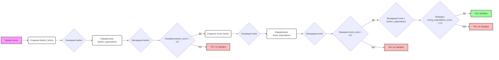

## Анализ кода `test_validation.py`

### 1. <алгоритм>

**Блок-схема:**

1.  **Инициализация:**
    *   Импортируются необходимые библиотеки и модули: `pytest`, `os`, `sys`, `create_oscar_the_architect`, `Simulation`, `control`, `TinyPersonFactory`, `TinyPersonValidator` и `testing_utils`.
    *   Добавляются пути к директориям, чтобы импортировать модули из `tinytroupe`.
2.  **`test_validate_person` function:**
    *   Функция `test_validate_person` принимает аргумент `setup`.
    *   **Создание и валидация банкира:**
        *   Определяется `banker_spec` (спецификация банкира) в виде многострочной строки.
        *   Создается `banker_factory` с помощью `TinyPersonFactory`, используя `banker_spec`.
        *   Генерируется персонаж `banker` с помощью `banker_factory.generate_person()`.
        *   Определяются `banker_expectations` (ожидания от банкира) в виде многострочной строки.
        *   Вызывается `TinyPersonValidator.validate_person` для проверки соответствия `banker` с `banker_expectations`. Результат: `banker_score` и `banker_justification`.
        *   Выводится в консоль `banker_score` и `banker_justification`.
        *   Проверяется, что `banker_score` больше 0.5, используя `assert`, в противном случае тест завершится с ошибкой.
    *   **Создание и валидация монаха:**
        *   Определяется `monk_spec` (спецификация монаха) в виде многострочной строки.
        *   Создается `monk_spec_factory` с помощью `TinyPersonFactory`, используя `monk_spec`.
        *    Генерируется персонаж `monk` с помощью `monk_spec_factory.generate_person()`.
        *   Определяются `monk_expectations` (ожидания от монаха) в виде многострочной строки.
        *   Вызывается `TinyPersonValidator.validate_person` для проверки соответствия `monk` с `monk_expectations`. Результат: `monk_score` и `monk_justification`.
        *   Выводится в консоль `monk_score` и `monk_justification`.
        *   Проверяется, что `monk_score` больше 0.5, используя `assert`, в противном случае тест завершится с ошибкой.
    *   **Неверные ожидания:**
        *   Вызывается `TinyPersonValidator.validate_person` для проверки соответствия `monk` с `banker_expectations`. Результат: `wrong_expectations_score` и `wrong_expectations_justification`.
        *   Проверяется, что `wrong_expectations_score` меньше 0.5, используя `assert`, в противном случае тест завершится с ошибкой.
        *   Выводится в консоль `wrong_expectations_score` и `wrong_expectations_justification`.

### 2. <mermaid>

**Зависимости `mermaid`:**
*   **`graph LR`**: Определяет тип диаграммы как направленный граф (left to right).
*   **`A[Начало теста]`**, **`B(Создание banker_factory)`**,...: Определяют узлы графа с их идентификаторами (например, A, B) и текстом внутри. Квадратные скобки обозначают прямоугольные блоки, круглые - блоки процессов, ромбы - блоки условий.
*   **`-->`**: Обозначает направленные связи между узлами.
*   **`{}`**:  Обозначают блоки принятия решений.
*    **`classDef`**: Определяет стили блоков.
*    **`class`**: Применяет стили к блокам.
*   Условные переходы описываются стрелками с пояснениями "Да" или "Нет".
*    Конечные узлы `H`, `N` и `Q` показывают случаи не прохождения теста, а узел `P` -  прохождение теста.

### 3. <объяснение>

**Импорты:**
*   `pytest`: Используется для написания и запуска тестов.
*   `os`: Используется для взаимодействия с операционной системой (в данном случае не используется напрямую, но может использоваться косвенно через другие импорты).
*   `sys`: Используется для модификации пути поиска модулей Python, добавляя директории `../../tinytroupe/`, `../../` и `..` для импорта модулей из проекта `tinytroupe`.
*   `create_oscar_the_architect`: Импортируется из `tinytroupe.examples`.
*   `Simulation` из `tinytroupe.control`: Класс для управления симуляцией (не используется напрямую в этом тесте).
*   `control` из `tinytroupe`: Пакет для управления симуляцией (не используется напрямую в этом тесте).
*   `TinyPersonFactory` из `tinytroupe.factory`: Класс для создания персонажей на основе спецификаций.
*   `TinyPersonValidator` из `tinytroupe.validation`: Класс для проверки соответствия персонажей ожиданиям.
*   `testing_utils`: Модуль с вспомогательными функциями для тестирования, который не используется в этом примере.

**Классы:**
*   `TinyPersonFactory`:
    *   **Роль:** Создает экземпляры персонажей (`TinyPerson`) на основе заданных спецификаций.
    *   **Методы:** `generate_person()` - генерирует нового персонажа.
    *   **Взаимодействие:** Используется для создания объектов `banker` и `monk`.
*   `TinyPersonValidator`:
    *   **Роль:** Проверяет соответствие персонажа заданным ожиданиям.
    *   **Методы:** `validate_person(person, expectations, include_agent_spec=False, max_content_length=None)` - возвращает оценку соответствия и обоснование.
    *   **Взаимодействие:** Используется для валидации персонажей `banker` и `monk`.

**Функции:**

*   `test_validate_person(setup)`:
    *   **Аргументы:** `setup` - аргумент фикстуры pytest, который обеспечивает предварительную настройку (здесь не используется).
    *   **Назначение:** Тестирует функциональность `TinyPersonValidator` путем создания персонажей, их валидации и проверки корректности оценки соответствия.
    *   **Примеры:**
        *   Создает `banker` на основе `banker_spec` и валидирует его, ожидая высокую оценку соответствия.
        *   Создает `monk` на основе `monk_spec` и валидирует его, ожидая высокую оценку соответствия.
        *   Проверяет, что `monk` получает низкую оценку при валидации с `banker_expectations`, что говорит о проверке несовместимости ожиданий и персонажа.
    *   **Возвращаемые значения:** Ничего не возвращает явно. Функция проверяет результаты валидации через `assert`, и в случае невыполнения assert выводит ошибку, иначе тест считается пройденным.

**Переменные:**

*   `banker_spec` (str): Многострочная строка, описывающая спецификацию банкира.
*   `banker_factory` (TinyPersonFactory): Экземпляр `TinyPersonFactory` для создания `banker`.
*   `banker` (TinyPerson): Экземпляр персонажа банкира.
*   `banker_expectations` (str): Многострочная строка, описывающая ожидания от банкира.
*   `banker_score` (float): Оценка соответствия `banker` ожиданиям.
*   `banker_justification` (str): Текстовое обоснование оценки.
*   `monk_spec` (str): Многострочная строка, описывающая спецификацию монаха.
*   `monk_spec_factory` (TinyPersonFactory): Экземпляр `TinyPersonFactory` для создания `monk`.
*   `monk` (TinyPerson): Экземпляр персонажа монаха.
*    `monk_expectations` (str): Многострочная строка, описывающая ожидания от монаха.
*   `monk_score` (float): Оценка соответствия `monk` ожиданиям.
*   `monk_justification` (str): Текстовое обоснование оценки.
*   `wrong_expectations_score` (float): Оценка соответствия `monk` ожиданиям от `banker`.
*   `wrong_expectations_justification` (str): Текстовое обоснование оценки.

**Потенциальные ошибки и области для улучшения:**
*   **Зависимости:** Тест сильно зависит от точности и качества реализации `TinyPersonFactory` и `TinyPersonValidator`.
*   **Жесткие проверки:** Проверки с помощью `assert` могут быть заменены на более информативные сообщения об ошибках.
*   **Отсутствие параметризации:** Было бы полезно параметризовать тесты для проверки разных персонажей и ожиданий.
*   **Константы:** Оценка 0.5 могла бы быть вынесена в константу для большей гибкости.

**Цепочка взаимосвязей с другими частями проекта:**
*   Этот файл тестирует `tinytroupe.validation.TinyPersonValidator`.
*   Использует `tinytroupe.factory.TinyPersonFactory` для создания персонажей.
*   Косвенно опирается на `tinytroupe.control` и `tinytroupe.examples`, хотя и не вызывает напрямую их функции.
*   Зависит от внутренней реализации классов `TinyPersonFactory` и `TinyPersonValidator`.