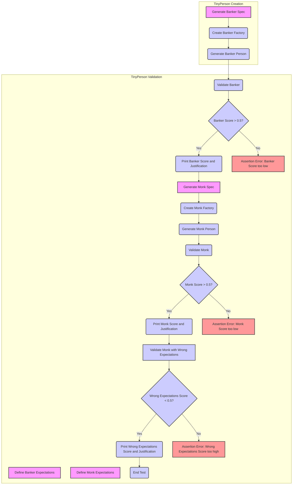

# Анализ кода `test_validation.py`

## <алгоритм>

1.  **Инициализация окружения и импорт библиотек:**
    *   Импортируются необходимые библиотеки: `pytest`, `os`, `sys`.
    *   Добавляются пути к директориям проекта для импорта модулей `tinytroupe`.
    *   Импортируются необходимые классы и функции из `tinytroupe` (например, `TinyPersonFactory`, `TinyPersonValidator`, `Simulation`, `create_oscar_the_architect`) и `testing_utils`.
2.  **Тест `test_validate_person(setup)`:**
    *   Этот тест использует фикстуру `setup` (не показана в коде), которая, вероятно, выполняет предварительную настройку для тестов.
    *   **Тест для банкира:**
        *   Определяется `banker_spec` — текстовое описание банкира.
            ```python
            banker_spec ="""
            A vice-president of one of the largest brazillian banks. Has a degree in engineering and an MBA in finance.
            Is facing a lot of pressure from the board of directors to fight off the competition from the fintechs.    
            """
            ```
        *   Создается экземпляр `TinyPersonFactory` с этим описанием.
            ```python
             banker_factory = TinyPersonFactory(banker_spec)
            ```
        *   Генерируется персонаж банкир с помощью `banker_factory.generate_person()`.
        *   Определяются `banker_expectations` — ожидаемые характеристики банкира.
           ```python
           banker_expectations ="""
            He/she is:
            - Wealthy
            - Very intelligent and ambitious
            - Has a lot of connections
            - Is in his 40s or 50s

            Tastes:
            - Likes to travel to other countries
            - Either read books, collect art or play golf
            - Enjoy only the best, most expensive, wines and food
            - Dislikes communists, unions and the like

            Other notable traits:
            - Has some stress issues, and might be a bit of a workaholic
            - Deep knowledge of finance, economics and financial technology
            - Is a bit of a snob
            - Might pretend to be a hard-core woke, but in reality that's just a facade to climb the corporate ladder  
            """
            ```
        *   Вызывается `TinyPersonValidator.validate_person()` для проверки соответствия персонажа ожиданиям. Результат - оценка `banker_score` и текстовое обоснование `banker_justification`.
            ```python
              banker_score, banker_justification = TinyPersonValidator.validate_person(banker, expectations=banker_expectations, include_agent_spec=False, max_content_length=None)
            ```
        *   Оценка и обоснование выводятся на печать.
        *   Проверяется, что `banker_score` больше 0.5 (успешная валидация). Если нет, то тест завершится с ошибкой.
        *   **Пример**: `banker_score` = 0.85, `banker_justification` = "... обоснование ...".
    *   **Тест для монаха:**
        *   Аналогично тесту банкира, но для описания монаха (`monk_spec`, `monk_expectations`).
        *   Также проверяется, что `monk_score` больше 0.5.
        *    **Пример**: `monk_score` = 0.92, `monk_justification` = "... обоснование ...".
        *    **Негативный тест:**
            *   Проверяется, что оценка для монаха с ожиданиями банкира `wrong_expectations_score` меньше 0.5. Это тест проверяет, что валидатор возвращает низкую оценку, если ожидания не соответствуют характеристикам персонажа.
             *  **Пример**: `wrong_expectations_score` = 0.23, `wrong_expectations_justification` = "... обоснование ...".
    *   Все результаты и обоснования выводятся в консоль.

## <mermaid>


**Зависимости:**

1.  **`pytest`**:  Используется для организации и выполнения тестов. Это фреймворк для тестирования Python.
2.  **`os`**: Предоставляет функции для взаимодействия с операционной системой.
3.  **`sys`**: Предоставляет доступ к некоторым переменным и функциям, которые взаимодействуют с интерпретатором Python. Здесь используется для добавления путей к директориям в `sys.path` для импорта модулей.
4.  **`tinytroupe.examples.create_oscar_the_architect`**: Импортирует функцию для создания персонажа "Оскар Архитектор" (не используется в данном тесте, но импортируется).
5.  **`tinytroupe.control.Simulation`**: Импортирует класс `Simulation` для управления моделированием (не используется в данном тесте, но импортируется).
6.  **`tinytroupe.control`**: Импортируется модуль `control`.
7. **`tinytroupe.factory.TinyPersonFactory`**: Используется для создания персонажей на основе текстовых описаний.
8.  **`tinytroupe.validation.TinyPersonValidator`**: Используется для проверки соответствия персонажа ожиданиям.
9.  **`testing_utils`**: Содержит вспомогательные функции для тестов.

## <объяснение>

**Импорты:**

*   `pytest`: Фреймворк для тестирования, используемый для написания и запуска тестов.
*   `os`: Модуль для работы с операционной системой, в данном случае не используется напрямую, но часто нужен для работы с путями к файлам и директориям.
*   `sys`: Модуль для работы с системными параметрами и функциями. Здесь он используется для добавления путей к директориям проекта в `sys.path`, что позволяет импортировать модули из этих директорий.
*   `tinytroupe.examples.create_oscar_the_architect`: Функция для создания предустановленного персонажа, не используется в данном тесте, но импорт показывает зависимость.
*   `tinytroupe.control.Simulation`: Класс для управления симуляциями, не используется в данном тесте, но импорт показывает зависимость.
*    `tinytroupe.control as control`: Импортирует все функции из `tinytroupe.control` модуля и устанавливает псевдоним `control` для удобства использования.
*   `tinytroupe.factory.TinyPersonFactory`: Класс, который используется для создания персонажей на основе спецификации. Он принимает текстовое описание и генерирует персонажа.
*   `tinytroupe.validation.TinyPersonValidator`: Класс, который используется для проверки соответствия персонажа ожиданиям. Он принимает персонажа и его ожидания и возвращает оценку и обоснование.
*   `testing_utils`: Набор вспомогательных функций для написания тестов.

**Классы:**

*   `TinyPersonFactory`:
    *   **Роль:** Создает экземпляры персонажей на основе текстового описания (спецификации).
    *   **Методы**: Имеет метод `generate_person()`, который использует модель для генерации персонажа на основе спецификации.
*   `TinyPersonValidator`:
    *   **Роль:** Проверяет, насколько персонаж соответствует заданным ожиданиям.
    *   **Методы**: Имеет статический метод `validate_person()`, который принимает персонажа и ожидания и возвращает оценку и текстовое обоснование.

**Функции:**

*   `test_validate_person(setup)`:
    *   **Аргументы:** `setup` (фиксгура pytest для предварительной настройки теста).
    *   **Назначение:** Это основной тестовый метод, который проверяет функциональность `TinyPersonValidator`. Он создает двух персонажей (банкира и монаха), генерирует их, определяет для них ожидания и проверяет, насколько персонажи соответствуют этим ожиданиям. Также он проверяет, что валидатор дает низкую оценку, когда ожидания не соответствуют персонажу.
    *   **Возвращаемое значение:** Нет явного возвращаемого значения, но в случае провала теста,  возбуждается исключение `AssertionError`.

**Переменные:**

*   `banker_spec`, `monk_spec`:  Строковые переменные, описывающие персонажей (банкира и монаха).
*   `banker_factory`, `monk_spec_factory`: Экземпляры `TinyPersonFactory`, которые используются для создания персонажей.
*   `banker`, `monk`: Экземпляры персонажей, сгенерированные `TinyPersonFactory`.
*   `banker_expectations`, `monk_expectations`: Строковые переменные, описывающие ожидания для персонажей.
*   `banker_score`, `monk_score`, `wrong_expectations_score`: Вещественные числа, представляющие оценки соответствия персонажа ожиданиям.
*   `banker_justification`, `monk_justification`, `wrong_expectations_justification`: Строки, которые содержат обоснование оценки валидатора.

**Потенциальные ошибки и области для улучшения:**

*   **Зависимость от текстовых описаний:** Тесты полностью полагаются на текстовые описания и ожидания, что может сделать их хрупкими. При изменении модели, генерирующей персонажей или логики валидатора, может потребоваться обновление этих описаний.
*   **Отсутствие гибкости:** Тест проверяет только соответствие, нет проверки на неполное соответствие, или частичное совпадение.
*   **Жесткие граничные значения:** Использование 0.5 в качестве граничного значения является жестким и может не подходить для всех случаев.

**Взаимосвязь с другими частями проекта:**

*   Этот тест напрямую использует классы `TinyPersonFactory` и `TinyPersonValidator` из пакета `tinytroupe`.
*   Он также показывает зависимость от `create_oscar_the_architect` и `Simulation`, хотя напрямую не используется в тесте.
*   Тест показывает, как валидатор `TinyPersonValidator` используется в сочетании с `TinyPersonFactory` для проверки соответствия персонажей их ожиданиям. Это важная часть процесса создания и валидации персонажей в проекте.
*   Зависимость от `testing_utils` означает, что в проекте есть утилиты для тестирования.

В целом, этот тест является важной частью проекта, поскольку он проверяет работу одного из ключевых компонентов — валидатора персонажей. Он демонстрирует, как создаются и проверяются персонажи на соответствие их ожиданиям.