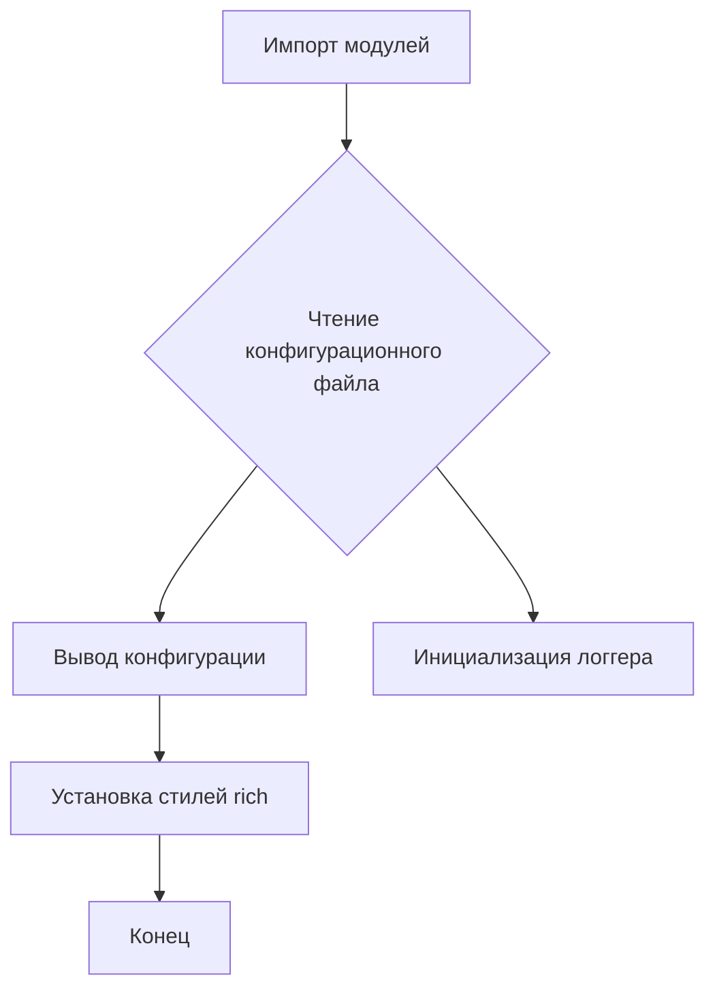
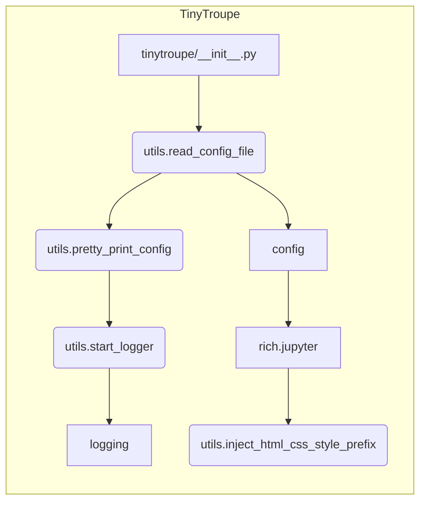

# Анализ кода из tinytroupe/__init__.py

**1. <input code>**

```python
import os
import logging
import configparser
import rich # for rich console output
import rich.jupyter

# add current path to sys.path
import sys
sys.path.append('.')
from tinytroupe import utils # now we can import our utils

# AI disclaimers
print(
"""
!!!!
DISCLAIMER: TinyTroupe relies on Artificial Intelligence (AI) models to generate content. 
The AI models are not perfect and may produce inappropriate or inacurate results. 
For any serious or consequential use, please review the generated content before using it.
!!!!
""")

config = utils.read_config_file()
utils.pretty_print_config(config)
utils.start_logger(config)

# fix an issue in the rich library: we don't want margins in Jupyter!
rich.jupyter.JUPYTER_HTML_FORMAT = \
    utils.inject_html_css_style_prefix(rich.jupyter.JUPYTER_HTML_FORMAT, "margin:0px;")
```

**2. <algorithm>**



**Пример:**

Модуль `utils` содержит функции для чтения конфигурации из файла, вывода её в красивом формате, и настройки логгера.  Этот код последовательно выполняет эти функции, используя прочитанную конфигурацию.

**3. <mermaid>**



**4. <explanation>**

* **Импорты:**
    * `os`: Для работы с операционной системой (например, чтение файлов).
    * `logging`: Для ведения логов.
    * `configparser`: Для работы с конфигурационными файлами.
    * `rich`: Библиотека для красивой вывода в консоли,  важна для визуализации данных.
    * `rich.jupyter`: Подмодуль для работы в Jupyter Notebook.
    * `sys`: Для манипуляций с системными переменными, в частности, `sys.path.append('.')` добавляет текущую директорию в пути поиска модулей, что позволяет импортировать модули из папки `tinytroupe`.
    * `utils`:  Модуль `utils` из пакета `tinytroupe`. Это означает, что в проекте существует модуль `utils` содержащий функции для работы с конфигурацией, стилями и логгерами.

* **Классы:** В данном коде нет объявлений классов.

* **Функции:**
    * `read_config_file()`: (В `utils`) Чтение конфигурационного файла. Возвращает объект `configparser.ConfigParser` с прочитанными данными.  Возможная ошибка - некорректный формат конфигурационного файла.
    * `pretty_print_config()`: (В `utils`)  Вывод конфигурации в удобочитаемом формате. Принимает на вход объект `configparser.ConfigParser`.
    * `start_logger()`: (В `utils`) Настройка логгера. Принимает на вход объект `configparser.ConfigParser`, использует данные из него для настройки логгера (уровни логов, файлы логов). Возможные ошибки - проблемы с конфигурацией логов, проблемы с доступом к файлам логов.
    * `inject_html_css_style_prefix()`: (В `utils`) Добавление CSS-стиля к HTML-формату, для корректной работы в Jupyter Notebook.

* **Переменные:**
    * `config`: Объект `configparser.ConfigParser`, хранящий конфигурацию.

* **Возможные ошибки/улучшения:**
    * **Проверка существования файла конфигурации:** Код не проверяет, существует ли файл конфигурации. Следует добавить проверку на существование и обработку исключений (FileNotFoundError).
    * **Обработка ошибок при чтении конфигурации:** Следует добавить обработку исключений, таких как ошибки в формате файла конфигурации (configparser.Error).
    * **Документирование:**  Добавление документации к функциям и классам.
    * **Зависимости:**  Важно проследить, какие внешние зависимости используются и как они взаимодействуют с другими частями проекта. В примере показано, что проект использует Rich.

* **Цепочка взаимосвязей:**
   `tinytroupe/__init__.py` импортирует и использует функции из модуля `utils`. Этот модуль, скорее всего, отвечает за общие функции работы с конфигурацией, логами и выводом, что указывает на определенную структуру проекта.